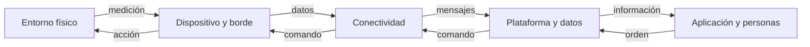

# Arquitectura de una solución IoT

> Este archivo pertenece a: **IoT y conectividad**  
> Ruta: `01. Bloques Temáticos/06. IoT y Conectividad/01. Fundamentos/02. Arquitectura IoT.md`

---

## Estado

**Estado:** En revisión  
**Versión:** v1.0  
**Bloque:** 06_iot-conectividad  
**Última actualización:** 2026-09-14  
**Responsable:** Aylin Salazar Delgado

---

## Descripción

La arquitectura IoT representa la forma en que los componentes físicos y digitales de una solución se organizan, se comunican y colaboran para cumplir un propósito. Permite observar el sistema completo: qué ocurre en el entorno, cuál dispositivo obtiene o ejecuta información, dónde se procesan los datos, cómo se transmiten, dónde se almacenan y de qué manera llegan a una aplicación o regresan como una acción.

Una arquitectura no es solamente una lista de piezas. Es una explicación visual y técnica de las relaciones entre esas piezas. Debe mostrar el recorrido de los datos, las decisiones que toma el sistema, los puntos donde puede fallar y las medidas que protegen los dispositivos, la red y la información.

Comprender la arquitectura antes de construir ayuda a seleccionar tecnologías con criterio, distribuir responsabilidades y detectar problemas anticipadamente. También facilita que otra persona pueda interpretar, reproducir, evaluar y mejorar el proyecto.

---

## Propósito

Orientar el análisis y el diseño de soluciones IoT mediante una arquitectura clara, segura y relacionada con una necesidad real.

Al finalizar este tema, se espera que la persona estudiante pueda:

- representar una solución IoT mediante capas o bloques funcionales;
- identificar el entorno físico, los dispositivos, la conectividad, la plataforma y la aplicación;
- explicar los flujos de telemetría, control, configuración y alertas;
- decidir cuáles tareas deben ejecutarse localmente y cuáles pueden depender de una plataforma remota;
- reconocer puntos únicos de fallo y proponer respuestas seguras;
- documentar datos, protocolos, frecuencia, responsables y medidas de protección; y
- justificar una arquitectura según criterios de latencia, energía, privacidad, confiabilidad y escalabilidad.

---

## Contenido

### 1. ¿Qué representa una arquitectura IoT?

Una arquitectura es un modelo simplificado del sistema. No intenta dibujar cada cable o línea de código, sino mostrar los componentes relevantes y la forma en que intercambian información.

Una arquitectura útil debe permitir responder estas preguntas:

- ¿Qué situación del mundo físico se desea observar o modificar?
- ¿Cuál sensor obtiene el dato y cuál actuador puede ejecutar una acción?
- ¿Qué dispositivo procesa la información?
- ¿Por cuál red se comunica?
- ¿Qué protocolo y formato utiliza?
- ¿Dónde se almacena o analiza el dato?
- ¿Qué aplicación presenta el resultado?
- ¿Quién puede consultar o controlar el sistema?
- ¿Qué ocurre si un componente falla?
- ¿Cómo se protegen las credenciales, los dispositivos y los datos?

La arquitectura debe diseñarse a partir del propósito. Dos proyectos que utilizan el mismo ESP32 pueden necesitar estructuras diferentes si uno controla una luz dentro del aula y el otro registra datos ambientales durante varios meses.

### 2. Modelo general por capas

Para fines educativos, una solución IoT puede organizarse en cinco capas relacionadas. Algunos sistemas combinan varias capas dentro de un mismo dispositivo, mientras que otros distribuyen las funciones entre equipos y servicios diferentes.



Las flechas superiores representan el flujo ascendente de información: el sistema observa el entorno y entrega datos a la aplicación. Las flechas inferiores representan el flujo descendente: una decisión o comando regresa hacia el dispositivo y produce una acción física.

#### Capa 1. Entorno físico

Es la realidad que el proyecto busca comprender o modificar. Puede tratarse de la temperatura de un aula, la humedad de un huerto, el nivel de agua de un recipiente, la iluminación de un espacio o el estado de una máquina.

Definir correctamente esta capa evita medir datos sin propósito. Antes de seleccionar un sensor, se debe indicar qué fenómeno interesa, por qué es relevante, en qué lugar se observará y qué decisión podría apoyarse con esa información.

#### Capa 2. Dispositivo y procesamiento de borde

Esta capa conecta el mundo físico con el digital. Incluye sensores, actuadores y dispositivos de procesamiento como ESP32, Arduino, micro:bit, Raspberry Pi o gateways especializados.

El dispositivo puede ejecutar tareas como:

- leer una señal del sensor;
- convertir la lectura a una unidad comprensible;
- comprobar si el valor está dentro de un rango posible;
- filtrar ruido o calcular un promedio;
- agregar fecha, hora o identificador;
- tomar una decisión inmediata;
- guardar datos temporalmente si no existe conexión;
- controlar un actuador; y
- preparar el mensaje que se transmitirá.

Se denomina **procesamiento de borde** o *edge computing* al procesamiento que ocurre cerca del lugar donde se generan los datos. Por ejemplo, un ESP32 puede apagar un motor inmediatamente si detecta una condición peligrosa, sin esperar una respuesta de Internet.

#### Capa 3. Conectividad

Transporta información entre el dispositivo y otros componentes. Puede incluir Wi-Fi, Bluetooth, Ethernet, redes móviles u otras tecnologías, según el alcance y los recursos del proyecto.

La conectividad no se define solo por el nombre de la red. La arquitectura también debe indicar:

- quién inicia la comunicación;
- si el intercambio es local o remoto;
- cuál protocolo se utiliza, como HTTP o MQTT;
- con qué frecuencia se envían datos;
- qué ocurre cuando la red no está disponible;
- cómo se autentican los componentes; y
- si la información viaja cifrada.

Una red rápida no garantiza una solución confiable. El diseño debe considerar cobertura, interferencia, consumo energético, disponibilidad y cantidad de dispositivos conectados.

#### Capa 4. Plataforma y gestión de datos

Recibe información de uno o varios dispositivos y proporciona servicios para almacenarla, consultarla, transformarla o distribuirla. Puede funcionar dentro del makerspace, en un servidor institucional o en la nube.

Entre sus responsabilidades se encuentran:

- registrar dispositivos autorizados;
- recibir mensajes y comprobar su estructura;
- almacenar mediciones con su fecha y hora;
- calcular indicadores o aplicar reglas;
- identificar valores anómalos;
- generar eventos o alertas;
- controlar quién puede acceder a los datos; y
- ofrecer una API o servicio para otras aplicaciones.

ThingSpeak, Blynk y Node-RED pueden cumplir algunas de estas funciones, pero no son la arquitectura completa. Son componentes dentro de una solución mayor.

#### Capa 5. Aplicación y personas usuarias

Es el punto donde la información se convierte en comprensión o acción. Puede ser un dashboard, una página web, una aplicación móvil, una pantalla local, una notificación o un informe.

La aplicación debe presentar datos con nombres, unidades y momento de actualización. También debe diferenciar entre un valor normal, una advertencia, una lectura inválida y un dispositivo desconectado. Si permite enviar comandos, debe comprobar permisos y mostrar el estado real del dispositivo después de la acción.

La persona usuaria forma parte de la arquitectura. Se debe definir quién consulta, quién administra, quién puede modificar reglas y quién tiene autorización para ejecutar controles.

### 3. Flujos de información

Una solución IoT puede manejar varios tipos de comunicación. Identificarlos evita representar todo con una sola flecha ambigua.

| Flujo | Dirección habitual | Propósito | Ejemplo |
| --- | --- | --- | --- |
| Telemetría | Dispositivo → plataforma | Informar mediciones o estados | Enviar temperatura cada minuto |
| Evento | Dispositivo → plataforma | Informar un cambio relevante | Avisar que se abrió una puerta de maqueta |
| Comando | Aplicación → dispositivo | Solicitar una acción | Encender un LED autorizado |
| Configuración | Plataforma → dispositivo | Ajustar parámetros | Cambiar el intervalo de lectura |
| Confirmación | Dispositivo → aplicación | Comunicar el resultado de una orden | Informar que el LED realmente encendió |
| Mantenimiento | Dispositivo ↔ administración | Diagnosticar o actualizar | Reportar versión de firmware |

El flujo de telemetría no debe confundirse con el de control. Recibir el dato “LED apagado” es diferente de enviar la instrucción “encender LED”. Una arquitectura clara utiliza flechas, nombres y direcciones distintas.

### 4. ¿Dónde se procesan los datos?

No toda la información debe enviarse directamente a la nube. El procesamiento puede distribuirse en tres lugares.

| Lugar | Ventajas | Limitaciones | Uso recomendado |
| --- | --- | --- | --- |
| Dispositivo | Respuesta rápida, funciona sin Internet y reduce datos transmitidos | Memoria y capacidad limitadas | Lectura, validación, control inmediato y estado seguro |
| Gateway o borde local | Integra varios dispositivos y permite reglas locales | Requiere otro equipo y mantenimiento | Conversión de protocolos, almacenamiento temporal y automatización local |
| Plataforma remota | Facilita análisis histórico, acceso desde varios lugares y crecimiento | Depende de red, permisos y servicio | Dashboards, almacenamiento prolongado y análisis de múltiples dispositivos |

La decisión depende del proyecto. Una alerta que protege un componente debe resolverse localmente porque no puede esperar una conexión. En cambio, comparar datos ambientales de varias aulas durante un mes resulta más apropiado para una plataforma con almacenamiento histórico.

Una arquitectura equilibrada mantiene las funciones esenciales aunque se pierda Internet y utiliza servicios remotos cuando realmente aportan valor.

### 5. Los datos también se diseñan

Antes de transmitir información se debe acordar qué significa cada dato. Un valor como `24.6` no es suficiente si no se conoce su variable, unidad, origen y momento de captura.

Un mensaje sencillo podría utilizar la siguiente estructura:

```json
{
  "dispositivo": "aula-01",
  "temperatura_c": 24.6,
  "humedad_pct": 58,
  "fecha_hora": "2026-09-14T09:30:00-06:00",
  "estado_sensor": "correcto"
}
```

Para cada dato conviene documentar:

- nombre y significado;
- tipo de dato;
- unidad de medida;
- rango esperado;
- frecuencia de captura y envío;
- precisión necesaria;
- origen;
- tiempo de conservación; y
- personas o servicios autorizados para consultarlo.

También se debe distinguir entre **captura** y **envío**. Un sensor puede leer cada segundo, calcular un promedio local y transmitir solo un valor por minuto. Esta decisión reduce tráfico y almacenamiento sin perder la información necesaria.

### 6. Ejemplo completo: estación ambiental escolar

Supóngase que un grupo desea conocer cómo cambian la temperatura y la humedad de un aula durante la jornada. El propósito no es recopilar información sobre las personas, sino analizar condiciones ambientales.

| Elemento de la arquitectura | Decisión del proyecto |
| --- | --- |
| Entorno | Aula seleccionada durante el horario escolar |
| Sensores | Sensor digital de temperatura y humedad |
| Dispositivo | ESP32 conectado a una fuente segura |
| Procesamiento local | Validar rangos, identificar errores y calcular un promedio |
| Conectividad | Wi-Fi de laboratorio o red local autorizada |
| Protocolo y formato | HTTP o MQTT con mensaje JSON |
| Plataforma | Servicio local o educativo que almacene series temporales |
| Aplicación | Dashboard con valores actuales, tendencias y última actualización |
| Usuario | Grupo de estudiantes y persona docente |
| Acción | Mostrar una advertencia educativa al superar un umbral definido |
| Seguridad | Credenciales fuera del repositorio y dashboard privado |
| Respuesta ante fallo | Guardar temporalmente o marcar el dato como no disponible |

#### Flujo normal

1. El sensor captura temperatura y humedad.
2. El ESP32 comprueba que la lectura sea válida.
3. El programa agrega identificador y fecha.
4. El dispositivo transmite el mensaje.
5. La plataforma valida y almacena la información.
6. El dashboard actualiza indicadores y gráficos.
7. La persona usuaria interpreta la tendencia.

#### Flujo ante una falla

Si el sensor devuelve un valor imposible, el ESP32 no debe publicarlo como una medición normal. Debe registrar un estado de error. Si la red falla, el dispositivo evita reinicios continuos y conserva su función local. Si el dashboard no recibe información reciente, debe mostrar “dato desactualizado” en lugar de mantener el último valor como si fuera actual.

### 7. Decisiones que debe justificar la arquitectura

Una arquitectura bien diseñada no busca incluir la mayor cantidad de tecnologías, sino seleccionar las necesarias para el propósito.

#### Latencia

Indica cuánto tiempo puede transcurrir entre un evento y la respuesta. Encender un LED educativo puede tolerar una pequeña demora; detener un mecanismo ante un riesgo requiere una decisión local inmediata.

#### Confiabilidad

Define qué tan importante es que los datos o comandos lleguen correctamente. Deben considerarse mensajes perdidos, duplicados, fuera de orden o retrasados.

#### Energía

Un dispositivo conectado permanentemente puede utilizar Wi-Fi con mayor frecuencia. Un sensor alimentado por batería debe limitar lecturas, transmisiones y tiempo activo.

#### Volumen y frecuencia

Enviar una temperatura por minuto es diferente de transmitir imágenes o cientos de lecturas por segundo. El volumen determina la red, el almacenamiento y el costo necesarios.

#### Seguridad y privacidad

La arquitectura debe reducir datos personales, separar funciones, proteger credenciales, autenticar componentes y limitar permisos. La pregunta no es únicamente “¿puede conectarse?”, sino “¿quién debería poder conectarse y para qué?”.

#### Escalabilidad

Un prototipo puede funcionar con un dispositivo y fallar al conectar cincuenta. Se deben considerar identificación, cantidad de mensajes, almacenamiento, administración, actualizaciones y mantenimiento.

#### Interoperabilidad

Los componentes necesitan formatos y protocolos compatibles. Utilizar nombres, unidades y estructuras documentadas permite cambiar una plataforma sin rediseñar todo el proyecto.

### 8. Fallos y comportamiento seguro

Todo componente puede fallar. La arquitectura debe describir cómo detecta y comunica la situación.

| Posible fallo | Riesgo | Respuesta esperada |
| --- | --- | --- |
| Sensor desconectado | Publicar un dato falso o antiguo | Marcar error y evitar decisiones basadas en esa lectura |
| Pérdida de red | Perder mediciones o comandos | Reintentar con límite y continuar funciones locales |
| Plataforma no disponible | Interrumpir visualización o almacenamiento | Conservar temporalmente datos esenciales y reportar estado |
| Mensaje inválido | Procesar valores incompletos | Rechazarlo, registrar el error y no activar actuadores |
| Comando repetido | Ejecutar varias veces una acción | Diseñar operaciones seguras e identificar mensajes |
| Credencial expuesta | Acceso no autorizado | Revocar, reemplazar y retirar la credencial del historial |
| Dato desactualizado | Interpretar el último valor como actual | Mostrar fecha, hora y estado de conexión |

El **estado seguro** es la condición que reduce el riesgo cuando el sistema no puede continuar normalmente. En una práctica con LED puede significar apagarlo. En otros proyectos puede ser detener un motor, mantener una válvula cerrada o conservar una regla local. Esta decisión debe definirse antes de programar.

### 9. Seguridad incorporada en la arquitectura

La seguridad no se añade al final. Cada capa necesita medidas acordes con su función.

- **Dispositivo:** proteger interfaces de configuración, evitar claves dentro del código publicado y mantener software actualizado.
- **Red:** utilizar redes autorizadas, segmentar los equipos de práctica y evitar exponer servicios directamente a Internet.
- **Comunicación:** autenticar los componentes y preferir cifrado cuando la tecnología lo permita.
- **Plataforma:** limitar permisos, conservar solo los datos necesarios y registrar accesos o errores relevantes.
- **Aplicación:** validar entradas, diferenciar roles y confirmar acciones antes de controlar actuadores.
- **Personas:** documentar responsables, consentimiento y procedimiento para eliminar datos y credenciales.

Un prototipo educativo puede comenzar en una red local aislada. La simplicidad no elimina la necesidad de seguridad; permite aprender buenas prácticas con un riesgo controlado.

### 10. Cómo documentar una arquitectura

El diagrama debe ser comprensible para una persona que no participó en el proyecto. Se recomienda:

- utilizar bloques con nombres concretos, como “sensor DHT22” o “ESP32”, en lugar de “parte 1”;
- ordenar el recorrido de izquierda a derecha o de arriba hacia abajo;
- usar flechas con dirección visible;
- escribir sobre cada flecha el dato, protocolo o comando que circula;
- diferenciar datos y comandos mediante etiquetas, no solo colores;
- marcar los límites entre dispositivo, red local y servicios externos;
- señalar dónde se almacenan datos y credenciales;
- identificar usuarios y permisos;
- incluir rutas alternativas o estados de fallo importantes; y
- acompañar el diagrama con una tabla de decisiones.

Una documentación mínima puede utilizar esta plantilla:

| Conexión | Origen | Destino | Dato o comando | Protocolo | Frecuencia | Si falla | Protección |
| --- | --- | --- | --- | --- | --- | --- | --- |
| Ejemplo | ESP32 | Plataforma | Temperatura en °C | MQTT | Cada minuto | Reintento limitado | Usuario y clave local |

### 11. Errores comunes

**Dibujar únicamente los componentes físicos.** La arquitectura también debe mostrar red, plataforma, aplicación, usuarios y datos.

**Utilizar flechas sin explicar qué circula.** Cada conexión debe indicar si transporta una medición, un evento, una configuración o un comando.

**Depender de Internet para una función crítica.** Las respuestas urgentes o seguras deben permanecer cerca del dispositivo.

**Guardar credenciales dentro del repositorio.** Las claves deben mantenerse en archivos excluidos, variables de entorno o mecanismos adecuados para la plataforma.

**Presentar el último dato como si fuera actual.** Toda interfaz debe mostrar fecha, hora y estado de actualización.

**Agregar plataformas sin una función definida.** Cada servicio aumenta complejidad, mantenimiento y exposición. Debe existir una razón para incorporarlo.

**Diseñar solo para el caso exitoso.** La arquitectura debe contemplar lecturas inválidas, desconexión, reinicio, mensajes duplicados y falta de permisos.

---

## Aplicación en Maker Academy

El tema se desarrolla mediante XperiencED Maker. El objetivo no es memorizar capas, sino aprender a descomponer, representar, probar y explicar un sistema conectado.

### Inspiración

La persona docente presenta un caso cercano, como una estación ambiental escolar, un huerto inteligente o una alerta de nivel de agua. El grupo observa el propósito y responde:

- ¿Qué sucede en el entorno?
- ¿Cuál dato permitiría comprender la situación?
- ¿Quién necesita esa información?
- ¿Se requiere solamente monitorear o también actuar?
- ¿Qué debería seguir funcionando si se pierde Internet?

Después se muestra una representación incompleta del sistema y se invita al grupo a identificar los componentes faltantes.

### Experimentación

Los equipos reciben tarjetas con nombres como sensor, ESP32, Wi-Fi, plataforma, dashboard, persona usuaria y actuador. Deben ordenar las tarjetas y conectarlas con flechas rotuladas.

Cada equipo construye una arquitectura que incluya:

1. propósito del sistema;
2. entorno físico;
3. dispositivo, sensor y actuador;
4. procesamiento local;
5. conectividad;
6. protocolo y formato de datos;
7. plataforma y almacenamiento;
8. aplicación y usuarios;
9. flujo de telemetría;
10. flujo de control, si corresponde;
11. posible fallo y estado seguro; y
12. medida de seguridad o privacidad.

La persona docente introduce situaciones de prueba: “no hay Wi-Fi”, “el sensor envía 300 °C”, “llega dos veces el mismo comando” o “una persona sin permiso intenta controlar el dispositivo”. El equipo modifica su arquitectura para responder.

### Reflexión

Cada equipo presenta el diagrama y justifica sus decisiones. Las preguntas de cierre pueden ser:

- ¿Qué parte de la arquitectura es indispensable?
- ¿Cuál componente podría convertirse en un punto único de fallo?
- ¿Qué se procesa localmente y qué se procesa en la plataforma?
- ¿Qué dato se transmite y por qué es necesario?
- ¿Cómo cambia el sistema si pasa de uno a cincuenta dispositivos?
- ¿Cómo sabe la aplicación que el dato es válido y reciente?

### Evidencias sugeridas

- Diagrama de arquitectura con flechas y etiquetas.
- Tabla de conexiones y datos.
- Mensaje JSON de ejemplo.
- Justificación de las tecnologías seleccionadas.
- Análisis de al menos tres fallos.
- Definición del estado seguro.
- Reflexión sobre seguridad, privacidad y escalabilidad.

### Criterios de observación

| Criterio | Evidencia observable |
| --- | --- |
| Organización del sistema | Representa todas las capas necesarias sin componentes decorativos |
| Flujo de datos | Distingue origen, destino, dirección, formato y frecuencia |
| Justificación | Relaciona decisiones técnicas con la necesidad del proyecto |
| Tolerancia a fallos | Identifica fallos y propone respuestas realistas |
| Seguridad y privacidad | Limita accesos y datos desde el diseño |
| Comunicación | Otra persona puede interpretar el diagrama y la tabla |

### Ajuste por nivel

- **Primeros niveles:** representar entorno, sensor, mensaje y respuesta mediante dibujos o roles. No es necesario utilizar términos como protocolo o plataforma.
- **Niveles intermedios:** incorporar dispositivo, conectividad, dashboard, flechas de datos y una falla sencilla.
- **Niveles avanzados:** documentar protocolos, formato, frecuencia, procesamiento local, almacenamiento, permisos, escalabilidad y estado seguro.

---

## Recursos relacionados

### Dentro del repositorio

- [`README.md`](README.md)
- [https://github.com/Universidad-Cenfotec/Maker-Academy/blob/70ecfe0c6e917736b3f05969cb09ca988adb33f0/01.%20Bloques%20Tem%C3%A1ticos/06.%20IoT%20y%20Conectividad/01.%20Fundamentos%20de%20IoT/que-es-iot.md](https://github.com/Universidad-Cenfotec/Maker-Academy/blob/70ecfe0c6e917736b3f05969cb09ca988adb33f0/01.%20Bloques%20Tem%C3%A1ticos/06.%20IoT%20y%20Conectividad/01.%20Fundamentos%20de%20IoT/que-es-iot.md)
- [`03. Dispositivos y conectividad.md`](03.%20Dispositivos%20y%20conectividad.md)
- [`04. Casos de uso.md`](04.%20Casos%20de%20uso.md)
- [`../00. Orientaciones/02. Vocabulario.md`](../00.%20Orientaciones/02.%20Vocabulario.md)
- [`../00. Orientaciones/03. Seguridad y privacidad.md`](../00.%20Orientaciones/03.%20Seguridad%20y%20privacidad.md)
- [`../03. ESP32/README.md`](../03.%20ESP32/README.md)
- [`../04. Protocolos/README.md`](../04.%20Protocolos/README.md)
- [`../05. Prácticas/README.md`](../05.%20Pr%C3%A1cticas/README.md)

### Fuentes de consulta

- [UIT - Visión general del Internet de las cosas](https://www.itu.int/ITU-T/recommendations/rec.aspx?rec=y.2060)
- [NIST - Consideraciones para gestionar riesgos de seguridad y privacidad en IoT](https://nvlpubs.nist.gov/nistpubs/ir/2019/nist.ir.8228.pdf)
- [NIST - Definición de dispositivo IoT](https://csrc.nist.gov/glossary/term/iot_device)

---


---

## Nota docente

La arquitectura debe trabajarse antes del montaje físico. Si el grupo no puede explicar qué dato circula, dónde se procesa y qué ocurre cuando falla una conexión, agregar hardware o plataformas solo aumentará la complejidad.

No existe una única arquitectura correcta para todos los proyectos. Se debe valorar la coherencia entre la necesidad, los componentes y las decisiones. Una solución pequeña, local y bien justificada puede ser más adecuada que una propuesta con múltiples servicios en la nube.

Durante la revisión, pida al equipo seguir un dato desde el sensor hasta la aplicación y luego seguir un comando en dirección contraria. Esta explicación permite detectar flechas ambiguas, funciones duplicadas, dependencias innecesarias y acciones sin confirmación.
