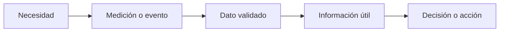

# Casos de uso del Internet de las Cosas

> Este archivo pertenece a: **IoT y conectividad** 
> Ruta: `01. Bloques Temáticos/06. IoT y Conectividad/01. Fundamentos de IoT/casos-uso-iot.md`

---

## Estado

**Estado:** En revisión 
**Versión:** v1.0 
**Bloque:** 06_iot-conectividad 
**Última actualización:** 2026-09-14 
**Responsable:** Aylin Salazar Delgado

---

## Descripción

Un caso de uso de Internet de las Cosas describe una situación concreta en la que objetos, sensores, actuadores, dispositivos y servicios conectados utilizan datos para responder a una necesidad. Su valor no depende de cuántos componentes tenga el sistema, sino de que la conexión permita observar, comprender, alertar, controlar o automatizar algo de manera útil y responsable.

Este documento presenta criterios para analizar casos de uso de IoT y ejemplos relacionados con el centro educativo, el makerspace y la comunidad. Cada caso se estudia desde la necesidad, las personas usuarias, el flujo de datos, el beneficio esperado, las limitaciones y los riesgos. Así se evita comenzar con una placa o plataforma sin haber definido primero el problema que se desea resolver.

---

## Propósito

Orientar la identificación, comparación y diseño de casos de uso de IoT que sean pertinentes, viables, seguros y adecuados para el contexto educativo.

Al finalizar este tema, se espera que la persona estudiante pueda:

- explicar qué es un caso de uso de IoT;
- distinguir entre monitoreo, alerta, control remoto y automatización;
- identificar la necesidad, la persona usuaria y el valor de una solución conectada;
- representar el recorrido de los datos y las acciones del sistema;
- comparar una propuesta IoT con una alternativa local o manual;
- reconocer beneficios, limitaciones, fallos y riesgos de privacidad o seguridad;
- seleccionar únicamente los datos necesarios para cumplir el propósito; y
- proponer un caso de uso relacionado con el centro educativo o la comunidad.

---

## Contenido

### 1. ¿Qué es un caso de uso de IoT?

Un caso de uso explica **quién necesita resolver una situación, qué información o acción requiere, cómo interviene el sistema conectado y qué resultado espera obtener**.

No es suficiente escribir “usar un ESP32 con un sensor”. Esa frase menciona componentes, pero no define la necesidad ni el valor del sistema. Un caso de uso más completo sería: “El grupo de ciencias necesita conocer cómo cambian la temperatura y la humedad del aula durante la jornada. Un sensor conectado registra las mediciones, las envía a una plataforma y las presenta en un dashboard para comparar horarios y discutir posibles mejoras del ambiente”.

Un caso de uso bien formulado contiene, como mínimo:

| Elemento | Pregunta orientadora |
| --- | --- |
| Necesidad | ¿Qué situación se desea comprender o mejorar? |
| Persona usuaria | ¿Quién consulta la información o recibe el beneficio? |
| Entorno | ¿Dónde ocurre y bajo cuáles condiciones? |
| Datos | ¿Qué se debe medir, registrar o recibir? |
| Acción | ¿Qué visualización, alerta, control o respuesta se espera? |
| Conectividad | ¿Por qué es necesario comunicar el dispositivo con otro sistema? |
| Resultado | ¿Cómo se sabrá si la propuesta es útil? |
| Restricciones | ¿Qué límites existen en costo, energía, red, tiempo o mantenimiento? |
| Riesgos | ¿Qué podría fallar o afectar la seguridad y la privacidad? |

### 2. ¿Cuándo aporta valor utilizar IoT?

La conexión agrega valor cuando permite realizar una tarea que sería difícil, lenta o poco confiable con un sistema aislado. Por ejemplo:

- observar varios lugares sin desplazarse constantemente;
- conservar datos históricos para reconocer cambios y tendencias;
- recibir una alerta cuando ocurre una condición relevante;
- coordinar varios dispositivos o compartir información entre sistemas;
- consultar el estado de un proyecto desde una interfaz autorizada;
- ajustar una configuración sin acceder físicamente al dispositivo; o
- apoyar decisiones mediante datos recientes y organizados.

IoT no siempre es la mejor respuesta. Una solución local, manual o sin Internet puede ser más apropiada cuando:

- el problema se resuelve con una acción inmediata dentro del mismo dispositivo;
- no existe una persona que necesite consultar los datos a distancia;
- la conexión añade complejidad, pero no mejora el resultado;
- el mantenimiento de cuentas, redes y credenciales supera el beneficio;
- la cobertura o la energía no son suficientes;
- el proyecto recopilaría datos personales que no son indispensables; o
- una falla de Internet podría impedir una función esencial.

La pregunta inicial no debe ser “¿cómo conectamos este objeto?”, sino “¿qué mejora concreta obtenemos al conectarlo?”.

### 3. Tipos de casos de uso

Una misma solución puede combinar varios tipos, pero conviene diferenciarlos para diseñar correctamente los datos, las interfaces y las responsabilidades.

| Tipo | Función principal | Ejemplo educativo | Consideración importante |
| --- | --- | --- | --- |
| Monitoreo | Observar valores o estados | Consultar temperatura y humedad del aula | Mostrar fecha, hora y vigencia del dato |
| Registro histórico | Conservar datos para compararlos | Analizar el consumo energético por semana | Definir cuánto tiempo se almacenará la información |
| Alerta | Notificar una condición relevante | Avisar que el nivel de agua es bajo | Evitar alarmas repetidas o sin contexto |
| Control remoto | Permitir una acción autorizada | Encender una luz de prueba desde una interfaz | Confirmar que la acción realmente ocurrió |
| Automatización | Ejecutar una regla sin intervención constante | Activar riego cuando se cumplen condiciones definidas | Mantener límites y un estado seguro local |
| Mantenimiento | Detectar señales de desgaste o fallo | Registrar horas de uso de un equipo | No sustituir inspecciones ni mecanismos de seguridad |

### 4. Del dato a una decisión

Un caso de uso no termina cuando el sensor produce una lectura. El dato debe recorrer un proceso hasta convertirse en información o en una acción.

Cada etapa debe poder explicarse:

1. **Necesidad:** se define la situación que se desea comprender o mejorar.
2. **Medición o evento:** un sensor observa una variable o detecta un cambio.
3. **Dato validado:** el sistema comprueba que la lectura tenga formato, unidad y rango posibles.
4. **Información útil:** una plataforma o aplicación organiza el dato con fecha, contexto y comparación.
5. **Decisión o acción:** una persona interpreta el resultado o el sistema ejecuta una regla autorizada.

Si no existe una decisión, una pregunta o una acción relacionada con los datos, el proyecto puede estar acumulando información sin propósito.

### 5. Casos de uso en el entorno educativo

Los siguientes ejemplos muestran aplicaciones posibles. No son instrucciones para instalar sistemas permanentes. Cada propuesta debe adaptarse a la edad del grupo, la infraestructura disponible y las autorizaciones del centro educativo.

#### 5.1. Estación ambiental escolar

**Necesidad:** conocer cómo cambian las condiciones ambientales de un aula, biblioteca, laboratorio o huerto durante un periodo determinado.

**Personas usuarias:** estudiantes, docentes y responsables del espacio.

**Datos posibles:** temperatura, humedad relativa, iluminación y, si se dispone de un sensor apropiado, una medición orientativa de calidad del aire.

**Flujo del sistema:**

`entorno → sensor → ESP32 → red autorizada → plataforma → dashboard → interpretación`

**Resultado esperado:** visualizar valores actuales, comparar horarios, reconocer tendencias y formular explicaciones basadas en datos.

**Valor de la conexión:** permite consultar un historial, reunir mediciones de varios espacios y observar el proyecto sin permanecer junto al dispositivo.

**Riesgos y medidas:**

- calibrar o comparar el sensor para evitar conclusiones basadas en lecturas incorrectas;
- mostrar siempre la unidad, fecha y hora de la última medición;
- evitar presentar el prototipo como instrumento médico o certificado;
- no recopilar nombres, imágenes ni audio si no son necesarios; y
- marcar claramente los periodos sin datos o sin conexión.

**Alternativa sin IoT:** registrar lecturas manualmente en una tabla. Esta opción puede ser suficiente para una actividad corta; IoT aporta más valor cuando se necesita continuidad o comparación entre varios lugares.

#### 5.2. Riego inteligente para un huerto escolar

**Necesidad:** apoyar el cuidado de plantas y evitar decisiones de riego basadas únicamente en horarios fijos.

**Personas usuarias:** estudiantes responsables del huerto y persona docente encargada.

**Datos posibles:** humedad del suelo, nivel del depósito y registro de riegos.

**Acciones posibles:** mostrar el estado, emitir una alerta o activar una bomba o válvula de baja tensión bajo condiciones controladas.

**Valor de la conexión:** permite revisar el historial, detectar periodos secos y notificar que el depósito necesita atención.

**Riesgos y medidas:**

- comprobar las lecturas en distintos tipos de suelo antes de definir umbrales;
- mantener la decisión crítica de detener el riego en el dispositivo local;
- utilizar componentes de baja tensión y separar correctamente agua y electricidad;
- establecer tiempo máximo de activación y estado predeterminado apagado;
- permitir control manual supervisado; y
- evitar que una orden remota pueda mantener la bomba encendida indefinidamente.

**Alternativa sin IoT:** un indicador local de humedad o una rutina manual de observación. La conexión se justifica si se requiere historial, aviso remoto o coordinación entre varios puntos de medición.

#### 5.3. Monitoreo educativo del consumo de energía

**Necesidad:** comprender cómo cambia el uso de energía de equipos autorizados en diferentes momentos.

**Personas usuarias:** grupo de ciencias, tecnología o educación ambiental.

**Datos posibles:** potencia instantánea, energía acumulada y tiempo de funcionamiento, obtenidos mediante equipos certificados o montajes de baja tensión.

**Resultado esperado:** comparar hábitos, identificar consumos innecesarios y proponer acciones de uso responsable.

**Valor de la conexión:** facilita construir un historial y comparar periodos sin copiar mediciones manualmente.

**Riesgos y medidas:**

- el estudiantado no debe intervenir instalaciones eléctricas, tableros ni conductores de tensión de red;
- utilizar medidores certificados, enchufes inteligentes autorizados o simulaciones;
- solicitar acompañamiento de personal calificado cuando corresponda;
- no controlar equipos esenciales o de seguridad desde un prototipo; y
- considerar que ciertos patrones de consumo pueden revelar horarios de ocupación, por lo que no deben publicarse sin revisión.

**Alternativa sin IoT:** consultar facturas o utilizar un medidor local. IoT resulta útil cuando se requieren mediciones más frecuentes y comparación temporal.

#### 5.4. Detección de nivel de agua o posibles fugas

**Necesidad:** conocer el nivel de un depósito educativo o detectar presencia de agua en un lugar donde podría causar daño.

**Personas usuarias:** responsables del laboratorio, huerto o espacio maker.

**Datos posibles:** nivel aproximado, presencia de agua, momento del evento y estado del dispositivo.

**Acciones posibles:** mostrar el nivel, activar una señal local y enviar una alerta.

**Valor de la conexión:** permite conocer la situación sin revisar constantemente el lugar y conservar un registro de eventos.

**Riesgos y medidas:**

- una alerta remota no debe ser la única medida de protección;
- incorporar una señal local y una revisión física;
- proteger los componentes contra humedad y evitar contactos eléctricos expuestos;
- definir cómo se detectará un sensor desconectado; y
- realizar pruebas con cantidades controladas de agua, sin conectarse a sistemas reales del edificio.

**Alternativa sin IoT:** alarma local o inspección periódica. La conexión agrega valor cuando la persona responsable no permanece cerca del punto de medición.

#### 5.5. Seguimiento del uso y mantenimiento de equipos maker

**Necesidad:** registrar horas de uso, temperatura de operación o eventos de mantenimiento de un equipo educativo autorizado.

**Personas usuarias:** persona encargada del makerspace y docentes que utilizan el recurso.

**Datos posibles:** tiempo de funcionamiento, fecha de revisión, estado disponible o fuera de servicio y alertas definidas por el fabricante.

**Resultado esperado:** organizar revisiones preventivas, documentar incidencias y evitar el uso de un equipo marcado como no disponible.

**Valor de la conexión:** centraliza información de varios equipos y permite consultar el estado antes de planificar una actividad.

**Riesgos y medidas:**

- no modificar protecciones, sensores internos ni sistemas de parada del fabricante;
- no asumir que un dato remoto reemplaza la inspección física;
- limitar quién puede cambiar el estado de mantenimiento;
- documentar responsable, fecha y motivo de cada cambio; y
- evitar recopilar datos destinados a vigilar el desempeño individual de estudiantes o docentes.

**Alternativa sin IoT:** bitácora física o formulario digital. La conexión automática se justifica si reduce errores y existe un proceso claro para utilizar la información.

#### 5.6. Gestión de residuos en una actividad escolar

**Necesidad:** observar cuándo un recipiente de demostración alcanza un nivel definido y analizar patrones de generación de residuos.

**Personas usuarias:** grupo encargado de una campaña ambiental.

**Datos posibles:** distancia entre el sensor y el contenido, porcentaje estimado de llenado y fecha de revisión.

**Resultado esperado:** emitir una alerta y comparar resultados entre periodos para apoyar decisiones de reducción y separación.

**Valor de la conexión:** permite reunir información de varios recipientes o ubicaciones y organizar revisiones según necesidad.

**Riesgos y medidas:**

- utilizar recipientes limpios durante el prototipo;
- instalar sensores sin contacto directo con residuos;
- validar que la forma del contenido puede alterar la medición;
- evitar cámaras si un sensor de distancia cumple el propósito; y
- no automatizar decisiones de limpieza sin confirmación humana.

**Alternativa sin IoT:** inspección visual. Para pocos recipientes cercanos puede ser más sencilla y suficiente.

### 6. Otros ámbitos de aplicación

Los principios anteriores también aparecen en contextos más amplios. Estos ejemplos sirven para analizar posibilidades, no para asumir que toda aplicación debe construirse dentro del centro educativo.

| Ámbito | Aplicaciones frecuentes | Pregunta crítica |
| --- | --- | --- |
| Agricultura | Humedad del suelo, clima, riego y almacenamiento | ¿La medición conduce a una decisión que mejora el manejo de recursos? |
| Conservación ambiental | Calidad de agua, temperatura, ruido o condiciones de hábitat | ¿Cómo se protege el entorno y se evita recopilar información sensible? |
| Salud y bienestar | Dispositivos de apoyo y seguimiento autorizado | ¿El dispositivo es adecuado, seguro y utilizado con consentimiento? |
| Industria | Estado de máquinas y mantenimiento preventivo | ¿Qué sucede si la lectura o la comunicación falla? |
| Transporte y logística | Ubicación, temperatura y estado de cargas | ¿Quién puede acceder a la ubicación y por cuánto tiempo? |
| Ciudades y edificios | Iluminación, agua, energía y calidad ambiental | ¿La solución beneficia a las personas sin convertir el espacio en un sistema de vigilancia? |
| Hogar | Iluminación, seguridad, clima y consumo | ¿La comodidad justifica los datos recopilados y la dependencia del servicio? |

### 7. Beneficios, limitaciones y desafíos

Los beneficios de IoT deben expresarse como resultados observables, no como afirmaciones generales sobre innovación.

| Posible beneficio | Indicador observable | Limitación o desafío relacionado |
| --- | --- | --- |
| Acceso oportuno a información | El dato está disponible cuando se necesita | Dependencia de red, energía y servicio |
| Registro continuo | Existe un historial con fecha y unidad | Datos incompletos, almacenamiento y mantenimiento |
| Respuesta más rápida | La alerta llega dentro del tiempo definido | Falsas alarmas o notificaciones ignoradas |
| Mejor uso de recursos | Se reduce consumo, desperdicio o revisión innecesaria | Una medición incorrecta puede llevar a una mala decisión |
| Automatización | Una regla se ejecuta de forma repetible | Debe existir supervisión, límite y estado seguro |
| Aprendizaje basado en datos | El grupo formula conclusiones verificables | Correlación no implica necesariamente causalidad |

Los desafíos principales incluyen confiabilidad de sensores, cobertura, consumo energético, compatibilidad, seguridad, privacidad, mantenimiento, costo y sostenibilidad. Una solución sigue necesitando responsables después de la demostración inicial.

### 8. Seguridad, privacidad y uso responsable

Cada caso de uso debe analizar los datos y los posibles efectos sobre las personas desde el inicio.

#### Recolección mínima

Se recopilan únicamente los datos necesarios para el propósito. Si el objetivo es medir temperatura, no se necesitan nombres, imágenes, audio ni ubicación personal.

#### Consentimiento y transparencia

Las personas deben saber qué se mide, por qué, quién accede a la información y durante cuánto tiempo se conserva. En proyectos con menores de edad se deben respetar los procedimientos institucionales y las autorizaciones correspondientes.

#### Acceso limitado

No todas las personas necesitan permisos de administración o control. Se deben distinguir funciones de consulta, configuración y ejecución de acciones.

#### Credenciales protegidas

Las contraseñas, llaves y tokens no deben publicarse en GitHub ni escribirse directamente en ejemplos destinados a compartirse. Deben utilizarse mecanismos separados y reemplazarse si se exponen.

#### Estado seguro

El sistema debe definir qué ocurre cuando pierde conexión, recibe un dato imposible o encuentra un error. En prácticas con actuadores, el estado seguro normalmente limita o detiene la acción.

#### Ciclo de vida

También debe planificarse quién actualiza el dispositivo, revisa el sensor, elimina los datos, revoca credenciales y desmonta el prototipo al finalizar el proyecto.

### 9. Cómo evaluar la pertinencia de una propuesta

Antes de construir, el equipo puede utilizar esta lista de preguntas:

1. ¿La necesidad está explicada sin mencionar todavía una tecnología?
2. ¿Existe una persona usuaria claramente identificada?
3. ¿El dato seleccionado ayuda a comprender o atender la necesidad?
4. ¿La conexión aporta una ventaja concreta frente a una solución local o manual?
5. ¿La frecuencia de medición es razonable?
6. ¿La solución puede mantenerse con los recursos disponibles?
7. ¿Se recopila únicamente la información necesaria?
8. ¿El sistema comunica datos inválidos, atrasados o ausentes?
9. ¿Existe un comportamiento seguro cuando falla la conexión?
10. ¿El beneficio esperado puede comprobarse mediante una evidencia?

Si varias respuestas son negativas, el caso debe revisarse antes de seleccionar sensores, plataformas o protocolos.

### 10. Ejemplo desarrollado: estación ambiental escolar

La siguiente ficha resume un caso de uso que puede servir como modelo para otros proyectos.

| Campo | Definición del caso |
| --- | --- |
| Situación | El grupo desconoce cómo cambian la temperatura y la humedad del aula durante la jornada |
| Persona usuaria | Estudiantes y persona docente de ciencias o tecnología |
| Pregunta | ¿En cuáles momentos cambian más las condiciones ambientales? |
| Datos mínimos | Temperatura, humedad, fecha, hora y estado del sensor |
| Dispositivo | Sensor ambiental conectado a un ESP32 |
| Conectividad | Wi-Fi o red local autorizada |
| Plataforma | Servicio educativo para almacenar series temporales |
| Aplicación | Dashboard con valores actuales, gráfico histórico y última actualización |
| Frecuencia inicial | Una medición procesada cada minuto, ajustable después de las pruebas |
| Respuesta | Interpretación humana y advertencia educativa al superar un umbral definido |
| Si no hay red | Conservar temporalmente o registrar el periodo sin datos; mantener funciones locales |
| Privacidad | No recopilar información personal |
| Evidencia de utilidad | Gráfico interpretable, datos con unidades y explicación de una tendencia |
| Alternativa | Mediciones manuales durante momentos seleccionados |

El objetivo no es afirmar automáticamente que una condición causó otra. El grupo debe comparar datos, reconocer limitaciones del sensor y formular explicaciones que puedan verificarse mediante nuevas observaciones.

### 11. Errores comunes al proponer casos de uso

**Empezar con la tecnología.** Elegir una placa o plataforma antes de comprender la necesidad puede producir un prototipo sin propósito claro.

**Confundir disponibilidad de datos con utilidad.** No todo lo que puede medirse necesita almacenarse o compartirse.

**Agregar Internet a una acción local sencilla.** Si una luz solo debe responder a un sensor cercano, quizá no necesita una plataforma remota.

**Automatizar sin límites.** Todo actuador debe tener condiciones de activación, tiempo máximo, control autorizado y estado seguro.

**Ignorar la calidad del dato.** Los sensores pueden presentar ruido, retrasos, desconexiones o valores imposibles.

**Mostrar el último dato como si fuera actual.** La interfaz debe indicar la fecha, la hora y el estado de conexión.

**Recopilar información personal por conveniencia.** El diseño debe minimizar datos y evitar cámaras, audio o ubicación cuando otra medición sea suficiente.

**Considerar terminado el proyecto cuando funciona una vez.** También deben probarse desconexiones, reinicios, mensajes repetidos y fallos del sensor.

---

## Aplicación en Maker Academy

El análisis de casos de uso se desarrolla mediante XperiencED Maker. La meta es que el estudiantado observe una situación, formule preguntas, compare alternativas y justifique una solución antes de construirla.

### Inspiración

La persona docente presenta situaciones cercanas, por ejemplo:

- algunas plantas del huerto reciben más agua que otras;
- no se conoce cómo cambia la temperatura del aula;
- un depósito debe revisarse varias veces al día;
- ciertos equipos requieren una bitácora de mantenimiento; o
- se desea analizar la generación de residuos durante una actividad.

Los equipos responden:

- ¿Qué ocurre actualmente?
- ¿Quién necesita mejorar o comprender la situación?
- ¿Cuál dato sería realmente útil?
- ¿Qué decisión podría tomarse con ese dato?
- ¿Es necesario conectar el sistema?

### Experimentación

Cada equipo selecciona una situación y completa una ficha de caso de uso. Después representa el sistema mediante un diagrama y compara dos alternativas: una conectada y otra manual o local.

La propuesta debe incluir:

1. necesidad y contexto;
2. persona usuaria;
3. pregunta que se desea responder;
4. datos mínimos;
5. sensor o evento de entrada;
6. dispositivo de procesamiento;
7. conectividad y plataforma, si se justifican;
8. visualización, alerta o acción;
9. beneficio verificable;
10. alternativa sin IoT;
11. posible fallo y respuesta segura; y
12. riesgo de seguridad o privacidad con su medida preventiva.

La persona docente incorpora situaciones de prueba: “no hay Wi-Fi”, “el sensor envía un valor imposible”, “la alerta se repite cada segundo”, “una persona sin permiso intenta controlar el sistema” o “el último dato tiene dos horas”. El equipo debe ajustar la propuesta.

### Reflexión

Cada equipo presenta ambas alternativas y responde:

- ¿Qué mejora concreta produce la conexión?
- ¿Cuál dato se decidió no recopilar y por qué?
- ¿Qué persona se beneficia y cómo se comprobará?
- ¿Qué parte debe funcionar aunque no haya Internet?
- ¿Cuál es el mayor riesgo del caso?
- ¿La solución sigue siendo viable después de considerar mantenimiento y seguridad?

### Evidencias sugeridas

- Ficha completa del caso de uso.
- Diagrama del flujo de datos y acciones.
- Comparación entre solución IoT y alternativa sin conexión.
- Tabla de beneficios, limitaciones y riesgos.
- Definición de un fallo y su respuesta segura.
- Boceto del dashboard, alerta o interfaz.
- Presentación breve con justificación de la propuesta.
- Reflexión individual sobre la recolección mínima de datos.

### Criterios de observación

| Criterio | Evidencia observable |
| --- | --- |
| Comprensión de la necesidad | Explica el problema sin depender del nombre de una tecnología |
| Pertinencia de IoT | Justifica el valor específico de la conexión |
| Uso de datos | Selecciona datos necesarios, comprensibles y relacionados con una decisión |
| Diseño del sistema | Relaciona sensor, procesamiento, red, plataforma e interfaz |
| Viabilidad | Considera recursos, mantenimiento y condiciones del entorno |
| Seguridad y privacidad | Minimiza datos, limita accesos y define una respuesta segura |
| Comunicación | Presenta el caso de forma que otra persona pueda comprenderlo y evaluarlo |

### Ajuste por nivel

- **Primeros niveles:** utilizar historias, dibujos y objetos cotidianos. Identificar quién necesita ayuda, qué observa el objeto y qué respuesta produce.
- **Niveles intermedios:** comparar monitoreo, alerta y control; dibujar el recorrido del dato e identificar un beneficio y un riesgo.
- **Niveles avanzados:** justificar arquitectura, protocolos, frecuencia, calidad del dato, permisos, mantenimiento, escalabilidad y alternativa sin IoT.

---

## Recursos relacionados

### Dentro del repositorio

- [`README.md`](README.md)
- [`que-es-iot.md`](que-es-iot.md)
- [`arquitectura-iot.md`](arquitectura-iot.md)
- [`dispositivos-conectividad-plataformas.md`](dispositivos-conectividad-plataformas.md)
- [`../01. Mapa de Progresión.md`](../01.%20Mapa%20de%20Progresi%C3%B3n.md)
- [`../02. Vocabulario.md`](../02.%20Vocabulario.md)
- [`../03.Seguridad.md`](../03.Seguridad.md)
- [`../04. Alineación con el PNFT.md`](../04.%20Alineaci%C3%B3n%20con%20el%20PNFT.md)
- [`../02. Plataformas y Herramientas/README.md`](../02.%20Plataformas%20y%20Herramientas/README.md)
- [`../03. ESP32/README.md`](../03.%20ESP32/README.md)
- [`../04. Protocolos de Comunicación/README.md`](../04.%20Protocolos%20de%20Comunicaci%C3%B3n/README.md)
- [`../05. Prácticas Guiadas/README.md`](../05.%20Pr%C3%A1cticas%20Guiadas/README.md)

### Fuentes de consulta

- [UIT-T Y.2060 - Visión general del Internet de las cosas](https://www.itu.int/rec/t-rec-y.2060-201206-i)
- [NISTIR 8228 - Gestión de riesgos de ciberseguridad y privacidad en IoT](https://csrc.nist.gov/pubs/ir/8228/final)
- [NISTIR 8259A - Capacidades básicas de ciberseguridad para dispositivos IoT](https://csrc.nist.gov/pubs/ir/8259/a/final)
- [FAO - Agricultura inteligente y sistemas agroalimentarios](https://www.fao.org/land-water/resources/videos/detail/smart-farming---the-next-revolution-of-agrifood-systems/en)

---

## Imagen sugerida

---

## Nota docente

La calidad de un caso de uso no se mide por la cantidad de sensores, plataformas o funciones. Se debe valorar la relación entre la necesidad, los datos y el resultado esperado. Una propuesta sencilla, local y bien justificada puede ser mejor que una solución conectada innecesariamente.

Antes de autorizar el montaje, solicite al equipo explicar el caso sin mencionar marcas ni componentes. Después pida que compare su propuesta con una alternativa sin IoT. Si no puede identificar una ventaja concreta de la conexión, conviene revisar el diseño.

En proyectos con actuadores, agua, equipos eléctricos, cámaras, micrófonos, ubicación o datos vinculados con personas, la actividad requiere revisión adicional de seguridad, privacidad y autorizaciones. Un prototipo educativo nunca debe sustituir un sistema profesional de protección, salud, emergencia o mantenimiento.

---

## Navegación

[← Dispositivos, conectividad y plataformas](dispositivos-conectividad-plataformas.md) · [Volver al índice de Fundamentos](README.md) · [Continuar con Plataformas y herramientas →](../02.%20Plataformas%20y%20Herramientas/README.md)
