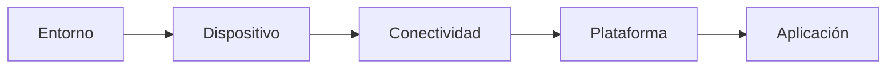

# Dispositivos, conectividad y plataformas IoT

> Este archivo pertenece a: **IoT y conectividad**<br>
> Ruta: `01. Bloques Temáticos/06. IoT y Conectividad/01. Fundamentos de IoT/dispositivos-conectividad-plataformas.md`

---

## Estado

**Estado:** En revisión<br>
**Versión:** v1.0<br>
**Bloque:** 06_iot-conectividad<br>
**Última actualización:** 2026-09-14<br>
**Responsable:** Aylin Salazar Delgado

---

## Descripción

Una solución IoT combina elementos físicos y digitales que cumplen funciones diferentes. Los dispositivos perciben o modifican el entorno, la conectividad permite intercambiar información y las plataformas reciben, organizan, procesan o presentan los datos. Ninguno de estos elementos constituye por sí solo una solución completa.

Este documento explica cómo reconocer y seleccionar sensores, actuadores, dispositivos de procesamiento, tecnologías de comunicación, protocolos, plataformas y aplicaciones. El énfasis se encuentra en comprender la función de cada componente y justificar su elección según la necesidad, no en utilizar la mayor cantidad posible de herramientas.

---

## Propósito

Orientar la selección e integración de los componentes principales de una solución IoT educativa, considerando compatibilidad, alcance, consumo energético, seguridad, mantenimiento y utilidad de los datos.

Al finalizar este tema, se espera que la persona estudiante pueda:

- diferenciar sensores, actuadores, microcontroladores, gateways, plataformas y aplicaciones;
- explicar la función de la conectividad dentro de un sistema IoT;
- distinguir una tecnología de red de un protocolo de aplicación;
- comparar Wi-Fi, Bluetooth, Ethernet y otras opciones según el contexto;
- reconocer las funciones de HTTP, MQTT, API y JSON en un nivel introductorio;
- comparar plataformas educativas según el propósito del proyecto;
- construir una cadena coherente desde el fenómeno físico hasta la interfaz;
- identificar incompatibilidades eléctricas, técnicas y de datos;
- anticipar fallos de sensores, red o plataforma; y
- aplicar prácticas básicas de seguridad y privacidad desde el diseño.

---

## Contenido

### 1. Componentes de una solución IoT

Una solución IoT puede representarse como una cadena de funciones relacionadas:



Cada bloque responde una pregunta distinta:

| Componente | Pregunta que responde | Ejemplo |
| --- | --- | --- |
| Entorno | ¿Qué situación física se desea observar o modificar? | Temperatura de un aula |
| Dispositivo | ¿Qué componente obtiene, procesa o ejecuta información? | Sensor ambiental y ESP32 |
| Conectividad | ¿Cómo llega la información a otro componente? | Red Wi-Fi autorizada |
| Plataforma | ¿Dónde se recibe, almacena o procesa el dato? | Servicio local o en la nube |
| Aplicación | ¿Cómo utiliza una persona el resultado? | Dashboard con gráfico histórico |

En algunos proyectos, varias funciones se encuentran en el mismo equipo. Un ESP32 puede leer un sensor, procesar el dato, conectarse por Wi-Fi y ofrecer una página web local. En otros casos, las responsabilidades se distribuyen entre varios dispositivos y servicios.

### 2. Dispositivos IoT

Un dispositivo IoT es un equipo con capacidad de comunicación que puede incorporar funciones de detección, actuación, procesamiento o almacenamiento. En un proyecto educativo conviene distinguir sus partes, aunque estén montadas en una misma placa.

#### 2.1. Sensores

Los sensores convierten una condición del entorno en una señal que el sistema puede leer. No entregan una representación perfecta de la realidad: poseen rango, resolución, tiempo de respuesta, tolerancia y condiciones de uso.

| Sensor o módulo | Variable observada | Uso educativo posible | Precaución principal |
| --- | --- | --- | --- |
| Temperatura y humedad | Condiciones ambientales | Estación ambiental | Evitar calor directo y comprobar el rango |
| Fotoresistor o sensor de luz | Iluminación aproximada | Comparar zonas o controlar una luz de prueba | Calibrar según el montaje y la luz ambiental |
| Humedad de suelo | Condición aproximada del sustrato | Huerto escolar | Comparar lecturas en el suelo real y evitar corrosión |
| Ultrasónico o distancia | Distancia a una superficie | Nivel de recipiente o presencia de objeto | Considerar ángulo, forma y material del objeto |
| Presencia de agua | Contacto con líquido | Alerta de demostración | Aislar conexiones y trabajar con baja tensión |
| Pulsador o interruptor | Cambio de estado | Solicitud de acción o confirmación local | Tratar rebotes y conexiones inestables |

Antes de seleccionar un sensor se debe preguntar:

- ¿Cuál variable se necesita medir?
- ¿En qué unidad se expresará?
- ¿Cuál rango puede presentarse?
- ¿Qué precisión resulta suficiente para el propósito?
- ¿Con qué frecuencia se necesita la lectura?
- ¿El sensor funciona bajo las condiciones del entorno?
- ¿Cómo se comprobará si la lectura es válida?

Un valor aislado como `58` carece de significado si no se conoce la variable, la unidad, el momento de captura y el origen. El dato debería acompañarse, como mínimo, de un identificador y una marca de tiempo cuando vaya a compararse o almacenarse.

#### 2.2. Actuadores

Los actuadores transforman una instrucción digital en una acción física. Un LED, un buzzer, un servomotor, una bomba, un ventilador y un relé son ejemplos de actuadores.

El microcontrolador entrega señales de control, pero normalmente no puede alimentar directamente motores, bombas u otras cargas. Según el componente, se requiere un controlador, transistor, módulo de potencia, diodo de protección o fuente externa adecuada.

| Actuador | Acción | Consideración de diseño |
| --- | --- | --- |
| LED | Indicador visual | Utilizar resistencia y definir qué significa cada estado |
| Buzzer | Aviso sonoro | Evitar sonidos continuos o innecesarios |
| Servomotor | Movimiento controlado | Usar alimentación suficiente y tierra común cuando corresponda |
| Motor o bomba DC | Movimiento o circulación | Incorporar controlador, límite de tiempo y estado apagado seguro |
| Relé o módulo de conmutación | Activar una carga separada | No trabajar con tensión de red en prácticas estudiantiles |

Todo actuador conectado a una plataforma remota debe tener límites locales. Si la red falla o llega una orden incorrecta, el dispositivo debe conservar un comportamiento seguro.

#### 2.3. Microcontroladores y computadoras de placa única

El dispositivo de procesamiento interpreta las entradas, ejecuta reglas, prepara mensajes y controla salidas.

| Tipo | Características | Uso recomendado |
| --- | --- | --- |
| Microcontrolador | Ejecuta tareas específicas con pocos recursos y bajo consumo | Lectura de sensores, control local y envío periódico de datos |
| Computadora de placa única | Ejecuta un sistema operativo y aplicaciones más complejas | Gateway, servidor local, base de datos o procesamiento avanzado |
| Gateway | Conecta dispositivos o redes diferentes | Reunir datos, convertir protocolos o mantener funciones locales |

El **ESP32** es especialmente útil en actividades IoT porque combina procesamiento, entradas y salidas con opciones de conectividad inalámbrica, según el modelo utilizado. Puede leer sensores, ejecutar validaciones, conectarse a una red y comunicarse con una plataforma.

La familia ESP32 incluye placas con características diferentes. Antes del montaje se debe consultar el modelo exacto, su pinout, voltaje lógico, alimentación disponible y compatibilidad de librerías. Muchas placas ESP32 trabajan con lógica de `3,3 V`; aplicar una señal incompatible puede dañar el dispositivo.

Una placa Arduino sin conectividad integrada también puede participar en una solución IoT si se comunica con un módulo de red, un ESP32 o un gateway. Lo importante es la arquitectura completa, no el nombre de una placa.

#### 2.4. Procesamiento de borde

El procesamiento de borde ocurre cerca del lugar donde se genera el dato. Permite responder rápidamente y mantener funciones básicas aunque no exista Internet.

El dispositivo puede:

- descartar lecturas imposibles;
- calcular promedios;
- detectar un cambio importante;
- reducir la cantidad de mensajes enviados;
- guardar temporalmente datos;
- ejecutar una regla inmediata; y
- llevar el sistema a un estado seguro.

Por ejemplo, una bomba no debe esperar una respuesta de la nube para detenerse después del tiempo máximo permitido. La plataforma puede registrar y visualizar la actividad, pero el límite de seguridad debe permanecer en el dispositivo.

### 3. Compatibilidad entre componentes

Que dos componentes puedan conectarse físicamente no significa que sean compatibles. Antes de construir se deben revisar varios niveles.

| Nivel de compatibilidad | Pregunta de comprobación |
| --- | --- |
| Eléctrico | ¿Voltaje, corriente y alimentación son adecuados? |
| Pines | ¿Los pines seleccionados admiten la función requerida? |
| Comunicación | ¿Ambos componentes utilizan una interfaz compatible? |
| Software | ¿Existe una librería apropiada para la placa y el entorno? |
| Datos | ¿Se comprenden formato, unidad, rango y significado? |
| Mecánico | ¿El sensor puede instalarse en la posición correcta? |
| Ambiental | ¿Funcionará con humedad, polvo, luz o temperatura del lugar? |

La hoja de datos, la documentación del fabricante y el diagrama del proyecto deben consultarse antes de alimentar el circuito.

### 4. Conectividad

La conectividad permite que el dispositivo intercambie información con otro componente. No equivale automáticamente a Internet. Un sistema puede comunicarse dentro de una red local, directamente con un teléfono o mediante un cable sin utilizar servicios externos.

#### 4.1. Comunicación dentro del dispositivo

Sensores, pantallas y módulos suelen comunicarse con el microcontrolador mediante interfaces como:

- **GPIO digital:** estados de encendido y apagado;
- **entrada analógica:** lectura de una señal variable;
- **I2C:** varios dispositivos comparten líneas de comunicación y utilizan direcciones;
- **SPI:** comunicación rápida entre un controlador y periféricos; y
- **UART o serial:** intercambio de datos entre dos equipos.

Estas interfaces conectan componentes cercanos. No sustituyen por sí mismas una red IoT, pero forman parte del recorrido del dato.

#### 4.2. Tecnologías de red

| Tecnología | Alcance habitual | Consumo relativo | Ventaja | Limitación | Uso educativo posible |
| --- | --- | --- | --- | --- | --- |
| Wi-Fi | Aula, edificio o red disponible | Medio o alto | Acceso a red local e Internet con buen volumen de datos | Depende de cobertura, credenciales e infraestructura | ESP32 a dashboard o plataforma |
| Bluetooth o BLE | Distancia corta | Bajo o medio | Comunicación directa con teléfono u otro dispositivo cercano | Alcance y compatibilidad dependen de los equipos | Configuración o control local |
| Ethernet | Limitado por cableado | Medio | Conexión estable y predecible | Requiere cable y adaptador | Gateway o servidor local |
| Red celular | Cobertura del operador | Medio o alto | Funciona lejos de la red escolar | Requiere módulo, plan y administración | Proyecto de campo avanzado |
| LPWAN | Larga distancia y pocos datos | Bajo | Adecuada para mensajes pequeños y dispositivos remotos | Requiere infraestructura o servicio específico | Monitoreo ambiental avanzado |

El alcance real depende de obstáculos, interferencia, antena, potencia, normativa y entorno. Por eso se debe probar la comunicación en el lugar donde funcionará el prototipo.

#### 4.3. Wi-Fi no es lo mismo que Internet

Wi-Fi es una tecnología que permite conectarse a una red inalámbrica. Internet es una red de redes que permite llegar a servicios externos. Un ESP32 puede estar conectado por Wi-Fi a una página local sin tener acceso a Internet.

Esta diferencia permite diseñar actividades más seguras y simples:

- **Red local:** el dispositivo y la interfaz funcionan dentro del aula o makerspace.
- **Internet:** el dispositivo se comunica con una plataforma externa.
- **Modo punto de acceso:** el dispositivo crea una red local para configuración o demostración.

La opción debe elegirse según el propósito y las políticas de la institución.

#### 4.4. Criterios para seleccionar conectividad

La tecnología se selecciona después de definir la necesidad y el flujo de datos.

1. **Distancia:** ¿los componentes están en la misma mesa, edificio o comunidad?
2. **Cantidad de datos:** ¿se envía una temperatura o contenido de mayor tamaño?
3. **Frecuencia:** ¿el mensaje se transmite cada segundo, cada minuto o solo ante un evento?
4. **Energía:** ¿el dispositivo está conectado a una fuente o depende de batería?
5. **Infraestructura:** ¿existe una red autorizada y estable?
6. **Movilidad:** ¿el dispositivo permanece fijo o cambia de lugar?
7. **Costo:** ¿requiere módulos, licencias o planes de datos?
8. **Seguridad:** ¿puede autenticarse y proteger la comunicación?
9. **Mantenimiento:** ¿quién cambiará credenciales o resolverá desconexiones?

### 5. Protocolos, APIs y formatos de datos

La tecnología de red transporta información; el protocolo de aplicación establece cómo se organiza el intercambio entre sistemas.

#### HTTP y HTTPS

HTTP se utiliza para solicitudes y respuestas en servicios web. Por ejemplo, un dispositivo puede enviar una medición a una API. HTTPS añade protección criptográfica durante la comunicación cuando se configura y valida correctamente.

#### MQTT

MQTT utiliza un modelo de publicación y suscripción. Los dispositivos publican mensajes en temas y otros componentes se suscriben a los temas que necesitan. Resulta útil cuando varios dispositivos o aplicaciones intercambian mensajes pequeños.

#### API

Una API define reglas para que un programa solicite o envíe información a otro. La documentación de la API especifica direcciones, métodos, autenticación, parámetros y respuestas.

#### JSON

JSON es un formato textual utilizado para representar datos mediante pares de nombre y valor. Un mensaje puede verse así:

```json
{
  "dispositivo": "aula-01",
  "temperatura_c": 24.6,
  "humedad_pct": 58,
  "estado": "correcto",
  "fecha_hora": "2026-09-14T09:30:00-06:00"
}
```

El formato debe mantenerse consistente. Cambiar `temperatura_c` por `temp` en algunos mensajes o mezclar Celsius y Fahrenheit sin indicarlo provoca errores difíciles de detectar.

| Elemento | Función | Ejemplo |
| --- | --- | --- |
| Red | Transporta la comunicación | Wi-Fi |
| Protocolo | Define el intercambio | HTTP, HTTPS o MQTT |
| API | Expone operaciones y datos | Enviar una medición |
| Formato | Organiza el contenido | JSON |
| Dato | Representa la observación | `temperatura_c: 24.6` |

Los protocolos se desarrollan con mayor detalle en la carpeta [`04. Protocolos de Comunicación`](../04.%20Protocolos%20de%20Comunicaci%C3%B3n/README.md).

### 6. Plataformas IoT

Una plataforma IoT recibe datos de dispositivos y proporciona funciones para utilizarlos. Dependiendo de la herramienta, puede incluir:

- registro e identificación de dispositivos;
- autenticación y administración de credenciales;
- recepción de mensajes;
- validación y transformación de datos;
- almacenamiento histórico;
- reglas y automatizaciones;
- visualización mediante dashboards;
- alertas o notificaciones;
- control de permisos; y
- integración con otras aplicaciones.

Una plataforma no corrige automáticamente un sensor mal instalado, un dato sin unidad ni una arquitectura insegura. Su función debe definirse dentro del proyecto.

#### 6.1. Plataforma local o en la nube

| Aspecto | Plataforma local | Plataforma en la nube |
| --- | --- | --- |
| Acceso | Dentro de la red o equipo configurado | Desde ubicaciones autorizadas con Internet |
| Dependencia | Requiere mantener el equipo local | Requiere conexión y disponibilidad del servicio |
| Control | Mayor control directo sobre configuración y datos | Depende de funciones, políticas y límites del proveedor |
| Escalabilidad | Limitada por el equipo y la administración local | Puede facilitar el crecimiento del proyecto |
| Uso educativo | Demostraciones, privacidad y trabajo sin Internet | Colaboración remota e históricos accesibles |

La decisión no debe reducirse a “local es seguro” o “nube es mejor”. Ambas opciones requieren configuración, mantenimiento, permisos y protección de datos.

#### 6.2. Plataformas presentes en Maker Academy

| Plataforma | Función principal | Uso educativo recomendado | Consideración |
| --- | --- | --- | --- |
| ThingSpeak | Recibir, almacenar, visualizar y analizar series de datos | Gráficos de sensores y comparación histórica | Revisar límites de cuenta, frecuencia y privacidad del canal |
| Blynk | Conectar dispositivos con interfaces web o móviles | Monitoreo y control remoto mediante widgets | Proteger tokens y definir permisos de control |
| Node-RED | Construir flujos para recibir, transformar, automatizar y visualizar datos | Integración local, MQTT, APIs y dashboards | Requiere administrar el entorno donde se ejecuta |

Las funciones, planes y límites de los servicios pueden cambiar. Antes de una actividad, la persona docente debe comprobar la documentación oficial, los requisitos de cuenta, la política de privacidad y las condiciones institucionales.

#### ThingSpeak

Resulta útil para introducir series temporales. Un dispositivo puede enviar mediciones a un canal y el grupo puede observar gráficos históricos. El aprendizaje debe centrarse en el significado, unidad, frecuencia y calidad del dato, no únicamente en lograr que aparezca una línea en pantalla.

#### Blynk

Permite construir interfaces web y móviles para consultar valores y, si el proyecto lo requiere, enviar acciones a un dispositivo. Cuando existe control remoto se deben separar permisos, confirmar el estado real del actuador y establecer límites locales.

#### Node-RED

Utiliza una programación visual basada en flujos. Puede recibir mensajes, transformarlos, aplicar reglas, comunicarse con servicios y presentar información. Puede ejecutarse cerca de los dispositivos o en otra infraestructura. Cada nodo agregado debe tener una función comprensible y documentada.

Las guías específicas se encuentran en [`02. Plataformas y Herramientas`](../02.%20Plataformas%20y%20Herramientas/README.md).

### 7. Dashboards y aplicaciones

El dashboard es una interfaz para interpretar el sistema. No debe limitarse a mostrar números grandes o elementos decorativos.

Una visualización útil indica:

- nombre de la variable;
- unidad de medida;
- dispositivo o ubicación;
- fecha y hora de actualización;
- estado de conexión;
- tendencia o historial cuando sea necesario;
- rango esperado o umbral explicado;
- diferencia entre dato válido, error y ausencia de dato; y
- permisos de la persona usuaria.

Un valor antiguo no debe mostrarse como si fuera actual. Si el dispositivo deja de transmitir, la interfaz debe informar “dato desactualizado” o “sin conexión”.

Cuando la aplicación permite control remoto, debe distinguir entre:

1. **orden enviada:** la aplicación transmitió una solicitud;
2. **orden recibida:** el dispositivo reconoció el mensaje; y
3. **acción confirmada:** el dispositivo informó su estado después de actuar.

Cambiar el color de un botón no demuestra que el actuador respondió.

### 8. Integración de los componentes

La selección debe realizarse en un orden lógico:

1. Definir la necesidad y la persona usuaria.
2. Identificar el fenómeno, dato o acción.
3. Seleccionar sensor o actuador.
4. Elegir el dispositivo de procesamiento.
5. Determinar qué debe ocurrir localmente.
6. Seleccionar conectividad según alcance, datos y energía.
7. Definir protocolo y formato.
8. Elegir plataforma solo si cumple una función necesaria.
9. Diseñar la interfaz y los permisos.
10. Probar fallos, seguridad y mantenimiento.

La siguiente tabla puede utilizarse para documentar decisiones:

| Componente | Selección | Función | Requisito | Riesgo o fallo | Respuesta prevista |
| --- | --- | --- | --- | --- | --- |
| Sensor |  |  |  |  |  |
| Procesamiento |  |  |  |  |  |
| Conectividad |  |  |  |  |  |
| Protocolo |  |  |  |  |  |
| Plataforma |  |  |  |  |  |
| Aplicación |  |  |  |  |  |
| Actuador, si aplica |  |  |  |  |  |

### 9. Ejemplo completo: estación ambiental escolar

Un grupo desea observar la temperatura y la humedad de un aula durante una semana y comparar distintos momentos de la jornada.

| Elemento | Selección inicial | Justificación |
| --- | --- | --- |
| Variable | Temperatura y humedad relativa | Responden a la pregunta definida por el grupo |
| Sensor | Sensor digital ambiental compatible | Entrega ambas variables con una interfaz documentada |
| Dispositivo | ESP32 | Procesa lecturas y ofrece conectividad Wi-Fi |
| Procesamiento local | Validar rangos y calcular promedio | Evita transmitir lecturas claramente inválidas |
| Conectividad | Wi-Fi institucional autorizado | Permite llegar a la plataforma desde el aula |
| Protocolo | HTTP o MQTT | Ambas opciones permiten mensajes pequeños y documentados |
| Formato | Campos con nombre, unidad, estado y fecha | Facilita interpretación y diagnóstico |
| Plataforma | Servicio educativo local o en la nube | Almacena la serie temporal |
| Aplicación | Dashboard | Muestra valores, historial y última actualización |
| Sin conexión | Reintento limitado y registro del periodo faltante | Evita reinicios constantes y datos engañosos |
| Seguridad | Credencial separada del código publicado | Reduce exposición de la cuenta o dispositivo |

#### Recorrido del dato

1. El sensor obtiene una lectura.
2. El ESP32 comprueba que el mensaje esté completo y dentro de un rango posible.
3. El programa agrega identificador y fecha o utiliza la marca de tiempo de la plataforma.
4. El dispositivo se conecta a la red autorizada.
5. El dato se transmite mediante el protocolo elegido.
6. La plataforma valida y almacena la información.
7. El dashboard muestra el valor con unidad y momento de actualización.
8. El grupo interpreta tendencias y reconoce periodos sin información.

Si el sensor falla, el sistema no debe inventar un valor. Si la red falla, el dispositivo no debe bloquear las funciones locales. Si la plataforma no responde, el dashboard debe diferenciar el último dato recibido de una medición actual.

### 10. Fallos frecuentes y respuesta esperada

| Falla | Posible consecuencia | Respuesta recomendada |
| --- | --- | --- |
| Sensor desconectado | Dato nulo, fijo o imposible | Marcar error y evitar decisiones automáticas |
| Alimentación insuficiente | Reinicios o lecturas inestables | Revisar fuente, consumo y conexiones |
| Pin o voltaje incompatible | Mal funcionamiento o daño | Consultar pinout y hoja de datos antes de energizar |
| Wi-Fi no disponible | Pérdida de transmisión | Reintentar con límite y conservar función local |
| Credencial incorrecta | Dispositivo fuera de línea | Reportar el estado sin revelar la clave |
| Formato modificado | Plataforma rechaza o interpreta mal el dato | Validar estructura y mantener nombres consistentes |
| Plataforma no disponible | Sin almacenamiento o visualización | Informar el fallo y conservar datos esenciales si es viable |
| Mensaje repetido | Acción duplicada | Diseñar comandos seguros e identificar mensajes |
| Dashboard desactualizado | Decisión basada en información antigua | Mostrar hora, estado y vigencia del dato |

### 11. Seguridad y privacidad desde la selección

Cada componente amplía las funciones y también la superficie que debe protegerse.

#### Dispositivo

- Cambiar configuraciones predeterminadas inseguras.
- Desactivar servicios que no se utilizan.
- Mantener inventario, versión y responsable.
- Planificar actualizaciones y retiro del prototipo.

#### Red

- Utilizar únicamente redes autorizadas.
- Evitar publicar servicios directamente en Internet.
- Separar los dispositivos de práctica cuando la infraestructura lo permita.
- No mostrar contraseñas durante demostraciones o capturas.

#### Comunicación

- Autenticar dispositivos y servicios.
- Preferir comunicación cifrada cuando la plataforma y el hardware lo permitan.
- Validar mensajes antes de procesarlos.
- Limitar frecuencia, tamaño y acciones aceptadas.

#### Plataforma

- Utilizar el mínimo permiso necesario.
- Mantener canales y dashboards privados cuando corresponda.
- Revocar tokens expuestos o que ya no se usan.
- Definir cuánto tiempo se conservan los datos.

#### Repositorio

- No publicar contraseñas, tokens, certificados ni nombres reales de redes.
- Utilizar valores de ejemplo en el código compartido.
- Excluir los archivos locales que contienen secretos.
- Revisar el historial si una credencial fue publicada y reemplazarla de inmediato.

#### Personas y datos

- Recopilar únicamente la información necesaria.
- Evitar cámaras, audio, ubicación o identificadores personales si otro sensor cumple el propósito.
- Explicar quién puede consultar, controlar o eliminar la información.
- Aplicar las autorizaciones institucionales correspondientes.

### 12. Criterios para comparar dos opciones

No existe un componente universalmente mejor. La selección depende del caso de uso.

| Criterio | Pregunta |
| --- | --- |
| Pertinencia | ¿Cumple una función necesaria? |
| Compatibilidad | ¿Se integra con el resto del sistema? |
| Facilidad de aprendizaje | ¿El grupo puede comprenderlo y utilizarlo con acompañamiento razonable? |
| Disponibilidad | ¿Puede reemplazarse o repetirse la actividad? |
| Energía | ¿La fuente soporta sensores, placa, red y actuadores? |
| Conectividad | ¿Funciona en el lugar y con la infraestructura disponible? |
| Datos | ¿Entrega la precisión, unidad y frecuencia necesarias? |
| Seguridad | ¿Permite autenticación, límites y actualización? |
| Privacidad | ¿Evita recopilar información innecesaria? |
| Mantenimiento | ¿Existe una persona responsable después de la demostración? |
| Costo total | ¿Incluye cuentas, fuentes, módulos, repuestos y tiempo de soporte? |

La comparación debe terminar con una decisión justificada. Completar una tabla sin explicar la elección no demuestra comprensión del sistema.

### 13. Errores comunes

**Confundir sensor con dispositivo completo.** El sensor obtiene una señal; el microcontrolador la procesa y la conectividad permite compartirla.

**Creer que Wi-Fi siempre significa Internet.** Puede existir una red local sin acceso a servicios externos.

**Llamar protocolo a cualquier tecnología.** Wi-Fi y Bluetooth proporcionan conectividad; HTTP y MQTT organizan el intercambio a otro nivel.

**Elegir la plataforma antes de definir los datos.** La herramienta debe responder a una necesidad, no determinarla.

**Alimentar motores desde la placa.** Los actuadores pueden requerir controladores y fuentes externas apropiadas.

**Ignorar las tierras, voltajes o pines.** Una conexión incorrecta puede producir lecturas inestables o dañar componentes.

**Publicar credenciales para facilitar la prueba.** Una clave expuesta debe reemplazarse, incluso si el proyecto es educativo.

**Depender de la nube para una acción segura.** Las funciones esenciales deben tener límites y comportamiento local.

**Mostrar números sin contexto.** Toda medición necesita nombre, unidad, origen y vigencia.

**Seleccionar más componentes de los necesarios.** Cada elemento aumenta puntos de fallo, consumo y mantenimiento.

---

## Aplicación en Maker Academy

Este tema se desarrolla mediante XperiencED Maker. El objetivo no es memorizar catálogos de componentes, sino aprender a seleccionar, combinar, probar y justificar cada parte de una solución.

### Inspiración

La persona docente presenta una necesidad cercana, como observar la humedad de un huerto o registrar la temperatura de un aula. Después muestra tarjetas con sensores, placas, redes, protocolos, plataformas e interfaces.

El grupo responde:

- ¿Cuál componente interactúa con el entorno?
- ¿Dónde se procesa la información?
- ¿Cómo viaja el dato?
- ¿Dónde se almacena?
- ¿Quién utiliza el resultado?
- ¿Qué componente no es necesario?

También se pueden comparar dos propuestas: una con muchos elementos y otra más sencilla. El grupo decide cuál responde mejor a la necesidad.

### Experimentación

Cada equipo recibe o selecciona un caso de uso. Debe construir una cadena funcional mediante tarjetas, diagrama o prototipo sin conexión externa inicial.

La propuesta debe incluir:

1. variable o evento;
2. sensor o entrada;
3. actuador, si se necesita;
4. dispositivo de procesamiento;
5. tarea que permanece en el borde;
6. tecnología de conectividad;
7. protocolo y formato;
8. plataforma;
9. dashboard o aplicación;
10. fuente de alimentación;
11. medida de seguridad; y
12. respuesta ante una falla.

Después, el equipo completa una tabla de compatibilidad y sigue un dato desde el sensor hasta la aplicación. La persona docente introduce cambios como:

- “no hay Internet”;
- “el sensor utiliza otro voltaje”;
- “la plataforma rechaza el mensaje”;
- “el actuador consume más corriente que la placa”;
- “la credencial aparece en GitHub”; o
- “el dashboard muestra un dato de hace dos horas”.

El grupo modifica su diseño y explica la decisión.

### Reflexión

Cada equipo presenta su cadena de componentes y responde:

- ¿Por qué se eligió este sensor?
- ¿Qué hace el ESP32 antes de enviar el dato?
- ¿Por qué se seleccionó esa conectividad?
- ¿Qué función cumple la plataforma?
- ¿Qué dato se decidió no recopilar?
- ¿Qué sigue funcionando sin Internet?
- ¿Cuál componente es el punto más probable de fallo?
- ¿Cómo podría simplificarse la solución?

### Evidencias sugeridas

- Diagrama de componentes y conexiones.
- Tabla de selección y compatibilidad.
- Comparación de dos tecnologías de conectividad.
- Ejemplo de mensaje JSON.
- Boceto de dashboard con estado y fecha.
- Prueba documentada de una falla.
- Justificación escrita de cada componente.
- Lista de credenciales o datos que no deben publicarse.

### Criterios de observación

| Criterio | Evidencia observable |
| --- | --- |
| Función de los componentes | Diferencia sensores, actuadores, procesamiento, red, plataforma y aplicación |
| Selección técnica | Justifica componentes según necesidad, compatibilidad, energía y entorno |
| Flujo de datos | Explica origen, formato, destino y uso de la información |
| Conectividad | Distingue red, Internet y protocolo |
| Manejo de fallos | Propone respuestas para desconexión, dato inválido o falta de plataforma |
| Seguridad y privacidad | Protege credenciales, limita accesos y minimiza datos |
| Comunicación | Otra persona puede interpretar y reproducir la propuesta |

### Ajuste por nivel

- **Primeros niveles:** trabajar con dibujos y roles: objeto que siente, camino del mensaje y persona que recibe la información.
- **Niveles intermedios:** diferenciar sensor, placa, red, plataforma e interfaz; comparar Wi-Fi y Bluetooth mediante situaciones concretas.
- **Niveles avanzados:** analizar compatibilidad eléctrica, consumo, protocolos, formato de datos, borde, nube, autenticación, mantenimiento y escalabilidad.

---

## Recursos relacionados

### Dentro del repositorio

- [`README.md`](README.md)
- [`que-es-iot.md`](que-es-iot.md)
- [`arquitectura-iot.md`](arquitectura-iot.md)
- [`casos-uso-iot.md`](casos-uso-iot.md)
- [`../01. Mapa de Progresión.md`](../01.%20Mapa%20de%20Progresi%C3%B3n.md)
- [`../02. Vocabulario.md`](../02.%20Vocabulario.md)
- [`../03.Seguridad.md`](../03.Seguridad.md)
- [`../04. Alineación con el PNFT.md`](../04.%20Alineaci%C3%B3n%20con%20el%20PNFT.md)
- [`../02. Plataformas y Herramientas/README.md`](../02.%20Plataformas%20y%20Herramientas/README.md)
- [`../03. ESP32/README.md`](../03.%20ESP32/README.md)
- [`../04. Protocolos de Comunicación/README.md`](../04.%20Protocolos%20de%20Comunicaci%C3%B3n/README.md)
- [`../05. Prácticas Guiadas/README.md`](../05.%20Pr%C3%A1cticas%20Guiadas/README.md)

### Fuentes de consulta

- [Espressif - Documentación oficial de ESP32](https://docs.espressif.com/projects/esp-idf/en/latest/esp32/)
- [MathWorks - Documentación de ThingSpeak](https://www.mathworks.com/help/thingspeak/)
- [Blynk - Documentación oficial](https://docs.blynk.io/)
- [Node-RED - Documentación oficial](https://nodered.org/docs/)
- [NISTIR 8228 - Gestión de riesgos de ciberseguridad y privacidad en IoT](https://csrc.nist.gov/pubs/ir/8228/final)

---

## Diagrama con ejemplos ilustrados


---

## Nota docente

No presente las plataformas como punto de partida. Primero defina la necesidad, el dato y el recorrido de la información. Después seleccione la herramienta que cumple la función requerida.

Antes de energizar un circuito, revise con el grupo alimentación, voltajes, pines y consumo. Los proyectos con motores, bombas o relés requieren controladores y fuentes apropiadas. Las prácticas estudiantiles deben mantenerse en baja tensión y no deben intervenir instalaciones eléctricas del edificio.

Cuando se utilicen servicios externos, compruebe previamente las políticas institucionales, requisitos de cuenta, límites vigentes y tratamiento de datos. Utilice datos simulados o una red local cuando permitan lograr el mismo objetivo pedagógico con menor riesgo.

---

## Navegación

[← Arquitectura IoT](arquitectura-iot.md) · [Volver al índice de Fundamentos](README.md) · [Continuar con Casos de uso →](casos-uso-iot.md)
