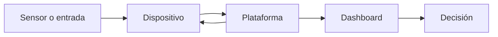

# Plataformas y herramientas para IoT

> Este archivo pertenece a: **IoT y conectividad**  
> Ruta: `01. Bloques Temáticos/06. IoT y Conectividad/02. Plataformas y Herramientas/README.md`

---

## Estado

**Estado:** Listo para revisión final  
**Versión:** v1.0  
**Bloque:** 06_iot-conectividad  
**Última actualización:** 2026-09-21  
**Responsable:** Aylin Salazar Delgado

---

## Descripción

Esta carpeta presenta herramientas que permiten recibir, organizar, visualizar y utilizar los datos producidos por una solución del Internet de las Cosas. El recorrido se concentra en tres plataformas —Blynk, ThingSpeak y Node-RED— y en los principios necesarios para construir dashboards básicos que comuniquen información de manera clara.

La plataforma no es el punto de partida del proyecto. Antes de crear una cuenta o instalar una herramienta, el grupo debe definir la necesidad, la persona usuaria, el dato que se recopilará y la decisión o acción que ese dato permitirá realizar. La herramienta se selecciona después, según la función que debe cumplir dentro del sistema.

Los contenidos están dirigidos a personas docentes y facilitadoras que necesitan introducir plataformas IoT de forma gradual, crítica y segura. Las experiencias pueden desarrollarse con datos simulados antes de conectar sensores reales. Esta estrategia permite comprender el flujo de información, diseñar la interfaz y discutir privacidad sin convertir la actividad en una secuencia de clics.

---

## Propósito

Orientar la selección y el uso educativo de plataformas IoT para que niños, niñas y jóvenes puedan transformar datos de dispositivos en información comprensible, decisiones justificadas y acciones seguras.

Después de trabajar esta carpeta, se espera que la persona estudiante pueda:

- explicar la función de una plataforma dentro de una arquitectura IoT;
- diferenciar monitoreo, visualización, análisis, control y automatización;
- comparar Blynk, ThingSpeak y Node-RED según la necesidad del proyecto;
- organizar variables, unidades, identificadores y marcas de tiempo;
- construir un dashboard básico con jerarquía visual y estados comprensibles;
- reconocer datos actuales, desactualizados, faltantes o inválidos;
- proteger credenciales, tokens y datos personales;
- documentar el recorrido del dato desde el dispositivo hasta la interfaz; y
- justificar por qué una herramienta es adecuada —o innecesaria— para un caso concreto.

---

## Contenido de la carpeta

| Orden | Documento | Pregunta orientadora | Aprendizaje principal |
| ---: | --- | --- | --- |
| 1 | [Blynk](blynk.md) | ¿Cómo crear una interfaz para monitorear y controlar un dispositivo conectado? | Relaciona plantillas, dispositivos, flujos de datos, widgets y eventos |
| 2 | [ThingSpeak](thingspeak.md) | ¿Cómo registrar y analizar mediciones a lo largo del tiempo? | Organiza datos en canales y campos para observar tendencias |
| 3 | [Node-RED](node-red.md) | ¿Cómo integrar fuentes, reglas, transformaciones y salidas mediante flujos? | Construye automatizaciones visuales y comprende el recorrido de los mensajes |
| 4 | [Dashboards básicos](dashboards-basicos.md) | ¿Cómo presentar datos para que una persona pueda interpretarlos y actuar? | Diseña interfaces claras, accesibles y conscientes del estado del sistema |

### 1. Blynk

Blynk se estudia como una plataforma para conectar dispositivos con interfaces web o móviles. Permite introducir el monitoreo en tiempo cercano al real, el control remoto, los eventos y la administración de dispositivos. El contenido enfatiza que una orden enviada desde la interfaz no confirma por sí sola que el actuador haya respondido.

### 2. ThingSpeak

ThingSpeak se utiliza para comprender series temporales. Un canal recibe mediciones organizadas en campos y las presenta mediante gráficos. La experiencia se concentra en la calidad del dato, la frecuencia de actualización, la interpretación de tendencias y la protección de las claves de escritura y lectura.

### 3. Node-RED

Node-RED permite representar la lógica como un flujo de nodos conectados. Resulta útil para recibir mensajes, transformarlos, aplicar condiciones, integrarlos con servicios y enviarlos a una interfaz o actuador. La guía utiliza primero mensajes simulados y luego propone conexiones con HTTP o MQTT.

### 4. Dashboards básicos

El dashboard se aborda como una herramienta de decisión, no como una colección de gráficos. El contenido explica cómo seleccionar indicadores, unidades, rangos, colores, estados de conexión y visualizaciones. También introduce accesibilidad, privacidad y diseño responsable.

---

## ¿Qué función cumple una plataforma IoT?

Una plataforma puede asumir una o varias responsabilidades:

- identificar dispositivos y recibir sus mensajes;
- autenticar conexiones y controlar permisos;
- almacenar datos actuales e históricos;
- transformar o validar mediciones;
- representar valores en tarjetas, indicadores, tablas o gráficos;
- evaluar condiciones y generar eventos;
- enviar instrucciones hacia un dispositivo;
- integrar APIs, bases de datos u otros servicios; y
- conservar registros que ayuden a explicar lo ocurrido.

La plataforma no corrige automáticamente un sensor mal conectado, una unidad incorrecta o un dato sin contexto. Tampoco sustituye los límites de seguridad que deben ejecutarse localmente. Un sistema responsable mantiene en el dispositivo las acciones críticas, como detener un motor o una bomba después del tiempo máximo permitido.

**Propósito pedagógico del diagrama:** representar el recorrido de la información y mostrar que una plataforma puede recibir datos y también enviar instrucciones hacia el dispositivo.

**Descripción alternativa:** un sensor o una entrada entrega información al dispositivo. El dispositivo la envía a la plataforma, la plataforma la presenta en un dashboard y la persona usuaria toma una decisión. Cuando existe control remoto, la plataforma también puede enviar una instrucción de regreso al dispositivo.

La flecha de regreso representa el control remoto. Debe utilizarse únicamente cuando existan permisos, confirmación de estado y un comportamiento seguro si la red falla.

---

## Comparación inicial de herramientas

| Criterio | Blynk | ThingSpeak | Node-RED |
| --- | --- | --- | --- |
| Enfoque principal | Monitoreo y control de dispositivos mediante aplicaciones | Registro, visualización y análisis de series temporales | Integración, transformación y automatización mediante flujos |
| Puesta en marcha | Requiere cuenta, plantilla y dispositivo | Requiere cuenta y canal para proyectos en la nube | Puede instalarse y utilizarse localmente |
| Interfaz | Dashboards web y móviles | Gráficos y visualizaciones de canales | Editor de flujos; dashboard opcional |
| Datos históricos | Sí, según funciones y condiciones del servicio | Es una de sus funciones centrales | Depende de los nodos y del almacenamiento configurado |
| Control remoto | Adecuado para prototipos con límites definidos | No es su objetivo educativo principal | Posible mediante flujos y nodos de entrada/salida |
| Trabajo sin Internet | Limitado cuando se utiliza Blynk Cloud | No para el servicio en la nube | Sí, si se ejecuta en la red local |
| Nivel sugerido | Intermedio | Inicial e intermedio | Intermedio y avanzado |
| Principal precaución | Proteger tokens y verificar el estado real del dispositivo | Proteger claves y respetar frecuencia y privacidad | Proteger el editor, los endpoints y los flujos |

Las funciones, límites, planes y requisitos de servicios externos pueden cambiar. Antes de cada actividad, la persona docente debe consultar la documentación oficial y las políticas institucionales.

---

## Criterios para seleccionar una herramienta

La elección puede realizarse mediante las siguientes preguntas:

1. **Propósito:** ¿se necesita observar, almacenar, controlar, automatizar o integrar?
2. **Persona usuaria:** ¿quién utilizará la interfaz y desde qué dispositivo?
3. **Tipo de dato:** ¿se trata de una lectura periódica, un evento o una orden?
4. **Historial:** ¿se necesita comparar minutos, días o semanas?
5. **Respuesta:** ¿la acción debe ocurrir localmente o puede depender de la red?
6. **Infraestructura:** ¿existe Internet, una red autorizada o un equipo para ejecutar un servicio local?
7. **Cuentas:** ¿la edad del grupo y la política institucional permiten crear cuentas externas?
8. **Privacidad:** ¿el proyecto recopila datos personales, ubicación, imagen, audio o hábitos?
9. **Mantenimiento:** ¿quién administrará credenciales, actualizaciones y respaldos?
10. **Costo y continuidad:** ¿la actividad depende de funciones que podrían cambiar de plan?

Si el objetivo puede alcanzarse con una tabla local o datos simulados, no es obligatorio utilizar un servicio en la nube.

---

## Ruta de aprendizaje sugerida

### Antes de comenzar

El grupo debería comprender la relación `entorno → sensor → dispositivo → conectividad → plataforma → aplicación`, reconocer entradas y salidas y diferenciar una red local de Internet. También resulta útil haber trabajado con variables, condiciones y unidades de medida.

La persona docente prepara un conjunto pequeño de datos simulados. Por ejemplo:

| fecha_hora | dispositivo | temperatura_c | humedad_pct | estado |
| --- | --- | ---: | ---: | --- |
| 2026-09-21 08:00 | aula-01 | 24.3 | 58 | correcto |
| 2026-09-21 08:05 | aula-01 | 24.8 | 57 | correcto |
| 2026-09-21 08:10 | aula-01 | — | — | sin_dato |

Este conjunto permite discutir nombres, unidades, marcas de tiempo y ausencia de datos antes de configurar una plataforma.

### Durante el recorrido

1. Analizar qué información necesita una persona usuaria.
2. Diseñar en papel un dashboard básico.
3. Comparar las tres plataformas mediante la tabla de criterios.
4. Explorar ThingSpeak para observar datos históricos.
5. Explorar Blynk para comprender monitoreo y control.
6. Utilizar Node-RED para representar reglas y transformaciones.
7. Incorporar estados de error, desconexión y dato desactualizado.
8. Revisar privacidad, credenciales y permisos.
9. Justificar la selección final para un caso de uso.

No es necesario utilizar las tres herramientas en un mismo proyecto. La comparación puede realizarse con demostraciones, capturas o datos simulados y luego seleccionar una sola plataforma para el prototipo.

### Producto de cierre

Cada equipo entrega una propuesta de plataforma para una solución IoT educativa. Debe incluir:

- necesidad, contexto y persona usuaria;
- variables con nombre, unidad y frecuencia;
- arquitectura y recorrido del dato;
- herramienta elegida y justificación;
- boceto o prototipo del dashboard;
- regla, alerta o acción asociada a los datos;
- forma de distinguir datos actuales, inválidos y ausentes;
- credenciales requeridas y manera de protegerlas;
- posible fallo de red o plataforma y comportamiento esperado; y
- criterio para determinar si la solución aporta valor.

---

## Aplicación en XperiencED Maker

### Inspiración

Se presenta una situación cercana: un huerto se riega sin conocer la humedad del suelo, un aula necesita observar sus condiciones ambientales o un makerspace desea registrar el uso de una herramienta. El grupo identifica quién necesita información y qué decisión desea tomar.

### Experimentación

Los equipos reciben datos simulados y prueban distintas representaciones. Posteriormente configuran una plataforma, conectan un dispositivo de prueba o construyen un flujo. Durante la experimentación se introducen errores intencionales: datos imposibles, mensajes repetidos, pérdida de conexión o valores sin unidad.

### Reflexión

Cada equipo explica qué mostró la interfaz, qué no pudo demostrar, cuál decisión permitió tomar y qué riesgo apareció. También compara la solución con una alternativa sin conexión y revisa si recopiló únicamente los datos necesarios.

### Evidencias sugeridas

- Matriz de comparación de plataformas.
- Diccionario de variables y unidades.
- Diagrama del recorrido del dato.
- Boceto y versión digital del dashboard.
- Flujo, canal o plantilla documentada.
- Registro de pruebas normales y pruebas de fallo.
- Lista de medidas de seguridad y privacidad.
- Reflexión sobre la utilidad real de la conexión.

---

## Seguridad, privacidad y uso institucional

- No publicar contraseñas, tokens, claves de API ni credenciales Wi-Fi en código, capturas o repositorios.
- Utilizar valores de ejemplo y archivos locales excluidos del control de versiones.
- Evitar cuentas personales del estudiantado cuando la institución no las autorice.
- No recopilar ubicación precisa, imágenes, audio o identificadores personales sin una necesidad legítima y autorización correspondiente.
- Configurar canales, dashboards y dispositivos como privados cuando el proyecto no requiera acceso público.
- Limitar los permisos de control remoto y mantener un apagado seguro local.
- No exponer Node-RED ni otros servicios locales directamente a Internet.
- Eliminar o rotar credenciales utilizadas en demostraciones compartidas.
- Verificar los términos, edades mínimas, planes y políticas de cada servicio antes de iniciar la actividad.

---

## Recursos relacionados

- [`../01. Fundamentos de IoT/README.md`](../01.%20Fundamentos%20de%20IoT/README.md)
- [`../03. ESP32/README.md`](../03.%20ESP32/README.md)
- [`../03.Seguridad.md`](../03.Seguridad.md)
- [`../04. Protocolos de Comunicación/README.md`](../04.%20Protocolos%20de%20Comunicaci%C3%B3n/README.md)
- [`../05. Prácticas Guiadas/README.md`](../05.%20Pr%C3%A1cticas%20Guiadas/README.md)
- [Documentación oficial de Blynk](https://docs.blynk.io/en)
- [Documentación oficial de ThingSpeak](https://www.mathworks.com/help/thingspeak/)
- [Documentación oficial de Node-RED](https://nodered.org/docs/)
- [Documentación de FlowFuse Dashboard](https://dashboard.flowfuse.com/)

---

## Nota docente

La meta de esta carpeta no es dominar todas las opciones de una plataforma. La evidencia principal es que el grupo pueda explicar qué ocurre con el dato, por qué se presenta de determinada forma, qué decisión permite tomar y cómo se protege el sistema.

Conviene preparar una alternativa con datos simulados para los casos en que una cuenta, la red institucional o un servicio externo no estén disponibles. La comprensión del sistema debe poder evaluarse aun cuando la plataforma no responda.
