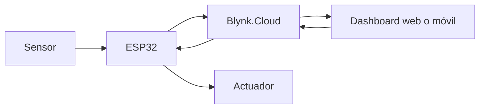

# Blynk: monitoreo y control de dispositivos IoT

> Este archivo pertenece a: **Plataformas y herramientas para IoT**  
> Ruta: `01. Bloques Temáticos/06. IoT y Conectividad/02. Plataformas y Herramientas/blynk.md`

---

## Estado

**Estado:** Listo para revisión final  
**Versión:** v1.0  
**Bloque:** 06_iot-conectividad  
**Última actualización:** 2026-09-21  
**Responsable:** Aylin Salazar

---

## Descripción

Blynk es una plataforma de software para conectar dispositivos electrónicos con servicios en la nube e interfaces web o móviles. En una experiencia educativa permite observar datos, organizar dispositivos, construir dashboards, enviar instrucciones y generar eventos sin desarrollar desde cero toda la infraestructura de una aplicación IoT.

La herramienta resulta apropiada para prototipos en los que una persona necesita consultar el estado de un dispositivo o ejecutar una acción remota. Su uso debe acompañarse de límites locales, protección de credenciales y confirmación del estado real. Presionar un botón en la aplicación demuestra que se envió una orden; no demuestra que el actuador respondió.

---

## Propósito

Comprender cómo una plataforma relaciona dispositivos, variables e interfaces para crear una experiencia de monitoreo y control remoto responsable.

Al finalizar este tema, se espera que la persona estudiante pueda:

- explicar la función de Blynk dentro de una arquitectura IoT;
- diferenciar plantilla, dispositivo, datastream, widget y evento;
- representar el recorrido de un dato desde el ESP32 hasta una interfaz;
- configurar variables con nombre, tipo, unidad y rango coherentes;
- enviar una medición y recibir una orden mediante pines virtuales;
- reconocer la diferencia entre orden enviada y estado confirmado;
- proteger el token de autenticación y las credenciales de red; y
- probar el sistema ante pérdida de conexión o datos inválidos.

---

## Contenido

### 1. ¿Qué es Blynk?

Blynk integra varios componentes:

- **Blynk.Cloud:** infraestructura que comunica dispositivos, datos y aplicaciones.
- **Blynk.Console:** aplicación web para administrar plantillas, dispositivos, datos, usuarios y dashboards.
- **Blynk.Apps:** aplicaciones móviles para monitorear, controlar y configurar interfaces.
- **Blynk Library:** biblioteca que facilita la comunicación de placas compatibles con la plataforma.
- **Blynk.Edgent:** conjunto de funciones para aprovisionamiento, administración de conectividad y otras capacidades en hardware compatible.

Para una primera experiencia con ESP32, el foco puede mantenerse en la consola, la biblioteca, una plantilla, un dispositivo y dos datastreams.



**Propósito pedagógico del diagrama:** explicar el recorrido bidireccional de los datos en una solución con Blynk y diferenciar el monitoreo del control remoto.

**Descripción alternativa:** el sensor entrega una lectura al ESP32, que la envía a Blynk.Cloud. La plataforma actualiza el dashboard web o móvil. Cuando una persona utiliza un control, la instrucción viaja desde el dashboard hacia Blynk.Cloud y luego al ESP32, que controla el actuador y debe informar su estado real.

### 2. Conceptos principales

| Concepto | Función | Ejemplo educativo |
| --- | --- | --- |
| Plantilla | Define la estructura común de un tipo de dispositivo | Estación ambiental escolar |
| Dispositivo | Representa una unidad concreta conectada | Estación del aula 8A |
| Datastream | Canal lógico por el que circula una variable | Temperatura en `V0` |
| Pin virtual | Identificador lógico utilizado por el programa y la interfaz | `V0`, `V1`, `V2` |
| Widget | Elemento visual o de interacción | Valor, gráfico, interruptor |
| Evento | Situación significativa que la plataforma puede registrar o comunicar | Temperatura fuera del rango acordado |
| Dashboard | Organización de widgets para una persona usuaria | Panel del aula |

Un pin virtual no es un pin físico del ESP32. Es una referencia lógica que conecta el código con un datastream. El programa decide qué dato enviar o qué acción ejecutar cuando cambia ese valor.

### 3. Diseño antes de configurar

Antes de abrir la plataforma, el equipo completa una tabla como la siguiente:

| Variable | Pin virtual | Tipo | Unidad | Rango educativo | Dirección |
| --- | --- | --- | --- | --- | --- |
| Temperatura | `V0` | decimal | °C | 0 a 50 | dispositivo → plataforma |
| Humedad | `V1` | decimal | % | 0 a 100 | dispositivo → plataforma |
| Luz de prueba | `V2` | entero | 0/1 | 0 o 1 | plataforma → dispositivo |
| Estado real de la luz | `V3` | entero | 0/1 | 0 o 1 | dispositivo → plataforma |

Separar la orden (`V2`) del estado confirmado (`V3`) evita que la interfaz presente una suposición como si fuera una evidencia.

### 4. Secuencia de configuración

Las etiquetas exactas de la interfaz pueden cambiar. La secuencia conceptual se mantiene:

1. Crear o utilizar una cuenta autorizada por la institución.
2. Activar el modo de desarrollo cuando la plataforma lo solicite.
3. Crear una plantilla con nombre, placa y tipo de conexión coherentes.
4. Crear los datastreams definidos en el diseño.
5. Crear un dispositivo a partir de la plantilla.
6. Agregar widgets y asociarlos con los datastreams.
7. Preparar el programa del ESP32 con la biblioteca correspondiente.
8. Mantener el token y las credenciales fuera del repositorio.
9. Probar primero con valores simulados.
10. Conectar el sensor o actuador y repetir las pruebas.

No deben utilizarse cuentas personales de menores ni recopilarse datos personales sin autorización institucional.

### 5. Programa de referencia para ESP32

El siguiente ejemplo muestra la estructura de una prueba con temperatura simulada y un LED. Los valores sensibles son marcadores y nunca deben reemplazarse dentro de un archivo que será publicado.

```cpp
#define BLYNK_TEMPLATE_ID "TU_TEMPLATE_ID"
#define BLYNK_TEMPLATE_NAME "EstacionAula"
#define BLYNK_AUTH_TOKEN "TU_TOKEN_PRIVADO"

#include <WiFi.h>
#include <BlynkSimpleEsp32.h>

char ssid[] = "TU_RED_WIFI";
char pass[] = "TU_CLAVE_WIFI";

const int PIN_LED = 2;
BlynkTimer temporizador;

void enviarDatos() {
  float temperaturaC = 24.5;  // Sustituir por una lectura validada
  Blynk.virtualWrite(V0, temperaturaC);
}

BLYNK_WRITE(V2) {
  int orden = param.asInt();
  digitalWrite(PIN_LED, orden ? HIGH : LOW);

  int estadoReal = digitalRead(PIN_LED);
  Blynk.virtualWrite(V3, estadoReal);
}

void setup() {
  Serial.begin(115200);
  pinMode(PIN_LED, OUTPUT);
  digitalWrite(PIN_LED, LOW);

  Blynk.begin(BLYNK_AUTH_TOKEN, ssid, pass);
  temporizador.setInterval(5000L, enviarDatos);
}

void loop() {
  Blynk.run();
  temporizador.run();
}
```

#### Aspectos que deben comprenderse

- `Blynk.run()` mantiene la comunicación y debe ejecutarse con frecuencia.
- El temporizador evita bloquear el programa con esperas largas.
- `virtualWrite` envía un valor hacia un datastream.
- `BLYNK_WRITE` atiende un cambio recibido desde la plataforma.
- La lectura de un sensor debe validarse antes de enviarse.
- Un actuador real puede necesitar fuente externa, controlador y protección; no debe alimentarse directamente desde un pin si supera sus límites.

El ejemplo utiliza el LED únicamente como carga segura de demostración. Motores, bombas y cargas de mayor potencia requieren diseño eléctrico adicional.

### 6. Credenciales fuera del código publicado

Para una práctica local puede utilizarse un archivo `secrets.h` que no se suba al repositorio:

```cpp
// secrets.h — archivo local, no publicar
#define BLYNK_AUTH_TOKEN "valor_real"
#define WIFI_SSID "valor_real"
#define WIFI_PASSWORD "valor_real"
```

El archivo público puede incluir `secrets.example.h` con marcadores:

```cpp
// secrets.example.h — sí puede publicarse
#define BLYNK_AUTH_TOKEN "REEMPLAZAR_LOCALMENTE"
#define WIFI_SSID "REEMPLAZAR_LOCALMENTE"
#define WIFI_PASSWORD "REEMPLAZAR_LOCALMENTE"
```

Si un token se publica accidentalmente, debe considerarse comprometido y reemplazarse desde la plataforma.

### 7. Diseño del dashboard

Para una estación ambiental básica se recomienda comenzar con pocos elementos:

- una tarjeta con la temperatura actual y su unidad;
- una tarjeta con la humedad actual;
- un gráfico histórico con período visible;
- un indicador de última actualización;
- un estado de conexión;
- un control para el LED de prueba; y
- un indicador separado con el estado confirmado del LED.

Los colores no deben ser la única forma de comunicar un estado. Un aviso puede combinar texto, símbolo y color: `Advertencia: temperatura alta`.

### 8. Monitoreo, control y automatización

| Función | Ejemplo | Precaución |
| --- | --- | --- |
| Monitoreo | Mostrar temperatura | Indicar unidad y actualidad del dato |
| Control | Solicitar el encendido de un LED | Confirmar el estado informado por el dispositivo |
| Evento | Registrar una temperatura fuera del rango | Definir el propósito del umbral |
| Automatización | Ejecutar una acción ante una condición | Mantener límites de seguridad locales |

Una condición educativa como `temperatura > 30 °C` no debe presentarse como recomendación de salud o norma universal. El umbral debe explicarse dentro del propósito de la práctica.

### 9. Pruebas necesarias

| Prueba | Acción | Resultado esperado |
| --- | --- | --- |
| Dato normal | Enviar un valor dentro del rango | Se muestra con unidad y hora |
| Dato imposible | Enviar un valor fuera del rango físico esperado | Se rechaza o marca como inválido |
| Desconexión | Apagar o desconectar el ESP32 | La interfaz no presenta el último valor como actual |
| Reconexión | Restaurar la red | El dispositivo recupera la comunicación sin activar salidas peligrosas |
| Orden remota | Cambiar el control del LED | La orden y el estado confirmado pueden distinguirse |
| Reinicio | Reiniciar el ESP32 | El actuador inicia en un estado seguro |

### 10. Problemas frecuentes

| Síntoma | Posible causa | Comprobación |
| --- | --- | --- |
| Dispositivo fuera de línea | Red, token o plantilla incorrectos | Revisar monitor serial y datos del dispositivo |
| Widget sin datos | Datastream o pin virtual no coincide | Comparar tabla de variables, código y configuración |
| Valores sin sentido | Tipo, unidad o rango incorrectos | Validar el dato antes de enviarlo |
| Interfaz cambia pero LED no responde | Solo se actualizó el widget | Revisar recepción, cableado y estado confirmado |
| Programa se desconecta | Uso de bloqueos o intervalos inadecuados | Evitar esperas largas y revisar la lógica del ciclo |
| Token expuesto | Se incluyó en código o captura | Revocarlo o reemplazarlo y retirar la evidencia pública |

---

## Aplicación en Maker Academy

### Reto

Diseñar una interfaz que permita observar una condición de un aula y controlar únicamente un LED de prueba. La interfaz debe demostrar cuándo recibió el último dato y confirmar el estado real del LED.

### Inspiración

El grupo compara dos pantallas: una con números sin contexto y otra con nombre, unidad, hora y estado. Luego responde: ¿cuál permite tomar una decisión y por qué?

### Experimentación

1. Definir la persona usuaria y la decisión que necesita tomar.
2. Completar el diccionario de datastreams.
3. Dibujar el dashboard.
4. Crear plantilla, dispositivo y variables.
5. Probar con temperatura simulada.
6. Añadir el LED de prueba.
7. Separar orden y estado confirmado.
8. Ejecutar las pruebas de desconexión y reinicio.

### Reflexión

- ¿Qué evidencia muestra que el dispositivo ejecutó una acción?
- ¿Cómo sabe la persona usuaria si el dato está actualizado?
- ¿Qué ocurriría si otra persona obtiene el token?
- ¿Cuál acción debe permanecer local aunque la plataforma falle?
- ¿Blynk aporta valor a este caso o bastaría una interfaz local?

---

## Evaluación sugerida

| Criterio | Evidencia esperada |
| --- | --- |
| Arquitectura | Diagrama coherente entre sensor, ESP32, nube e interfaz |
| Datos | Variables con nombre, tipo, unidad, rango y dirección |
| Funcionamiento | Envío de dato y recepción de orden verificables |
| Interfaz | Información legible, actual y contextualizada |
| Seguridad | Token y credenciales ausentes del repositorio |
| Confiabilidad | Pruebas de desconexión, reinicio y dato inválido |
| Argumentación | Explicación del valor y las limitaciones de la herramienta |

---

## Recursos relacionados

- [Introducción oficial de Blynk](https://docs.blynk.io/en)
- [Quickstart oficial de Blynk](https://docs.blynk.io/en/getting-started/what-do-i-need-to-blynk)
- [`README.md`](README.md)
- [`dashboards-basicos.md`](dashboards-basicos.md)
- [`../03.Seguridad.md`](../03.Seguridad.md)
- [`../03. ESP32/README.md`](../03.%20ESP32/README.md)

---

## Nota docente

Las funciones y los planes de Blynk pueden cambiar. Revise la documentación oficial antes de preparar capturas o instrucciones basadas en la interfaz. La evaluación debe centrarse en el recorrido del dato, la coherencia de las variables, la protección de credenciales y la interpretación del estado, no en memorizar la ubicación de botones.

Si no es posible utilizar cuentas externas, la actividad puede realizarse mediante tarjetas que representen plantillas, dispositivos, datastreams y widgets. El aprendizaje conceptual no debe depender de la disponibilidad del servicio.
