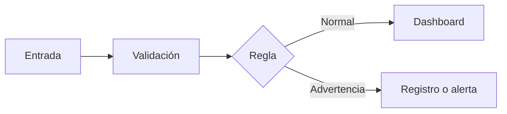

# Node-RED: integración y automatización mediante flujos

> Este archivo pertenece a: **Plataformas y herramientas para IoT**  
> Ruta: `01. Bloques Temáticos/06. IoT y Conectividad/02. Plataformas y Herramientas/node-red.md`

---

## Estado

**Estado:** En revisión  
**Versión:** v1.0  
**Bloque:** 06_iot-conectividad  
**Última actualización:** 2026-09-21  
**Responsable:** Aylin Salazar Delgado 

---

## Descripción

Node-RED es una herramienta de programación basada en flujos para aplicaciones orientadas a eventos. Su editor se ejecuta en el navegador y permite conectar nodos que reciben, transforman, evalúan y envían mensajes. Puede utilizarse en una computadora, una Raspberry Pi, un servidor o infraestructura administrada.

En educación, Node-RED ayuda a hacer visible el recorrido de los datos para niños, niñas y jóvenes. Cada conexión representa un paso: una entrada produce un mensaje, una regla lo valida, una condición determina una ruta y una salida muestra, almacena o comunica el resultado.

Node-RED no elimina la necesidad de comprender la lógica. Un flujo con muchos nodos puede ser tan difícil de mantener como un programa desordenado. Los nombres, comentarios, pruebas y medidas de seguridad forman parte del aprendizaje continuo en la apropiación tecnológica.

---

## Propósito

Representar e implementar procesos IoT mediante flujos visuales que integren datos, reglas y salidas de forma comprensible, verificable y segura para el estudiantado.

Al finalizar este tema, se espera que el estudiantado pueda:

- explicar los conceptos de nodo, mensaje, conexión, flujo y despliegue;
- construir un flujo básico con entrada, procesamiento y salida;
- utilizar `msg.payload` y otras propiedades de un mensaje;
- validar datos antes de visualizarlos o utilizarlos;
- dirigir mensajes mediante condiciones;
- diferenciar el editor, el runtime y un dashboard;
- importar y exportar flujos sin exponer credenciales;
- identificar el riesgo de exponer el editor o endpoints sin protección; y
- documentar y probar un flujo ante datos inválidos o ausencia de conexión.

---

## Aplicación en Maker Academy

Node-RED se utiliza principalmente en los proyectos tecnológicos de III Ciclo y Educación Diversificada para facilitar la comprensión de las arquitecturas de Internet de las Cosas (IoT). Permite al estudiantado —niños, niñas y jóvenes— estructurar visualmente la lógica detrás de sus soluciones y prototipos, conectando las lecturas físicas de componentes, como microcontroladores ESP32, con interfaces, bases de datos o automatizaciones.

Favorece el eje de Pensamiento Computacional, ya que hace evidente la entrada, el procesamiento, la validación y la salida de información, apoyando la experimentación guiada y la reflexión sobre la calidad de los datos en escenarios del mundo real.

---

## Contenido

### 1. Modelo de flujo

Un flujo representa una secuencia de eventos y transformaciones.



La entrada puede provenir de un botón de prueba, un sensor, MQTT, una solicitud HTTP o un archivo. La salida puede ser el panel de depuración, un dashboard, una API, una base de datos o un mensaje hacia otro dispositivo.

### 2. Conceptos principales

| Concepto | Significado | Ejemplo |
| --- | --- | --- |
| Nodo | Unidad que realiza una función | Recibir MQTT, cambiar un valor, mostrar depuración |
| Conexión | Ruta por la que circula un mensaje | Salida de `inject` hacia `function` |
| Mensaje | Objeto que transporta datos y metadatos | `msg.payload = 24.5` |
| Flujo | Conjunto de nodos conectados en una pestaña | Procesamiento de una estación ambiental |
| Runtime | Proceso que ejecuta los flujos desplegados | Node-RED en una computadora local |
| Deploy | Acción que aplica los cambios al runtime | Activar una nueva regla |
| Nodo de configuración | Configuración compartida por otros nodos | Servidor MQTT |

El mensaje es un objeto de JavaScript. La propiedad más utilizada es `msg.payload`, pero pueden existir otras propiedades como `msg.topic`, `msg.device_id` o `msg.timestamp`.

### 3. Nodos iniciales

| Nodo | Uso educativo |
| --- | --- |
| `inject` | Generar un dato o evento de prueba |
| `debug` | Observar el mensaje sin construir una interfaz |
| `change` | Crear, copiar, mover o modificar propiedades |
| `switch` | Dirigir mensajes según una condición |
| `function` | Aplicar lógica en JavaScript cuando los nodos básicos no bastan |
| `delay` | Limitar frecuencia o introducir una espera controlada |
| `catch` | Capturar errores generados por nodos |
| `status` | Observar cambios de estado de otros nodos |
| `mqtt in/out` | Recibir o publicar mensajes MQTT |
| `http in/response` | Construir un endpoint HTTP controlado |
| `http request` | Consultar un servicio externo autorizado |

Se recomienda resolver primero con nodos básicos. El nodo `function` debe utilizarse cuando la lógica lo justifique y siempre con comentarios claros.

### 4. Primer flujo con datos simulados

La primera experiencia no necesita sensores ni Internet:

1. Arrastrar un nodo `inject`.
2. Configurarlo con un número, por ejemplo `24.5`.
3. Conectarlo a un nodo `debug`.
4. Desplegar el flujo.
5. Activar el nodo de entrada.
6. Observar `msg.payload` en el panel de depuración.

Después se añade un nodo `function` para validar y estructurar el dato:

```javascript
const temperaturaC = Number(msg.payload);

if (!Number.isFinite(temperaturaC)) {
    node.warn("La temperatura no es numérica");
    return null;
}

if (temperaturaC < 0 || temperaturaC > 50) {
    node.warn("Temperatura fuera del rango del prototipo");
    return null;
}

msg.payload = {
    dispositivo: "aula-01",
    temperatura_c: temperaturaC,
    fecha_hora: new Date().toISOString(),
    estado: "correcto"
};

return msg;
```

`return null` detiene ese mensaje cuando no cumple los criterios. El aviso explica lo ocurrido sin convertir un dato inválido en una medición legítima.

### 5. Flujo importable de ejemplo

El siguiente flujo contiene una entrada numérica, una validación y una salida de depuración. Antes de importarlo, el grupo debe leerlo y explicar cada nodo.

```json
[
  {
    "id": "entrada-temperatura",
    "type": "inject",
    "z": "flujo-aula",
    "name": "Temperatura simulada",
    "props": [
      {
        "p": "payload"
      }
    ],
    "payload": "24.5",
    "payloadType": "num",
    "x": 170,
    "y": 120,
    "wires": [
      [
        "validar-temperatura"
      ]
    ]
  },
  {
    "id": "validar-temperatura",
    "type": "function",
    "z": "flujo-aula",
    "name": "Validar y dar contexto",
    "func": "const valor = Number(msg.payload);\nif (!Number.isFinite(valor) || valor < 0 || valor > 50) {\n    node.warn(\"Dato inválido\");\n    return null;\n}\nmsg.payload = {\n    dispositivo: \"aula-01\",\n    temperatura_c: valor,\n    fecha_hora: new Date().toISOString(),\n    estado: \"correcto\"\n};\nreturn msg;",
    "outputs": 1,
    "x": 420,
    "y": 120,
    "wires": [
      [
        "ver-mensaje"
      ]
    ]
  },
  {
    "id": "ver-mensaje",
    "type": "debug",
    "z": "flujo-aula",
    "name": "Mensaje validado",
    "active": true,
    "complete": "payload",
    "targetType": "msg",
    "x": 680,
    "y": 120,
    "wires": []
  }
]
```

No deben importarse flujos de fuentes desconocidas sin revisarlos. Un flujo puede incluir solicitudes externas, escritura de archivos, comandos o nodos adicionales con efectos no evidentes que afecten la seguridad de la red.

### 6. Reglas con el nodo `switch`

Después de estructurar el mensaje, un nodo `switch` puede comparar `msg.payload.temperatura_c`:

- salida 1: valor menor o igual al umbral educativo;
- salida 2: valor mayor al umbral; y
- salida 3: valor ausente o no reconocido.

Las rutas deben nombrarse por su significado. `normal`, `advertencia` y `dato_invalido` resultan más claros que `salida 1`, `salida 2` y `salida 3`.

Una advertencia no debe activar automáticamente un equipo de potencia durante una práctica. Primero puede enviarse a un nodo `debug`, una tarjeta visual o un LED de baja potencia para resguardar la seguridad del estudiantado.

### 7. Integración con MQTT

Un flujo IoT frecuente utiliza MQTT:

```text
mqtt in → json → validación → switch → dashboard o registro
```

Ejemplo de tema:

```text
makeracademy/aula-01/ambiente
```

Ejemplo de mensaje:

```json
{
  "temperatura_c": 24.5,
  "humedad_pct": 58,
  "estado": "correcto"
}
```

La configuración del broker debe mantenerse en un nodo de configuración. Las credenciales no deben incluirse en el JSON exportado ni en capturas. El uso de MQTT se desarrolla con mayor profundidad en la carpeta de protocolos.

### 8. Integración con HTTP

Node-RED puede recibir solicitudes mediante `http in` y responder con `http response`. También puede consultar servicios mediante `http request`.

Antes de crear un endpoint se debe definir:

- método y ruta;
- datos aceptados;
- validación;
- autenticación;
- límite de frecuencia;
- respuesta normal y respuesta de error; y
- información que se registrará.

Un endpoint de prueba dentro de una red local no debe exponerse directamente a Internet. La ausencia de una dirección pública no sustituye la seguridad.

### 9. Dashboards con Node-RED

El paquete original `node-red-dashboard` está deprecado. Para proyectos nuevos, la documentación actual orienta hacia **FlowFuse Dashboard**, también llamado Node-RED Dashboard 2.0, disponible como:

```text
@flowfuse/node-red-dashboard
```

Su jerarquía básica incluye:

1. **Base:** ruta general del dashboard.
2. **Page:** página navegable.
3. **Group:** conjunto de widgets.
4. **Widget:** componente como texto, gráfico, indicador o botón.

Los nodos adicionales deben instalarse únicamente desde fuentes confiables y con autorización sobre el equipo. Antes de una clase, el personal docente debe verificar compatibilidad, versión y mantenimiento del paquete.

### 10. Estado y contexto

Node-RED permite guardar información mediante contexto de nodo, flujo o ámbito global. Esto puede utilizarse para conservar el último valor o calcular cambios.

El contexto no debe asumirse como almacenamiento permanente. La persistencia depende de la configuración y el reinicio puede eliminar datos. Para históricos importantes se debe utilizar un almacenamiento apropiado y documentado.

### 11. Organización del flujo

Un flujo comprensible incluye:

- nombres que describen funciones;
- comentarios que explican decisiones;
- conexiones con dirección lógica;
- grupos para procesos relacionados;
- manejo explícito de errores;
- entradas de prueba;
- separación entre datos, reglas y salidas; y
- ausencia de credenciales en propiedades exportables.

Evite conexiones que crucen todo el lienzo o nodos sin nombre. Si el flujo crece, puede dividirse en pestañas, subflujos o componentes con interfaces claras.

### 12. Seguridad

La documentación oficial advierte que el editor de Node-RED no está protegido por defecto. Cualquier persona que alcance su dirección podría acceder y desplegar cambios si no se configura seguridad.

Prácticas mínimas de ciudadanía y ética digital:

- ejecutar la primera experiencia en un equipo y red confiables;
- no redirigir el puerto del editor hacia Internet;
- configurar autenticación antes de compartir el acceso;
- utilizar HTTPS cuando corresponda;
- proteger los endpoints y dashboards;
- revisar nodos adicionales antes de instalarlos;
- evitar credenciales dentro de nodos exportados;
- mantener copias de respaldo de los flujos; y
- limitar permisos del sistema operativo y de los servicios utilizados.

### 13. Pruebas del flujo

| Prueba | Entrada | Resultado esperado |
| --- | --- | --- |
| Normal | `24.5` | Mensaje estructurado en salida normal |
| Límite | `50` | Se acepta si el rango lo incluye |
| Fuera de rango | `80` | Se rechaza y genera advertencia |
| Texto inesperado | `hola` | No continúa como medición |
| Propiedad ausente | Mensaje sin `payload` | Se maneja como error |
| Mensajes rápidos | Varias entradas por segundo | Se aplica límite si la salida lo necesita |
| Servicio desconectado | Broker o API no disponible | Se informa el estado sin perder seguridad local |

### 14. Problemas frecuentes

| Síntoma | Posible causa | Comprobación |
| --- | --- | --- |
| No se observa el mensaje | Flujo sin desplegar o conexión incorrecta | Revisar Deploy, cables y nodo `debug` |
| `undefined` | Ruta de propiedad incorrecta | Inspeccionar el mensaje completo |
| Mensaje tratado como texto | Tipo de dato o JSON no convertido | Revisar tipo y nodo `json` |
| Flujo se ejecuta muchas veces | Entrada repetida o ciclo accidental | Identificar origen y limitar frecuencia |
| Dashboard vacío | Widget, grupo o propiedad incorrectos | Probar primero con `debug` |
| Editor accesible sin inicio de sesión | Seguridad no configurada | Detener exposición y aplicar la guía oficial |

---

## Experiencia de aprendizaje sugerida

### Reto

Construir un flujo que reciba una temperatura simulada, rechace valores inválidos, clasifique el estado y presente el resultado en depuración o un dashboard local.

### Inspiración

El grupo representa físicamente el flujo: un estudiante entrega una tarjeta con un valor, otro la valida, un tercero aplica una condición lógica y un cuarto muestra el resultado al resto. Después, se traduce cada rol a un nodo virtual en la plataforma.

### Experimentación

1. Crear un flujo simple `inject → debug`.
2. Inspeccionar el mensaje completo y sus propiedades.
3. Añadir un proceso de validación.
4. Añadir rutas condicionadas con el nodo `switch`.
5. Probar qué sucede con valores normales y valores erróneos.
6. Incorporar un dashboard básico o una salida simulada segura.
7. Documentar la función de cada nodo elegido.
8. Exportar el flujo y revisar minuciosamente que no contenga claves secretas.

### Reflexión

- ¿En qué momento y nodo se valida el dato?
- ¿Qué ruta lógica sigue un valor inválido y cómo se reporta?
- ¿Qué parte de este proceso debe continuar funcionando si Internet falla en el aula?
- ¿Qué información revela el flujo que acabamos de exportar?
- ¿Consideran que esta representación visual facilita comprender lo que hace el código interno?

---

## Evaluación sugerida

| Criterio | Evidencia esperada |
| --- | --- |
| Flujo y progresión | Secuencia clara de entrada, validación, regla y salida. |
| Gestión de mensajes | Uso coherente de propiedades y tipos de variables. |
| Validación de datos | Los datos inválidos se detectan y no se presentan como lecturas legítimas. |
| Iteración y pruebas | Casos normales, casos límite y errores debidamente documentados. |
| Legibilidad y documentación | Nodos nombrados, comentados y organizados para fácil lectura. |
| Seguridad y privacidad | Editor no expuesto públicamente y credenciales ausentes del documento exportado. |
| Comunicación | El equipo estudiantil puede explicar de manera verbal el recorrido completo de un mensaje. |

---

## Recursos relacionados

- [Documentación oficial de Node-RED](https://nodered.org/docs/)
- [Guía oficial de seguridad de Node-RED](https://nodered.org/docs/user-guide/runtime/securing-node-red)
- [Documentación de FlowFuse Dashboard](https://dashboard.flowfuse.com/)
- [Inicio de FlowFuse Dashboard](https://dashboard.flowfuse.com/getting-started.html)
- [`README.md`](README.md)
- [`dashboards-basicos.md`](dashboards-basicos.md)
- [`../04. Protocolos de Comunicación/README.md`](../04.%20Protocolos%20de%20Comunicaci%C3%B3n/README.md)

---

## Nota docente

Las interfaces, límites y paquetes adicionales de Node-RED pueden cambiar con el tiempo. El personal docente siempre debe verificar la documentación oficial más reciente antes de preparar capturas o instrucciones basadas en esta herramienta.

Inicie las experiencias de aprendizaje siempre con los nodos `inject` y `debug`. Cuando los niños, niñas y jóvenes comprenden la estructura del mensaje (`msg`), resulta significativamente más sencillo incorporar sensores físicos, protocolos MQTT, HTTP o dashboards. Esta secuencia progresiva también permite evaluar la lógica y la calidad del dato sin depender exclusivamente de componentes de hardware o conectividad constante.

Prepare el entorno tecnológico antes de la sesión presencial y verifique las versiones instaladas de Node.js, Node-RED y paquetes extra. No solicite al estudiantado instalar paquetes o exponer servicios de red sin supervisión y autorización institucional.
