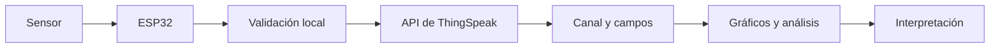

# ThingSpeak: registro y análisis de datos IoT

> Este archivo pertenece a: **IoT y Conectividad**  
> Ruta: `01. Bloques Temáticos/06. IoT y Conectividad/02. Plataformas y Herramientas/thingspeak.md`

---

## Estado

**Estado:** Listo para revisión final  
**Versión:** v1.0  
**Bloque:** 06_iot-conectividad  
**Última actualización:** 2026-09-21  
**Responsable:** Aylin Salazar Delgado

---

## Descripción

ThingSpeak es un servicio de analítica IoT de MathWorks que permite recibir, almacenar, visualizar y analizar flujos de datos. Resulta especialmente útil para proyectos educativos que producen mediciones periódicas y necesitan observar cambios a lo largo del tiempo.

El elemento central es el **canal**. Cada canal organiza variables en campos y guarda cada actualización como una entrada con fecha y hora. La plataforma puede recibir datos mediante APIs REST o MQTT y ofrece gráficos y herramientas de análisis. En esta guía se utiliza para estudiar series temporales, calidad del dato y lectura responsable de gráficos.

---

## Propósito

Proporcionar los fundamentos técnicos y metodológicos sobre el registro de series temporales en ThingSpeak, con el fin de orientar al personal docente en la mediación de proyectos de telemetría, calidad del dato e interpretación gráfica con ESP32.

---

## Contenido

### 1. ¿Qué es una serie temporal?

Una serie temporal es un conjunto de observaciones asociadas con distintos momentos. No basta con almacenar `25.4`; se necesita saber qué representa, en qué unidad se expresa, cuándo se obtuvo y cuál dispositivo la produjo.

| fecha_hora | dispositivo | temperatura_c | humedad_pct |
| --- | --- | ---: | ---: |
| 2026-09-21 08:00 | aula-01 | 24.3 | 58 |
| 2026-09-21 08:05 | aula-01 | 24.8 | 57 |
| 2026-09-21 08:10 | aula-01 | 25.1 | 56 |

Un gráfico permite observar tendencias, cambios, ciclos y valores inusuales. Sin embargo, no explica automáticamente por qué ocurrieron. Para interpretar un aumento de temperatura podrían necesitarse observaciones sobre ventilación, cantidad de personas, ubicación del sensor o exposición al sol.

### 2. Arquitectura básica con ThingSpeak



**Propósito pedagógico del diagrama:** mostrar que la plataforma forma parte de una cadena en la que el dato se captura, valida, transmite, organiza y finalmente se interpreta.

**Descripción alternativa:** un sensor entrega una lectura al ESP32. El dispositivo valida localmente el valor y lo envía mediante la API de ThingSpeak. La plataforma lo almacena en un canal y sus campos, genera gráficos o análisis y permite que una persona interprete la información.

El dispositivo debe validar los datos antes de enviarlos. La plataforma almacena lo recibido, pero no puede saber si un sensor estaba desconectado, mal ubicado o utilizando una unidad incorrecta.

### 3. Elementos principales

| Elemento | Función | Ejemplo |
| --- | --- | --- |
| Canal | Agrupa datos relacionados de un proyecto | Estación ambiental del aula |
| Campo | Representa una variable numérica | Campo 1: temperatura en °C |
| Entrada | Conjunto de valores enviado en una actualización | Temperatura y humedad a las 08:05 |
| Channel ID | Identifica el canal | Número asignado por la plataforma |
| Write API Key | Autoriza la escritura de datos | Secreto utilizado por el dispositivo |
| Read API Key | Autoriza la lectura de un canal privado | Secreto utilizado por una aplicación autorizada |
| Visualización | Representa los datos | Gráfico de temperatura |

De acuerdo con la estructura actual del servicio, un canal organiza hasta ocho campos. La persona docente debe verificar los límites, intervalos de actualización y condiciones del plan antes de la actividad, porque pueden cambiar.

### 4. Diseño del canal

Antes de crearlo, el equipo prepara un diccionario:

| Campo | Nombre | Unidad | Tipo esperado | Rango de validación | Frecuencia |
| ---: | --- | --- | --- | --- | --- |
| 1 | Temperatura | °C | decimal | 0 a 50 | cada 20 s en la demostración |
| 2 | Humedad relativa | % | decimal | 0 a 100 | cada 20 s en la demostración |
| 3 | Nivel de luz | valor relativo | entero | 0 a 4095 | cada 20 s en la demostración |

El rango de validación pertenece al contexto del prototipo. No debe utilizarse para afirmar que un valor es seguro para todas las personas o situaciones.

### 5. Privacidad del canal

Un canal privado requiere autorización para consultar sus datos. Un canal público puede ser observado por cualquier persona que conozca su dirección o lo encuentre mediante mecanismos del servicio.

Antes de hacerlo público, se debe comprobar que no contenga:

- nombres o identificadores de personas;
- horarios individuales;
- ubicación precisa de personas o bienes sensibles;
- imágenes, audio o información biométrica;
- datos que permitan inferir presencia o rutinas; o
- claves, tokens o información de configuración.

Para una práctica educativa, es preferible mantener el canal privado y compartir únicamente capturas o datos anonimizados cuando sea necesario.

### 6. Creación conceptual de un canal

La interfaz puede cambiar, pero el proceso general es:

1. Utilizar una cuenta autorizada.
2. Crear un canal nuevo.
3. Asignar un nombre y una descripción que expliquen el propósito.
4. Activar únicamente los campos necesarios.
5. Nombrar cada campo con su variable y unidad.
6. Definir la privacidad antes de recopilar datos.
7. Identificar el Channel ID.
8. Guardar la Write API Key en un lugar privado.
9. Preparar una visualización con título, unidad y período.
10. Realizar una prueba con datos simulados.

### 7. Envío mediante una solicitud HTTP

Una actualización sencilla puede representarse así:

```text
https://api.thingspeak.com/update?api_key=TU_WRITE_API_KEY&field1=24.5&field2=58
```

Esta dirección es solo un ejemplo con valores ficticios. La clave real no debe colocarse en documentación, capturas, historial compartido ni repositorios.

Una respuesta positiva normalmente incluye el identificador de la entrada creada. Una respuesta de error o valor inesperado debe registrarse para diagnóstico; no debe asumirse que el dato quedó almacenado.

### 8. Programa de referencia para ESP32

Este ejemplo envía datos simulados mediante la biblioteca de ThingSpeak. El intervalo de 20 segundos es ilustrativo y debe comprobarse contra los límites vigentes del servicio y del tipo de cuenta antes de utilizarse en una actividad.

```cpp
#include <WiFi.h>
#include <ThingSpeak.h>

const char* WIFI_SSID = "TU_RED_WIFI";
const char* WIFI_PASSWORD = "TU_CLAVE_WIFI";

unsigned long CHANNEL_ID = 0000000;
const char* WRITE_API_KEY = "TU_WRITE_API_KEY";

WiFiClient cliente;
unsigned long ultimaActualizacion = 0;
const unsigned long INTERVALO_MS = 20000;

bool datoValido(float temperaturaC, float humedadPct) {
  return temperaturaC >= 0 && temperaturaC <= 50 &&
         humedadPct >= 0 && humedadPct <= 100;
}

void conectarWifi() {
  WiFi.begin(WIFI_SSID, WIFI_PASSWORD);
  while (WiFi.status() != WL_CONNECTED) {
    delay(500);
    Serial.print('.');
  }
  Serial.println("\nWi-Fi conectado");
}

void setup() {
  Serial.begin(115200);
  conectarWifi();
  ThingSpeak.begin(cliente);
}

void loop() {
  if (millis() - ultimaActualizacion < INTERVALO_MS) {
    return;
  }
  ultimaActualizacion = millis();

  float temperaturaC = 24.5;  // Sustituir por lectura real validada
  float humedadPct = 58.0;

  if (!datoValido(temperaturaC, humedadPct)) {
    Serial.println("Dato inválido: no se envía");
    return;
  }

  ThingSpeak.setField(1, temperaturaC);
  ThingSpeak.setField(2, humedadPct);

  int codigo = ThingSpeak.writeFields(CHANNEL_ID, WRITE_API_KEY);
  if (codigo == 200) {
    Serial.println("Datos almacenados");
  } else {
    Serial.print("Error HTTP: ");
    Serial.println(codigo);
  }
}
```

#### Consideraciones del programa

- Las credenciales reales deben mantenerse fuera del archivo publicado.
- Una lectura inválida no debe convertirse en cero, porque cero puede ser un dato legítimo.
- El código comprueba la respuesta del servicio.
- La frecuencia debe responder a la necesidad; enviar más datos no siempre produce mejor información.
- Un proyecto real debe gestionar reconexión y almacenamiento temporal si la red falla.

### 9. Frecuencia de muestreo y frecuencia de envío

**Muestrear** significa obtener una lectura del sensor. **Enviar** significa comunicar una lectura a la plataforma. No tienen que ocurrir con la misma frecuencia.

Un dispositivo puede medir cada segundo, calcular un promedio durante un minuto y enviar un solo resultado. Esta estrategia puede:

- reducir mensajes y consumo de energía;
- disminuir ruido;
- respetar límites del servicio; y
- conservar suficiente información para el propósito.

La frecuencia debe documentarse. Un gráfico no permite comparar correctamente dos proyectos si uno registra cada segundo y otro cada hora sin que esa diferencia sea visible.

### 10. Interpretación de los gráficos

Una visualización básica debe indicar:

- variable y unidad;
- intervalo temporal visible;
- fecha y hora de la última entrada;
- ubicación o dispositivo, si resulta necesario y seguro;
- ausencia de datos;
- cambios en la frecuencia de captura; y
- anotaciones sobre eventos relevantes.

#### Preguntas de análisis

- ¿La tendencia aparece en varias lecturas o solo en un punto?
- ¿El valor atípico puede deberse al sensor o al entorno?
- ¿Existen intervalos sin datos?
- ¿Cambió la ubicación o la forma de medición?
- ¿El gráfico muestra un rango que exagera o esconde diferencias?
- ¿Qué información adicional se necesita antes de concluir una causa?

#### Recurso visual complementario sugerido

- **Tipo:** captura conceptual o maqueta anotada de un dashboard de ThingSpeak.
- **Ubicación sugerida:** después de esta sección sobre interpretación de gráficos.
- **Propósito:** identificar el nombre de la variable, la unidad, el eje temporal, la última actualización y un intervalo sin datos antes de utilizar la plataforma.
- **Texto alternativo:** dashboard de ThingSpeak para una estación ambiental escolar; presenta un gráfico de temperatura en grados Celsius a lo largo del tiempo, la hora de la última actualización y un espacio visible que representa una interrupción en la recepción de datos.

### 11. Calidad del dato

| Situación | Riesgo | Tratamiento posible |
| --- | --- | --- |
| Valor fuera del rango | Sensor o conversión incorrecta | Rechazar y registrar el error |
| Valor repetido durante mucho tiempo | Sensor detenido o condición estable | Comparar con estado del dispositivo |
| Intervalo sin entradas | Pérdida de energía o red | Mostrar ausencia, no interpolar sin explicación |
| Cambio brusco | Evento real o ruido | Verificar con observación y sensores relacionados |
| Unidad incorrecta | Interpretación equivocada | Normalizar antes de almacenar |
| Hora incorrecta | Comparaciones falsas | Revisar zona horaria y fuente de tiempo |

### 12. Problemas frecuentes

| Síntoma | Posible causa | Comprobación |
| --- | --- | --- |
| No aparece una nueva entrada | Clave, canal o solicitud incorrectos | Revisar respuesta HTTP sin publicar la clave |
| Solo se actualiza un campo | Número de campo incorrecto | Comparar código con diseño del canal |
| Actualizaciones rechazadas | Frecuencia superior a la permitida | Consultar límites actuales y ampliar intervalo |
| Gráfico vacío | Período, privacidad o campo equivocado | Verificar canal y rango temporal |
| Datos públicos por error | Configuración de privacidad | Cambiar acceso y evaluar si se expuso información |
| Valores extraños | Sensor, escala o unidad | Validar localmente y comparar con referencia |

---

## Aplicación en Maker Academy

ThingSpeak puede utilizarse en proyectos del bloque de IoT y Conectividad para registrar mediciones de estaciones ambientales, huertos escolares, consumo energético u otros prototipos con ESP32. Su valor pedagógico se encuentra en relacionar la captura física con el análisis de series temporales, la calidad del dato, la privacidad y la formulación de conclusiones basadas en evidencia.

La mediación puede iniciar con datos simulados y continuar con lecturas reales cuando el grupo comprenda la estructura del canal, los campos, las unidades, la frecuencia y los criterios de validación.

### Reto

Registrar una variable ambiental simulada durante una sesión y construir una explicación basada en evidencia. El equipo debe identificar al menos una limitación de los datos.

### Inspiración

Se presentan tres gráficos: uno sin unidad, otro sin fecha y otro con un intervalo vacío. El grupo identifica qué preguntas no pueden responderse y qué información falta.

### Experimentación

1. Definir la pregunta que se desea investigar.
2. Crear el diccionario de campos.
3. Diseñar el canal como privado.
4. Enviar datos simulados.
5. Conectar el ESP32 o importar un conjunto controlado.
6. Etiquetar el gráfico.
7. Introducir un dato inválido y una pausa de conexión.
8. Comparar lo que muestra la plataforma con el registro de pruebas.

### Reflexión

- ¿Qué puede afirmarse con los datos y qué no?
- ¿Cómo afecta la frecuencia a la interpretación?
- ¿Cuál valor debería rechazarse?
- ¿Se necesita que el canal sea público?
- ¿ThingSpeak es apropiado si el proyecto requiere control inmediato?

### Evaluación formativa

| Criterio | Evidencia esperada |
| --- | --- |
| Pregunta | Relación clara entre necesidad, variable y período |
| Organización | Campos con nombre, unidad, rango y frecuencia |
| Envío | Datos recibidos con verificación de respuesta |
| Visualización | Gráfico con contexto temporal y unidad |
| Análisis | Conclusión limitada por la evidencia disponible |
| Calidad | Identificación de datos inválidos, ausentes o atípicos |
| Seguridad | Claves protegidas y privacidad justificada |

---

## Recursos relacionados

- [Documentación oficial de ThingSpeak](https://www.mathworks.com/help/thingspeak/)
- [Referencia oficial de la API de ThingSpeak](https://www.mathworks.com/help/thingspeak/channels-and-charts-api.html)
- [`README.md`](README.md)
- [`dashboards-basicos.md`](dashboards-basicos.md)
- [`../03. ESP32/README.md`](../03.%20ESP32/README.md)
- [`../03.Seguridad.md`](../03.Seguridad.md)

---

## Nota docente

ThingSpeak es más valioso cuando el grupo formula una pregunta y necesita observar datos a lo largo del tiempo. Evite reducir la actividad a “subir un número”. Solicite siempre variable, unidad, frecuencia, contexto y una interpretación que reconozca limitaciones.

Los límites del servicio y las opciones de cuenta pueden cambiar. Confirme la documentación oficial antes de definir intervalos o requisitos. Mantenga un conjunto de datos simulado como alternativa si la red o la plataforma no están disponibles.
