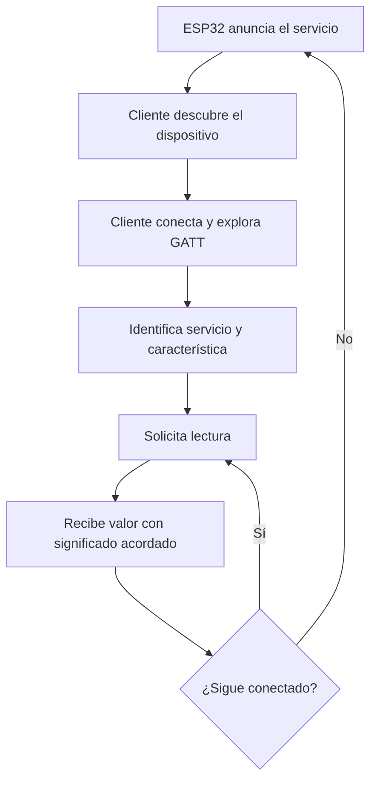

# Bluetooth básico con ESP32: comunicación cercana y BLE

> Este archivo pertenece a: **IoT y Conectividad**  
> Ruta: `01. Bloques Temáticos/06. IoT y Conectividad/03. ESP32/bluetooth-basico.md`

---

## Estado

**Estado:** En revisión  
**Versión:** v1.0  
**Bloque:** 06_iot-conectividad  
**Última actualización:** 2026-09-30

---

## Descripción

Bluetooth permite comunicación inalámbrica cercana sin requerir un router. Bluetooth clásico y Bluetooth Low Energy (BLE) utilizan modelos de interacción distintos y no están disponibles en todas las variantes de ESP32.

Este documento orienta la selección de una tecnología compatible y presenta un servicio BLE de lectura con un dato ficticio. La mediación centra la atención en quién descubre el dispositivo, quién consulta el dato y qué límites de acceso existen.

---

## Propósito

Proporcionar fundamentos para que la persona docente acompañe la comparación de Wi-Fi, Bluetooth clásico y BLE, explique el intercambio mediante servicios y características y adapte la exploración cercana al nivel del grupo y al contexto del proyecto.

---

## Contenido

### 1. Cuándo considerar Bluetooth

Una consulta o configuración cercana puede realizarse sin infraestructura Wi-Fi. Antes de elegir Bluetooth, determine la distancia prevista, la cantidad y frecuencia de datos, la energía disponible y la compatibilidad del dispositivo cliente.

Bluetooth no implica conexión a Internet. Si el dato llegará a una plataforma externa mediante un teléfono, ese teléfono actúa como puente y requiere su propia conexión, aplicación y controles de acceso.

El alcance real depende de radio, antena, potencia, obstáculos e interferencias. BLE puede reducir consumo en un diseño apropiado, pero no garantiza una autonomía determinada ni debe presentarse como una versión intercambiable de Bluetooth clásico.

### 2. Bluetooth clásico y BLE

| Aspecto | Bluetooth clásico | BLE |
| --- | --- | --- |
| Modelo habitual | Perfiles como SPP para comunicación tipo serial, si están soportados. | Servicios y características con operaciones GATT. |
| Biblioteca de referencia en Arduino | `BluetoothSerial.h` para SPP en hardware compatible. | Biblioteca `BLE` del paquete oficial o implementación compatible. |
| Cliente requerido | Aplicación y sistema compatibles con el perfil. | Cliente GATT con las funciones requeridas. |
| Compatibilidad | Depende del chip, el perfil y el sistema cliente. | Depende del chip, la biblioteca y el cliente. |

Una aplicación que funciona como terminal Bluetooth clásico no necesariamente puede leer un servicio BLE. La compatibilidad de teléfonos y computadores debe probarse antes de la experiencia. Para esta carpeta se utiliza **BLE de lectura** como demostración, sin depender de un perfil serial clásico.

### 3. Comprobar la familia de chip

| Familia | Bluetooth clásico | BLE |
| --- | --- | --- |
| ESP32 original | Sí | Sí |
| ESP32-S2 | No | No |
| ESP32-S3 | No | Sí |
| ESP32-C3 | No | Sí |
| ESP32-C6 | No | Sí |
| ESP32-H2 | No | Sí |

La tabla describe hardware. La disponibilidad de una API también depende de la versión y configuración del entorno. La referencia de código se prepara para el **ESP32 original con Arduino-ESP32 3.x**. Si se cambia de chip o de biblioteca, revise ejemplos del fabricante para esa combinación antes de copiar el programa.

Si `BluetoothSerial` informa que SPP no está disponible en un S3 o C3, no se soluciona instalando cualquier biblioteca con nombre parecido: se requiere una tecnología soportada por ese chip.

### 4. Vocabulario mínimo de BLE

| Término | Significado en la demostración |
| --- | --- |
| Advertising o anuncios | El dispositivo informa que puede ser descubierto. |
| Periférico y central | Roles de conexión; aquí el ESP32 es periférico y el cliente inicia la conexión. |
| Servidor y cliente GATT | Roles de acceso a servicios; aquí el ESP32 expone el dato y la aplicación lo consulta. |
| Servicio | Agrupa características relacionadas. |
| Característica | Expone un valor y las operaciones permitidas. |
| UUID | Identificador del servicio o la característica. |
| Lectura | Solicitud para obtener el valor disponible. |
| Escritura | Solicitud para cambiar o entregar un valor, si está habilitada. |
| Notificación | Envío de actualizaciones a un cliente suscrito. |

Los roles de enlace y GATT son conceptos diferentes, aunque coincidan en esta demostración. Un nombre visible o un UUID identifica un recurso, pero no demuestra que su origen sea confiable.

### 5. Recorrido del dato



**Propósito pedagógico:** diferenciar descubrimiento, conexión y lectura; encontrar un nombre no equivale a recibir un dato.

**Descripción alternativa:** el ESP32 anuncia un servicio; el cliente lo encuentra, conecta, identifica una característica y solicita su lectura. Puede volver a leer mientras siga conectado o reiniciar el descubrimiento después de desconectarse.

### 6. Servicio BLE de lectura con un dato simulado

**Contrato del dato:** texto UTF-8 `temperatura_c=24.5;origen=simulado`. El valor no procede de un sensor y no se interpreta como una lectura ambiental real. El servicio tiene una característica de solo lectura; no controla actuadores, no admite escritura y no envía notificaciones.

**Recursos:** ESP32 original, alimentación USB, Arduino-ESP32 3.x y un cliente GATT preparado por la persona docente. No se requieren conexiones externas ni cuentas personales.

```cpp
#include <Arduino.h>
#include <BLEDevice.h>
#include <BLEServer.h>
#include <BLEUtils.h>
#include <atomic>

const char* SERVICE_UUID = "f0190001-4c82-4d36-9a11-5e049e9c1120";
const char* VALUE_UUID = "f0190002-4c82-4d36-9a11-5e049e9c1120";
std::atomic<bool> reanunciar{false};

class EventosServidor : public BLEServerCallbacks {
  void onConnect(BLEServer*) override {
    Serial.println("Cliente conectado; el dato sigue siendo simulado.");
  }
  void onDisconnect(BLEServer*) override {
    reanunciar.store(true);
  }
};

void setup() {
  Serial.begin(115200);
  BLEDevice::init("Maker-ESP32-Demo");
  BLEServer* servidor = BLEDevice::createServer();
  servidor->setCallbacks(new EventosServidor());

  BLEService* servicio = servidor->createService(SERVICE_UUID);
  BLECharacteristic* dato = servicio->createCharacteristic(
    VALUE_UUID, BLECharacteristic::PROPERTY_READ
  );
  dato->setValue("temperatura_c=24.5;origen=simulado");
  servicio->start();

  BLEAdvertising* anuncios = BLEDevice::getAdvertising();
  anuncios->addServiceUUID(SERVICE_UUID);
  anuncios->setScanResponse(true);
  BLEDevice::startAdvertising();
  Serial.println("Servicio BLE listo para lectura de datos ficticios.");
}

void loop() {
  if (reanunciar.exchange(false)) {
    delay(250);  // Pausa de la demostracion para recuperar los anuncios.
    BLEDevice::startAdvertising();
    Serial.println("Disponible de nuevo tras desconexion.");
  }
  delay(10);
}
```

El indicador `reanunciar` comunica un evento desde el callback al bucle principal; `std::atomic` permite ese acceso compartido. La pausa de 250 ms es una elección de esta demostración, no una regla de BLE. Los UUID son identificadores de ejemplo, no claves de acceso.

El dato permanece fijo. Una nueva lectura devuelve el mismo texto y no prueba que exista una nueva medición. El programa no implementa emparejamiento seguro, cifrado obligatorio ni autorización para información sensible; por eso solo expone datos ficticios en una demostración supervisada.

#### Cómo interpretar la prueba

1. Activar Bluetooth y los permisos de búsqueda requeridos por el sistema cliente.
2. Abrir un cliente GATT compatible; no depender de la lista de dispositivos emparejados de los ajustes del teléfono.
3. Buscar `Maker-ESP32-Demo`; usar un nombre distinto por equipo si se preparan varias placas.
4. Conectar, localizar el UUID del servicio y luego el de la característica.
5. Solicitar **Read** y mostrar el valor como texto UTF-8, no solo como bytes hexadecimales.
6. Identificar la unidad y la etiqueta `origen=simulado`.
7. Desconectar, volver a buscar y comprobar una segunda conexión.

La operación de lectura no obliga a emparejar el dispositivo. Descubrir, conectar, emparejar y autorizar son procesos diferentes. Si el cliente no puede leer el texto por su configuración o tamaño permitido, revise la operación, la decodificación y la negociación del enlace con una aplicación probada.

### 7. Lectura, actualización y pérdida de conexión

Una lectura entrega el valor almacenado en la característica. Una notificación requiere una característica con esa propiedad y un cliente suscrito; no aparece automáticamente por crear un servicio.

Si se añade un sensor, documente unidad, origen, intervalo y validez del dato. Si el cliente pierde conexión, la interfaz debe mostrarlo y no conservar el último valor como si estuviera recibiendo actualizaciones. Para control, defina además quién puede escribir, qué valores se aceptan y cuál es el estado ante desconexión.

### 8. Seguridad y diagnóstico

En un proyecto con información sensible o acciones reales, revise emparejamiento, cifrado, autenticación, permisos de las características y protección frente a comandos inválidos. La cercanía física y el nombre del dispositivo no constituyen autorización.

No utilice identificadores BLE para registrar presencia del estudiantado sin una finalidad y autorización institucionales. No registre los dispositivos de otras personas durante la demostración.

| Situación | Comprobación |
| --- | --- |
| No compila la biblioteca | Familia de chip, paquete oficial, versión y bibliotecas duplicadas. |
| El nombre no aparece | Advertising activo, permisos, distancia y conexión previa aún abierta. |
| Se detecta pero no se lee | Cliente GATT, UUID y propiedad de lectura. |
| Aparece una secuencia hexadecimal | Seleccionar interpretación UTF-8 según contrato. |
| El dato nunca cambia | En esta referencia es fijo y simulado. |
| No vuelve a conectar | Revisar cierre del cliente y reinicio de anuncios. |

Pruebe cerca de la placa y cambie una condición por vez. No establezca un alcance garantizado a partir de una única prueba.

---

## Aplicación en Maker Academy

### Inspiración

Plantee una consulta cercana: obtener un dato ficticio desde un prototipo sin router. Invite a comparar esa necesidad con una consulta desde otro edificio o con un registro continuo en una plataforma.

### Experimentación y ajuste por nivel

| Nivel | Alcance y mediación | Evidencia |
| --- | --- | --- |
| 1. Preescolar | Representar un mensaje cercano con objetos o tarjetas. | Explica quién recibe la señal. |
| 2. 1.º–3.º | Ordenar descubrir, conectar y recibir mediante pictogramas. | Distingue encontrar de recibir. |
| 3. 4.º–6.º | Observar una lectura preparada y reconocer unidad y origen. | Tabla de dato simulado y significado. |
| 4. 7.º–9.º | Leer un servicio guiado y documentar una desconexión. | Diagrama, UUID y registro de prueba. |
| 5. 10.º–11.º | Justificar BLE, diseñar el contrato de datos y revisar permisos. | Especificación y validación de compatibilidad. |

### Reflexión y evaluación formativa

Solicite explicar por qué detectar el dispositivo no confirma haber leído información. Compare el dato fijo con una medición nueva y pregunte qué debería indicar la interfaz cuando se pierde conexión.

Observe la pertinencia de la tecnología, la interpretación del dato, la compatibilidad y el reconocimiento de los límites de acceso. Si el equipo trata el UUID como contraseña, pida comprobar quién puede descubrirlo y vuelva a distinguir identificación de autorización.

---

## Recursos relacionados

- [Orientación y progresión de la carpeta](README.md)
- [Introducción al ESP32](introduccion-esp32.md)
- [Wi-Fi básico](wifi-basico.md)
- [Mapa de Progresión del bloque](../01.%20Mapa%20de%20Progresi%C3%B3n.md)
- [Seguridad del bloque](../03.Seguridad.md)
- [Arquitectura y compatibilidad Bluetooth de Espressif](https://docs.espressif.com/projects/esp-idf/en/latest/esp32/api-guides/bt-architecture/overview.html)
- [BLE en Arduino-ESP32](https://docs.espressif.com/projects/arduino-esp32/en/latest/api/ble.html)
- [Ejemplos oficiales BLE de Arduino-ESP32](https://github.com/espressif/arduino-esp32/tree/master/libraries/BLE/examples)

---

## Imagen sugerida


---

## Nota docente

Prepare el cliente y pruebe lectura, desconexión y reconexión antes de la experiencia. En niveles iniciales, mantenga la observación conceptual y la representación visual. En niveles superiores, exija compatibilidad y propósito justificados antes de añadir escritura o notificaciones.
