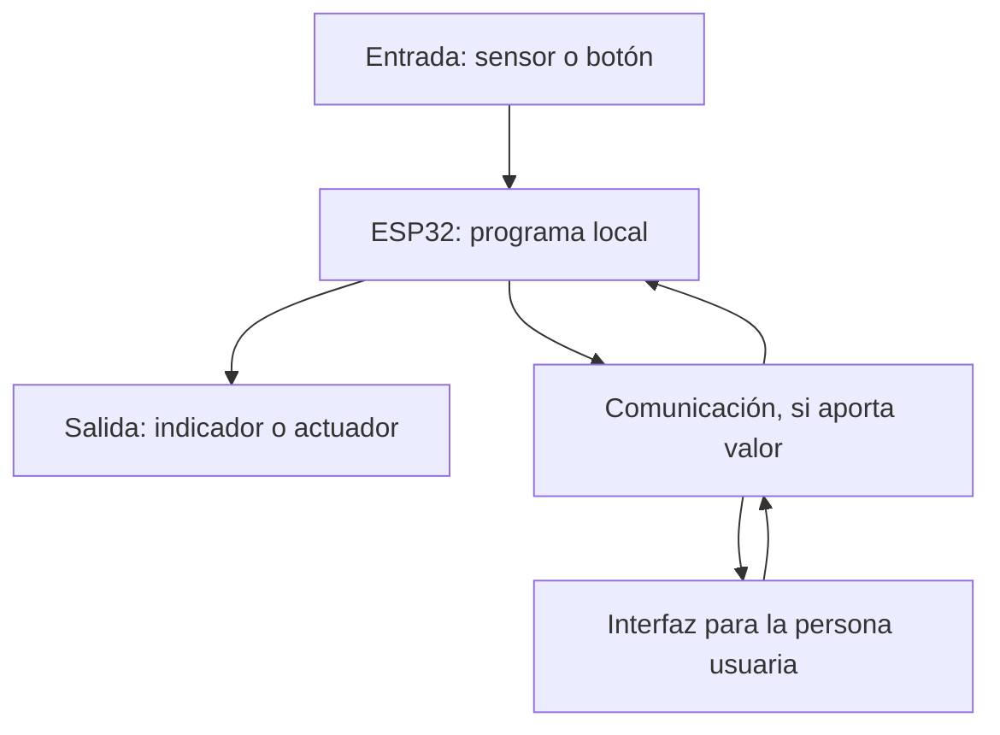

# Introducción al ESP32: componentes, programación y uso seguro

> Este archivo pertenece a: **IoT y Conectividad**  
> Ruta: `01. Bloques Temáticos/06. IoT y Conectividad/03. ESP32/introduccion-esp32.md`

---

## Estado

**Estado:** En revisión  
**Versión:** v1.1  
**Bloque:** 06_iot-conectividad  
**Última actualización:** 2026-09-30

---

## Descripción

ESP32 es una familia de sistemas en un chip desarrollada por Espressif. Una placa de desarrollo integra uno de estos chips o módulos con componentes que facilitan su alimentación, programación y conexión con sensores y actuadores.

Este documento orienta al personal docente para presentar el papel de la placa dentro de un prototipo, reconocer sus límites eléctricos y preparar una primera demostración local antes de incorporar conectividad.

---

## Propósito

Proporcionar los fundamentos técnicos y de mediación para que la persona docente acompañe la comprensión de entrada, proceso y salida con ESP32, seleccione una placa compatible y promueva pruebas seguras y documentadas.

---

## Contenido

### 1. Chip, módulo y placa de desarrollo

| Elemento | Qué incluye | Qué debe comprobarse |
| --- | --- | --- |
| Chip o SoC | Procesador, memoria y periféricos integrados. | Familia y capacidades del fabricante. |
| Módulo | Chip y componentes como memoria flash y antena, según modelo. | Referencia exacta: WROOM, WROVER u otra. |
| Placa de desarrollo | Módulo o chip, regulación, conectores y circuito de programación. | Pinout, alimentación, USB y componentes propios. |

El nombre comercial de una placa no basta para elegir código ni conexiones. “ESP32” no significa que todas las placas tengan los mismos pines, memoria, Bluetooth o Wi-Fi.

### 2. Función dentro del prototipo

Un ESP32 puede leer una entrada, procesarla y producir una salida sin conectarse a ninguna red. Al incorporar comunicación, también puede enviar datos o recibir solicitudes de otros dispositivos. Disponer de radio no convierte automáticamente cualquier programa en una solución IoT.



**Propósito pedagógico:** diferenciar la respuesta local del intercambio de información y mostrar que la comunicación puede ser bidireccional.

**Descripción alternativa:** una entrada llega al programa del ESP32 y este genera una salida local. Si la necesidad requiere comunicación, el programa intercambia información con una interfaz utilizada por una persona.

Para mediar el diagrama pregunte: ¿qué decisión puede tomar la placa por sí misma?, ¿qué cambia si se pierde la red?, ¿qué necesita observar la persona usuaria?

### 3. Capacidades y variantes de referencia

La siguiente selección permite reconocer diferencias frecuentes; no es un inventario completo de la familia.

| Familia de chip | Wi-Fi integrado | Bluetooth integrado |
| --- | --- | --- |
| ESP32 original | 2,4 GHz | Clásico y BLE. |
| ESP32-S2 | 2,4 GHz | No. |
| ESP32-S3 | 2,4 GHz | BLE; no clásico. |
| ESP32-C3 | 2,4 GHz | BLE; no clásico. |
| ESP32-C6 | 2,4 GHz | BLE; no clásico. |
| ESP32-H2 | No | BLE; no clásico. |

Confirme el modelo en la documentación oficial. Los ejemplos con GPIO23 corresponden a una placa ESP32-DevKitC con ESP32-WROOM original; ese número no debe trasladarse automáticamente a otras variantes.

### 4. Pines y condiciones eléctricas

**GPIO** significa entrada o salida de propósito general. Su función depende del programa y de las restricciones del chip, del módulo y de la placa. La ubicación física del conector y el número GPIO son datos diferentes.

En el ESP32 original:

- Los GPIO trabajan con lógica de **3,3 V**. No aplicar directamente señales de 5 V.
- GPIO34–GPIO39 son solo entradas y no tienen resistencias internas de pull-up o pull-down habilitables por software. La placa puede no exponerlos todos.
- GPIO6–GPIO11 se utilizan normalmente para memoria flash y deben evitarse como conexiones del proyecto en las placas de referencia.
- Algunos pines intervienen en el arranque; una conexión externa puede impedir iniciar o cargar el programa.
- GPIO1 y GPIO3 suelen utilizarse para comunicación serial y programación.
- ADC2 comparte recursos con Wi-Fi. Para una lectura analógica simultánea con Wi-Fi en el ESP32 original, se debe revisar la restricción y preferir un pin ADC1 disponible.

Estas restricciones no describen todos los chips de la familia. Consulte el pinout específico antes de usar `INPUT_PULLUP`, una salida, un sensor analógico o un periférico.

#### Alimentación segura

Para la primera demostración, alimente la placa de referencia por USB. En ESP32-DevKitC V4, las opciones USB, 5 V/GND y 3V3/GND son mutuamente excluyentes: se utiliza solo una a la vez.

Desconecte antes de modificar el circuito. Revise polaridad, continuidad y posibles cortocircuitos. Los GPIO no alimentan motores, servos ni otras cargas de potencia; se requiere una etapa apropiada, una fuente dimensionada y las conexiones de referencia eléctrica que correspondan. Una señal de 5 V requiere adaptación de nivel antes de entrar a un GPIO.

### 5. Entornos de programación

| Entorno | Uso posible | Decisión docente |
| --- | --- | --- |
| Programación por bloques compatible | Secuencias y relaciones de control visibles. | Probar el soporte real de la placa y de la función requerida. |
| MicroPython | Programación con Python y exploración interactiva. | Usar firmware compatible y APIs propias de ese entorno. |
| Arduino-ESP32 | Referencias en C++ con bibliotecas del fabricante. | Registrar placa, versión y dependencias. |
| ESP-IDF | Desarrollo con mayor control técnico. | Reservar para formación o proyectos que lo requieran. |

Los ejemplos de esta carpeta utilizan Arduino-ESP32 como referencia docente. La persona docente selecciona el lenguaje y los apoyos de acuerdo con el [Mapa de Progresión del bloque](../01.%20Mapa%20de%20Progresi%C3%B3n.md) y las orientaciones institucionales de bloques y Python. Un archivo de Arduino no se ejecuta directamente en MicroPython.

#### Preparación en Arduino IDE

1. Instalar Arduino IDE desde su fuente oficial.
2. Añadir la URL estable de Espressif en las preferencias del gestor de placas, siguiendo la documentación oficial:

   `https://espressif.github.io/arduino-esp32/package_esp32_index.json`

3. Instalar **esp32 by Espressif Systems** y registrar su versión.
4. Seleccionar la placa que corresponda al modelo físico, según su fabricante.
5. Conectar un cable USB que transmita datos y seleccionar el puerto reconocido por el sistema.
6. Compilar un ejemplo local y cargarlo.
7. Abrir el monitor serial a la velocidad declarada en el programa.

Si se requiere un controlador USB, identifique primero el puente USB de la placa y utilice la fuente del fabricante. No todas las variantes emplean el mismo circuito USB. Si el arranque de carga requiere BOOT y EN, siga las instrucciones del modelo; no convierta esa maniobra en un requisito universal.

### 6. Primera referencia: un LED local

**Objetivo técnico:** comprobar una salida y observar un intervalo de encendido. **Alcance:** placa ESP32-DevKitC con ESP32-WROOM original, LED externo y Arduino-ESP32 3.x.

Con la placa desconectada:

| Conexión | Destino |
| --- | --- |
| GPIO23 | Un extremo de una resistencia de 330 Ω. |
| Otro extremo de la resistencia | Ánodo del LED. |
| Cátodo del LED | GND de la placa. |

El cátodo suele identificarse por la pata corta o el lado plano del encapsulado; confirme el componente si las patas fueron cortadas. La resistencia limita la corriente y debe conservarse.

```cpp
#include <Arduino.h>

constexpr uint8_t PIN_LED = 23;  // Solo para la placa de referencia.
constexpr unsigned long INTERVALO_MS = 1000;
unsigned long ultimoCambio = 0;
bool encendido = false;

void setup() {
  Serial.begin(115200);
  pinMode(PIN_LED, OUTPUT);
  digitalWrite(PIN_LED, LOW);
  Serial.println("Salida local lista; LED apagado.");
}

void loop() {
  const unsigned long ahora = millis();
  if (ahora - ultimoCambio >= INTERVALO_MS) {
    ultimoCambio = ahora;
    encendido = !encendido;
    digitalWrite(PIN_LED, encendido ? HIGH : LOW);
    Serial.println(encendido ? "LED encendido" : "LED apagado");
  }
}
```

`setup()` configura el inicio y `loop()` revisa continuamente si corresponde cambiar la salida. `millis()` permite comparar tiempo transcurrido sin detener el programa durante un segundo. La resta entre valores `unsigned long` conserva el cálculo de intervalos cortos incluso cuando el contador se reinicia por desbordamiento.

La demostración alterna cada segundo; un ciclo completo de encendido y apagado dura dos segundos. No lee un sensor, no utiliza Wi-Fi y no es todavía una solución IoT.

#### Qué observar

- El LED y el monitor serial deben mostrar estados coherentes.
- Modificar el intervalo debe cambiar el tiempo de cada estado.
- Reiniciar debe comenzar con la salida apagada.
- Si no hay luz, revisar polaridad, resistencia, GND y correspondencia entre pin y programa con la alimentación desconectada.

### 7. Diagnóstico inicial

| Situación | Comprobación pertinente |
| --- | --- |
| No aparece un puerto | Cable de datos, conector, reconocimiento USB y controlador del modelo. |
| El programa no compila | Placa seleccionada, paquete y mensaje de error completo. |
| La carga no inicia | Puerto correcto y secuencia de arranque indicada por el fabricante. |
| Hay símbolos ilegibles en el monitor | Velocidad serial del programa y del monitor. |
| La placa se reinicia | Alimentación, cable, cortocircuitos y carga conectada. |
| El LED no responde | GPIO disponible, polaridad, resistencia y continuidad. |

Cambie una condición por vez y documente su efecto. Un LED de alimentación encendido demuestra presencia de energía en una parte de la placa; no confirma que el programa o el circuito externo funcionen.

---

## Aplicación en Maker Academy

### Inspiración

Muestre un objeto que recibe una señal y cambia una salida. Pida identificar la entrada, la decisión y la respuesta. Luego presente la placa como una posibilidad para implementar esa relación, con un propósito definido.

### Experimentación

Consulte el [Mapa de Progresión del bloque](../01.%20Mapa%20de%20Progresi%C3%B3n.md) para seleccionar el alcance técnico, los apoyos y las Evidencias correspondientes al ciclo educativo. El desglose por ciclos se concentra en ese recurso.

Modele una prueba local segura y solicite una predicción antes de ejecutar el programa. Ajuste el acompañamiento según la autonomía observada:

- Cuando se requiera mayor apoyo, utilice un montaje preparado, secuencias visuales y una demostración docente. Solicite identificar qué cambia y qué permanece igual.
- Cuando el grupo pueda modificar una condición, proponga cambiar el intervalo del LED y comparar la predicción con el comportamiento observado. Mantenga la revisión docente de las conexiones.
- Cuando exista mayor autonomía, solicite justificar el modelo de placa y el GPIO seleccionado, formular una hipótesis de fallo y registrar una comprobación antes de modificar el prototipo.

Cambie una variable por vez y documente su efecto. La autonomía modifica la cantidad de apoyo; la seguridad y la necesidad de explicar el funcionamiento se mantienen.

### Reflexión y evaluación formativa

Pregunte qué parte del comportamiento proviene del programa, qué parte depende del circuito y qué permanece local. Si el equipo dice “la placa no sirve”, solicite una observación concreta y una siguiente comprobación.

Las Evidencias permiten valorar la identificación de componentes, la relación entre programa y salida, el cuidado de las conexiones y la mejora documentada. Con mayor autonomía, solicite justificar el modelo de placa y el pin utilizado. Ofrezca explicaciones orales, secuencias visuales o registros escritos como formas de comunicar el aprendizaje, de acuerdo con las necesidades de apoyo del grupo.

---

## Recursos relacionados

- [Orientación y progresión de la carpeta](README.md)
- [Wi-Fi básico](wifi-basico.md)
- [Bluetooth básico](bluetooth-basico.md)
- [Mapa de Progresión del bloque](../01.%20Mapa%20de%20Progresi%C3%B3n.md)
- [Dispositivos, conectividad y plataformas](../01.%20Fundamentos%20de%20IoT/dispositivos-conectividad-plataformas.md)
- [Seguridad del bloque](../03.Seguridad.md)
- [Instalación oficial de Arduino-ESP32](https://docs.espressif.com/projects/arduino-esp32/en/latest/installing.html)
- [Guía oficial de ESP32-DevKitC V4](https://docs.espressif.com/projects/esp-dev-kits/en/latest/esp32/esp32-devkitc/user_guide.html)
- [GPIO del ESP32 original](https://docs.espressif.com/projects/esp-idf/en/latest/esp32/api-reference/peripherals/gpio.html)
- [MicroPython para ESP32](https://docs.micropython.org/en/latest/esp32/quickref.html)

---

## Nota docente

Priorice una explicación verificable del comportamiento local antes de incorporar la red. Prepare y pruebe la demostración con el mismo modelo que utilizará el grupo. No dé por universales el pin del LED integrado, el procedimiento de carga ni las funciones de Bluetooth.
