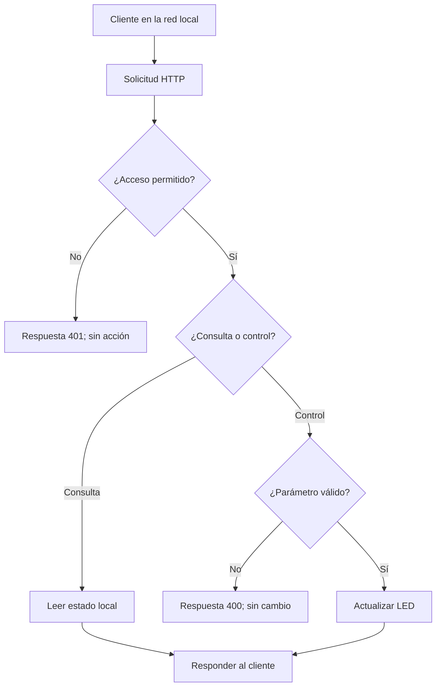

Asumiendo que solicita la revisión pedagógica, técnica y de estandarización del archivo `servidor-web-embebido.md` como Revisor de Contenidos de Maker Academy, presento a continuación el dictamen de auditoría y el documento final optimizado para publicación en el repositorio.

---

## Dictamen de revisión

* **Estado actual:** En revisión -> **Estado recomendado:** Validado (v1.1).


* **Valoración general:** El contenido presenta una alta calidad técnica y pedagógica. Cumple con la estructura conceptual del Modelo Pedagógico Maker Academy, la metodología XperiencED Maker (Inspiración, Experimentación y Reflexión) y los criterios de progresión por competencias del Programa Nacional de Formación Tecnológica (PNFT). La demostración técnica en C++ mediante `WebServer.h` es clara, segura y contextualizada para el entorno de aula.


### Matriz de evaluación según la Guía de Estandarización

| Criterio de estandarización | Estado | Observación / Ajuste realizado |
| --- | --- | --- |
| **Metadatos e inicio del archivo** | Conforme | Presenta módulo, ruta exacta, versión y el identificador de bloque `06_iot-conectividad`.

 |
| **Jerarquía de títulos Markdown** | Conforme | Mantiene una estructura fluida (`#`, `##`, `###`, `####`) sin saltos de nivel.

 |
| **Vocabulario oficial** | Conforme | Usa estrictamente los términos oficiales (*Maker Academy*, *XperiencED Maker*, *PNFT*, *4P*).

 |
| **Alineación pedagógica** | Conforme | Integra los tres momentos de mediación y la progresión graduada desde Preescolar hasta Educación Diversificada.

 |
| **Recursos visuales y diagramas** | Requería ajuste | La sección `## Imagen ilustrativa` se encontraba vacía. Se incorporó la sugerencia descriptiva del recurso visual conforme al libro de marca.

 |
| **Enlaces y navegación interna** | Requería ajuste | Se normalizó la ruta en los recursos relacionados (`../03. Seguridad.md`) para asegurar la compatibilidad de navegación en GitHub.

 |

---

## Archivo final estandarizado

A continuación se incluye la versión corregida y normalizada, lista para ser integrada en el repositorio institucional:

```markdown
# Servidor web embebido con ESP32: consulta y control local

> Este archivo pertenece a: **IoT y Conectividad**  
> Ruta: `01. Bloques Temáticos/06. IoT y Conectividad/03. ESP32/servidor-web-embebido.md`

```

---

## Estado

**Estado:** Validado

**Versión:** v1.1

**Bloque:** 06_iot-conectividad

**Última actualización:** 2026-09-30

---

## Descripción

Un servidor web embebido es una aplicación que se ejecuta en el microcontrolador y responde solicitudes de un navegador u otro cliente. Puede entregar una página, informar un estado o atender una acción permitida sin depender de una plataforma externa.

Este documento orienta al personal docente para relacionar red, solicitudes HTTP, interfaz y comportamiento local. La referencia utiliza una red AP de demostración y un LED externo, con consulta de estado, autorización básica y apagado por tiempo.

---

## Propósito

Proporcionar fundamentos técnicos y criterios de mediación para que la persona docente acompañe el análisis de una interfaz web local, distinga consulta de control y promueva validación de entradas, acceso apropiado y reconocimiento de fallos.

---

## Contenido

### 1. Qué significa “embebido”

El programa del servidor se ejecuta en el ESP32 y comparte sus recursos con otras tareas. El navegador recibe contenido enviado por la placa, pero la página visible no constituye una conexión permanente ni demuestra que el dispositivo siga activo.

El servidor puede funcionar en modo STA o AP. En STA, el cliente necesita una ruta de red hacia la IP del ESP32. En AP, el cliente se conecta a la red creada por la placa. En esta referencia se usa AP para preparar una demostración local sin router ni Internet.

### 2. Solicitudes y respuestas

| Elemento | Función | Ejemplo |
| --- | --- | --- |
| Cliente | Inicia la solicitud. | Navegador del dispositivo autorizado. |
| Servidor | Atiende la solicitud. | Programa del ESP32. |
| Ruta | Identifica el recurso o la acción. | `/estado`. |
| Método | Expresa el tipo de operación. | GET para consultar; POST para una acción. |
| Código HTTP | Informa el resultado. | 200, 400, 401 o 404. |
| Cuerpo de respuesta | Contenido devuelto. | HTML o JSON. |

En esta demostración **GET consulta** y **POST solicita un estado del LED**. No se debe usar una visita a un enlace GET para provocar un cambio físico. Elegir POST tampoco constituye por sí solo una autorización ni una protección completa frente a solicitudes maliciosas.



**Propósito pedagógico:** mostrar que la aplicación decide si una solicitud puede ejecutarse y que una entrada inválida no debe cambiar la salida.

**Descripción alternativa:** una solicitud local pasa por una comprobación de acceso. Si está permitida, una consulta lee el estado y una acción valida su parámetro antes de cambiar el LED. Los accesos y parámetros rechazados reciben un código de error.

### 3. Preparación y contrato de rutas

**Hardware de referencia:** ESP32-DevKitC con módulo ESP32-WROOM original y Arduino-ESP32 3.x. Conecte, con la alimentación desconectada, GPIO23 → resistencia de 330 Ω → ánodo del LED, y cátodo → GND. Consulte la introducción para comprobar el circuito.

Se utilizan `WiFi.h` y `WebServer.h` del paquete oficial. No es necesario instalar un servidor asíncrono adicional. El ejemplo atiende una demostración de baja carga; no se plantea como servicio para muchos clientes simultáneos.

| Método y ruta | Resultado esperado |
| --- | --- |
| `GET /` | Página con el estado observado al cargar y dos acciones. |
| `GET /estado` | JSON con estado lógico del LED y tiempo desde arranque. |
| `POST /led` con `estado=1` | Encendido temporal; responde con redirección a la página. |
| `POST /led` con `estado=0` | Apagado; responde con redirección. |
| `POST /led` con otro valor | Error 400; conserva el estado previo. |
| Solicitud a ruta inexistente | Error 404. |

Las tres rutas principales requieren usuario y contraseña de aplicación. La contraseña Wi-Fi y la contraseña de la aplicación cumplen funciones diferentes.

### 4. Referencia de servidor local

Los textos `CAMBIAR_CLAVE_AULA` y `CAMBIAR_CLAVE_WEB` son marcadores ficticios. Sustitúyalos en una copia privada, con claves distintas; no comparta esa copia como Evidencia. El encendido dura nominalmente cinco segundos y se cancela si no quedan estaciones asociadas al AP.

```cpp
#include 
#include 
#include 

constexpr uint8_t PIN_LED = 23;  // Placa de referencia ESP32-WROOM.
constexpr unsigned long TIEMPO_ENCENDIDO_MS = 5000;
const char* AP_SSID = "ESP32-Maker-Web";
const char* AP_PASSWORD = "CAMBIAR_CLAVE_AULA";
const char* WEB_USER = "docente";
const char* WEB_PASSWORD = "CAMBIAR_CLAVE_WEB";

WebServer servidor(80);
bool servidorListo = false;
bool encendido = false;
unsigned long ultimoComando = 0;

void apagarLed() {
  encendido = false;
  digitalWrite(PIN_LED, LOW);
}

void aplicarApagado() {
  if (encendido &&
      (millis() - ultimoComando >= TIEMPO_ENCENDIDO_MS ||
       WiFi.softAPgetStationNum() == 0)) {
    apagarLed();
  }
}

bool accesoPermitido() {
  if (servidor.authenticate(WEB_USER, WEB_PASSWORD)) {
    return true;
  }
  servidor.requestAuthentication();
  return false;
}

void mostrarPagina() {
  if (!accesoPermitido()) return;
  String pagina = "";
  pagina += "";
  pagina += "";
  pagina += "ESP32: demostracion local";
  pagina += "

```

# LED de demostracion

Estado observado al cargar: ";
pagina += encendido ? "ENCENDIDO" : "APAGADO";
pagina += "

El encendido es temporal. Actualice para volver a consultar.

";
pagina += "

";
pagina += "Encender durante 5 s ";
pagina += "Apagar

";
pagina += "

[Consultar de nuevo](https://www.google.com/search?q=%2F) | ";
pagina += "[Ver estado en JSON](https://www.google.com/search?q=%2Festado)

";
servidor.sendHeader("Cache-Control", "no-store");
servidor.send(200, "text/html; charset=utf-8", pagina);
}

void mostrarEstado() {
if (!accesoPermitido()) return;
String json = "{"led_encendido":";
json += encendido ? "true" : "false";
json += ","tiempo_desde_arranque_ms":";
json += String(millis());
json += "}";
servidor.sendHeader("Cache-Control", "no-store");
servidor.send(200, "application/json", json);
}

void cambiarLed() {
if (!accesoPermitido()) return;
if (servidor.args() != 1 || !servidor.hasArg("estado")) {
servidor.send(400, "text/plain; charset=utf-8", "Parametro requerido: estado=0 o 1");
return;
}
const String valor = servidor.arg("estado");
if (valor != "0" && valor != "1") {
servidor.send(400, "text/plain; charset=utf-8", "Valor invalido; no se cambia el LED");
return;
}
encendido = (valor == "1");
ultimoComando = millis();
digitalWrite(PIN_LED, encendido ? HIGH : LOW);
servidor.sendHeader("Location", "/");
servidor.sendHeader("Cache-Control", "no-store");
servidor.send(303, "text/plain", "Consultar estado en /");
}

void setup() {
Serial.begin(115200);
pinMode(PIN_LED, OUTPUT);
apagarLed();
WiFi.mode(WIFI_AP);
if (!WiFi.softAP(AP_SSID, AP_PASSWORD)) {
Serial.println("No se inicio la red; LED apagado.");
return;
}
servidor.on("/", HTTP_GET, mostrarPagina);
servidor.on("/estado", HTTP_GET, mostrarEstado);
servidor.on("/led", HTTP_POST, cambiarLed);
servidor.onNotFound([](https://www.google.com/search?q=) {
servidor.send(404, "text/plain; charset=utf-8", "Ruta no encontrada");
});
servidor.begin();
servidorListo = true;
Serial.print("Abrir http://");
Serial.println(WiFi.softAPIP());
}

void loop() {
if (servidorListo) {
aplicarApagado();
servidor.handleClient();
aplicarApagado();
}
delay(1);
}

```

#### Cómo analizar el programa

- Al iniciar, el LED queda apagado; si falla el AP, no se inicia el servidor.
- `handleClient()` atiende solicitudes durante el bucle principal.
- `authenticate()` comprueba credenciales de aplicación y `requestAuthentication()` solicita acceso si falta o falla.
- El control solo acepta un parámetro y los valores exactos `0` o `1`; no convierte cualquier texto a número.
- La acción fija un estado en vez de alternarlo. Repetir `estado=0` mantiene el apagado; repetir `estado=1` renueva el intervalo.
- Una respuesta 303 indica al navegador que consulte la página después del POST, evitando que una actualización normal repita ese formulario.
- `no-store` solicita no guardar la respuesta; la página explica que el estado corresponde a su última carga.
- El temporizador se comprueba antes y después de atender al cliente. Es **cooperativo**: una operación de red que demore puede retrasar el apagado. No proporciona una garantía de seguridad en tiempo real.

El estado publicado es el que ordena el software. No confirma que el LED físico o un actuador hayan respondido: para eso se necesita observación o realimentación apropiada. La ausencia de estaciones asociadas no identifica cuál persona cerró la página; el intervalo limita la permanencia del comando aunque otro cliente siga en la red.

### 5. Comprobaciones de la demostración

1. Conectar el cliente a `ESP32-Maker-Web` con la clave privada de aula.
2. Mantener la conexión aunque el sistema indique que la red no tiene Internet.
3. Abrir la IP mostrada por la placa con `http://` y no `https://`.
4. Introducir las credenciales de aplicación en el diálogo del navegador.
5. Consultar la página y luego `/estado`; comparar el estado lógico con la observación física.
6. Encender, observar el apagado temporal y volver a consultar. Una página que permanece abierta no se actualiza automáticamente.
7. Probar apagado, una ruta inexistente y un parámetro inválido preparado por la persona docente.
8. Comprobar acceso rechazado en un cliente nuevo sin credenciales y desconexión de todos los clientes durante el encendido.

Para el parámetro inválido se puede usar un cliente HTTP autorizado o un formulario de prueba preparado. No es obligatorio enseñar herramientas de red avanzadas para esta comprobación.

| Condición | Resultado que debe observarse |
| --- | --- |
| Consulta autorizada | 200 y estado comprensible. |
| Credenciales ausentes o incorrectas | 401, sin cambio del LED. |
| `estado=abc` | 400, sin ejecutar un nuevo estado. |
| Ruta inexistente | 404. |
| Comando de encendido válido | LED activo temporalmente y retorno a apagado. |
| Pérdida de acceso o reinicio | Consulta interrumpida; el reinicio comienza apagado. |

La expiración del temporizador puede apagar el LED mientras se comprueba un parámetro inválido. Eso no significa que el valor inválido haya ejecutado una acción; compare con los tiempos del registro.

### 6. Límites de seguridad y de funcionamiento

Este ejemplo usa **HTTP y autenticación básica**. HTTP no cifra el contenido de extremo a extremo y la autenticación básica no equivale a cifrado. La red AP de pruebas debe ser privada y supervisada, con datos ficticios y únicamente un LED de demostración. No exponga el servidor a Internet ni reutilice las claves publicadas como marcadores.

Para una aplicación con información sensible o acciones reales se requiere diseñar acceso, HTTPS o una arquitectura protegida, protección frente a solicitudes de otros orígenes, límites de mensajes y recuperación. El ejemplo no implementa sesiones personales ni protección CSRF; POST y una contraseña no cubren esos requisitos.

No sustituya el LED por una bomba, motor, cerradura u otra carga de riesgo manteniendo el mismo circuito y programa. La alimentación, la etapa de potencia y el comportamiento seguro deben diseñarse para esa aplicación.

Un ESP32 tiene memoria y capacidad limitadas. La biblioteca de esta referencia atiende un cliente simultáneo y puede dedicar tiempo a esperas de red. Las páginas, frecuencia de solicitudes y tareas locales deben ajustarse al contexto. No afirme “control en tiempo real” a partir de una demostración que solo se observó una vez.

### 7. Problemas frecuentes

| Situación | Comprobación |
| --- | --- |
| La página no abre | Cliente en AP correcto, IP actual, servidor iniciado y protocolo HTTP. |
| El móvil cambia a otra conexión | Ajustes de cambio automático por ausencia de Internet. |
| Se pide contraseña repetidamente | Credenciales de aplicación, distintas de las de Wi-Fi. |
| La página muestra LED encendido después del apagado | Actualizar: el contenido representa el estado al cargar. |
| Llega 404 al controlar | Método POST y ruta `/led`; visitar esa ruta con GET no ejecuta control. |
| Hay respuesta pero no luz | Circuito, GPIO, polaridad y diferencia entre estado lógico y físico. |
| La respuesta se demora | Cliente, señal, carga del bucle y límites del servidor. |

Registre predicción, condición, código o mensaje observado y próxima comprobación. Esa documentación permite separar un fallo de red, uno de aplicación y uno de circuito.

```

---

## Aplicación en Maker Academy

### Inspiración

Muestre una señal que una persona necesita consultar desde un navegador. Pregunte qué diferencia hay entre conocer el estado y poder cambiarlo, y quién debería tener cada permiso.

### Experimentación y ajuste por nivel

| Nivel | Ajuste y apoyo docente | Evidencia |
| --- | --- | --- |
| 1. Preescolar | Representar consultar y solicitar una acción con tarjetas. | Distingue observar de cambiar. |
| 2. 1.º–3.º | Diseñar una interfaz en papel y ordenar la respuesta. | Boceto y explicación del mensaje. |
| 3. 4.º–6.º | Explorar una interfaz preparada y relacionarla con una salida local. | Reconoce el estado y una página antigua. |
| 4. 7.º–9.º | Consultar rutas, interpretar errores y modificar una interfaz guiada. | Tabla de respuestas y diagrama del sistema. |
| 5. 10.º–11.º | Diseñar rutas y validación; revisar acceso y probar con usuarios. | Contrato HTTP, código, resultados y límites. |

### Reflexión y evaluación formativa

Pida comparar lo visible en el navegador, la respuesta de la aplicación y la observación física. Una pregunta útil es: “¿Qué Evidencia permite afirmar que la acción ocurrió y qué parte del sistema falta observar?”.

Valore si la interfaz comunica propósito y estado, si el equipo diferencia consulta de control, si rechaza entradas inválidas y si justifica quién puede acceder. Retroalimente una mejora concreta, como aclarar cuándo se consultó el estado o reducir la permanencia de un comando. En los primeros niveles, estas relaciones se explican con bocetos y situaciones representadas.

---

## Recursos relacionados

* [Orientación y progresión de la carpeta](https://www.google.com/search?q=README.md)
* [Introducción al ESP32 y circuito del LED](https://www.google.com/search?q=introduccion-esp32.md)
* [Wi-Fi básico](https://www.google.com/search?q=wifi-basico.md)
* [Mapa de Progresión del bloque](https://www.google.com/search?q=../01.%2520Mapa%2520de%2520Progresi%25C3%25B3n.md)
* [HTTP y HTTPS](https://www.google.com/search?q=../04.%2520Protocolos%2520de%2520Comunicaci%25C3%25B3n/http-https.md)
* [Práctica de control de LED web](https://www.google.com/search?q=../05.%2520Pr%25C3%25A1cticas%2520Guiadas/control-led-web/README.md)
* [Seguridad del bloque](https://www.google.com/search?q=../03.%2520Seguridad.md)
* [Biblioteca WebServer oficial](https://github.com/espressif/arduino-esp32/tree/master/libraries/WebServer)
* [API pública de WebServer](https://github.com/espressif/arduino-esp32/blob/master/libraries/WebServer/src/WebServer.h)
* [Referencia Wi-Fi de Arduino-ESP32](https://docs.espressif.com/projects/arduino-esp32/en/latest/api/wifi.html)

---

## Imagen ilustrativa


*Figura 1: Diagrama de interacción entre el cliente local (dispositivo móvil o computadora), el punto de acceso creado por el ESP32, la validación de peticiones HTTP (GET/POST) y el control físico sobre el circuito del LED.*

---

## Nota docente

Prepare las credenciales en privado, pruebe el circuito y seleccione los casos de fallo adecuados al nivel. Si el grupo solo logra pulsar botones, solicite una explicación del recorrido de la solicitud y una comparación entre interfaz y dispositivo antes de ampliar el proyecto.

```

```
