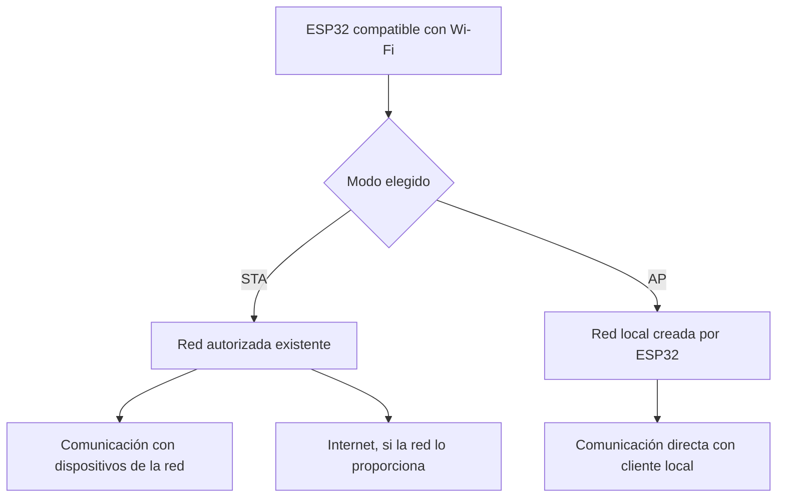

# Wi-Fi básico con ESP32: conexión, estados y diagnóstico

> Este archivo pertenece a: **Internet de las Cosas y Conectividad**  
> Ruta: `01. Bloques Temáticos/06. IoT y Conectividad/03. ESP32/wifi-basicoa.md`

---

## Estado

**Estado:** Validado  
**Versión:** v1.1  
**Bloque:** 06_iot-conectividad  
**Última actualización:** 2026-09-30

---

## Descripción

Wi-Fi permite intercambiar información dentro de una red inalámbrica. Un ESP32 compatible puede conectarse a un punto de acceso existente o crear una red local para que otros dispositivos se comuniquen con él.

Este documento orienta la mediación de conexiones básicas, la distinción entre red local e Internet y la interpretación de estados y fallos. La demostración usa una red autorizada y no requiere una plataforma en la nube.

---

## Propósito

Proporcionar criterios técnicos y pedagógicos para que la persona docente acompañe una conexión Wi-Fi con propósito, enseñe a reconocer qué se ha confirmado y promueva recuperación y diagnóstico sin ocultar fallos ni exponer credenciales.

---

## Contenido

### 1. Wi-Fi, red local e Internet

Wi-Fi es el enlace inalámbrico; la red local conecta dispositivos del entorno; Internet conecta redes y servicios externos. Puede existir comunicación local por Wi-Fi sin acceso a Internet.

Un mensaje como “conectado” no demuestra por sí mismo que un servicio externo respondió. Se deben distinguir tres comprobaciones: conexión con la red, configuración IP disponible y respuesta de la aplicación que utiliza el proyecto.

| Concepto | Función en la conexión |
| --- | --- |
| SSID | Nombre de la red que se desea utilizar. |
| Contraseña de red | Credencial para una red protegida; no identifica a cada usuario de la aplicación. |
| Punto de acceso | Permite que dispositivos se incorporen a la red inalámbrica. |
| Dirección IP | Identifica una interfaz en la red; puede cambiar. |
| DHCP | Asigna configuración IP automáticamente cuando el servicio está disponible. |
| DNS | Permite resolver un nombre de servicio a una dirección. |
| RSSI | Estimación de potencia de la señal recibida, expresada en dBm. |

RSSI no mide velocidad, disponibilidad de Internet ni calidad completa del servicio. En una comparación controlada, un valor menos negativo suele indicar una señal recibida más fuerte; no se debe convertir un único umbral en garantía de funcionamiento.

### 2. Modos de funcionamiento

| Modo | Quién ofrece la red | Uso pertinente |
| --- | --- | --- |
| **STA: estación** | Router o punto de acceso existente. | Integrar el ESP32 en una red autorizada. |
| **AP: punto de acceso local** | ESP32. | Demostración directa o interfaz local sin router. |
| **AP + STA** | ESP32 y punto de acceso existente. | Necesidades específicas que requieren mayor cuidado de configuración. |

Crear un AP no comparte Internet automáticamente. STA y servidor web tampoco son sinónimos: el modo define cómo se incorpora el dispositivo a la red y el servidor define qué aplicación atiende solicitudes.



**Propósito pedagógico:** separar las alternativas de conexión y mostrar que Internet es una condición adicional.

**Descripción alternativa:** el ESP32 se conecta como estación a una red existente o crea un punto de acceso local. En la primera opción puede comunicarse en la red y acceder a Internet si está disponible; en la segunda, atiende clientes de su propia red sin proporcionar Internet por defecto.

### 3. Preparación de la conexión

Para los ejemplos de esta carpeta se usa el **ESP32 original**, compatible con Wi-Fi de 2,4 GHz. Una red solo de 5 GHz no sirve para esa placa. Esta condición no debe generalizarse a toda la familia de chips.

Confirme con la administración del centro qué red puede utilizarse. La referencia STA siguiente está pensada para una red con contraseña personal compatible, sin portal cautivo ni autenticación empresarial. Una red institucional que exige usuario, certificados o aceptación en navegador necesita otra configuración.

Revise también si la red aísla clientes. Dos dispositivos conectados al mismo SSID pueden tener restricciones que impidan comunicarse entre sí. No cambie la seguridad de la red institucional para resolver una demostración; utilice una red de pruebas autorizada o el modo AP preparado por la persona docente.

### 4. Referencia STA con tiempo de espera y reintentos

**Alcance:** ESP32 original, Arduino-ESP32 3.x, biblioteca `WiFi.h` del paquete oficial. No requiere circuitos externos. Los textos de SSID y contraseña son marcadores ficticios que se reemplazan solo en la copia privada del entorno.

```cpp
#include <Arduino.h>
#include <WiFi.h>

const char* WIFI_SSID = "TU_RED_AUTORIZADA";
const char* WIFI_PASSWORD = "TU_CLAVE_PRIVADA";
constexpr unsigned long LIMITE_INTENTO_MS = 10000;
constexpr unsigned long PAUSA_REINTENTO_MS = 5000;
constexpr unsigned long INTERVALO_ESTADO_MS = 3000;

bool intentando = false;
bool estabaConectado = false;
unsigned long inicioIntento = 0;
unsigned long finIntento = 0;
unsigned long ultimoEstado = 0;

void iniciarIntento() {
  inicioIntento = millis();
  intentando = true;
  WiFi.begin(WIFI_SSID, WIFI_PASSWORD);
  Serial.println("Intentando conectar; credenciales no se muestran.");
}

void setup() {
  Serial.begin(115200);
  WiFi.mode(WIFI_STA);
  WiFi.setAutoReconnect(false);  // Este ejemplo gestiona sus reintentos.
  iniciarIntento();
}

void loop() {
  const unsigned long ahora = millis();

  if (WiFi.status() == WL_CONNECTED) {
    intentando = false;
    if (!estabaConectado) {
      estabaConectado = true;
      Serial.print("Red conectada. IP local: ");
      Serial.println(WiFi.localIP());
      Serial.println("Esto no confirma acceso a Internet.");
    }
    if (ahora - ultimoEstado >= INTERVALO_ESTADO_MS) {
      ultimoEstado = ahora;
      Serial.print("RSSI (dBm): ");
      Serial.println(WiFi.RSSI());
    }
  } else {
    if (estabaConectado) {
      estabaConectado = false;
      intentando = false;
      finIntento = ahora;
      WiFi.disconnect();
      Serial.println("Conexion perdida; se mantiene la logica local.");
    }
    if (intentando && ahora - inicioIntento >= LIMITE_INTENTO_MS) {
      WiFi.disconnect();
      intentando = false;
      finIntento = ahora;
      Serial.println("Tiempo de espera agotado; revisar condiciones.");
    }
    if (!intentando && ahora - finIntento >= PAUSA_REINTENTO_MS) {
      iniciarIntento();
    }
  }
  delay(10);  // Pausa breve; no se espera indefinidamente por la red.
}
```

El intento dura hasta diez segundos y, si falla, el programa espera cinco segundos antes de iniciar otro. El código evita un bucle de espera indefinido y deja espacio para añadir funciones locales. No almacena medidas pendientes, no prueba DNS y no confirma recepción en una plataforma.

El límite y el intervalo de reintento son decisiones de la demostración, no recomendaciones universales. Un proyecto prolongado puede necesitar un número limitado de reintentos, espera progresiva y una política de energía. Documente qué se pierde mientras no hay comunicación.

### 5. Referencia AP para una red local

Este programa alternativo crea la red y muestra la IP; todavía **no contiene un servidor web**. Se utiliza por separado del ejemplo STA.

```cpp
#include <Arduino.h>
#include <WiFi.h>

const char* AP_SSID = "ESP32-Maker-Aula";
const char* AP_PASSWORD = "CAMBIAR_CLAVE_AULA";  // Marcador ficticio.

void setup() {
  Serial.begin(115200);
  WiFi.mode(WIFI_AP);
  if (!WiFi.softAP(AP_SSID, AP_PASSWORD)) {
    Serial.println("No se pudo crear la red local.");
    return;
  }
  Serial.print("IP del AP: ");
  Serial.println(WiFi.softAPIP());
}

void loop() {
  delay(10);
}
```

Reemplace el marcador por una clave privada de aula de al menos ocho caracteres, dentro de los requisitos de la API. Use un SSID distinto por equipo cuando haya varias placas. La clave Wi-Fi protege el acceso a la red, pero no sustituye la autorización de la aplicación.

El teléfono o computador puede indicar “sin Internet”; eso es esperable en esta red local. En el [servidor web embebido](servidor-web-embebido.md) se agrega la aplicación que responde al navegador. No presuponga una IP fija: consulte la dirección que imprime la placa.

### 6. Estados y calidad de la comunicación

Enseñe a registrar qué estado se conoce y cuál falta por comprobar:

| Observación | Qué permite afirmar |
| --- | --- |
| La red aparece en una búsqueda | Su señal se detectó; no confirma acceso. |
| Se informa conexión e IP | El ESP32 está asociado y tiene configuración local. |
| La aplicación recibe respuesta válida | Esa solicitud fue atendida por el servicio esperado. |
| Se pierde la conexión | El estado remoto podría quedar desactualizado. |
| Se recupera la red | La aplicación todavía debe comprobar sus operaciones pendientes. |

Para una lectura remota, acompañe el valor con unidad, estado y referencia temporal apropiada. No reemplace un dato ausente por cero ni presente el último valor como actual sin indicarlo. `millis()` mide tiempo desde el arranque; no es fecha y hora de calendario.

### 7. Diagnóstico con una hipótesis por prueba

| Síntoma | Hipótesis y comprobación |
| --- | --- |
| No conecta | Revisar SSID, clave en privado, banda y cobertura. |
| Conecta pero no abre un servicio | Revisar IP, servicio activo, aislamiento y ruta. |
| Funciona localmente pero no en nube | Revisar salida a Internet, DNS y respuesta de aplicación. |
| Se desconecta al activar una carga | Revisar alimentación y demanda de corriente. |
| El AP no aparece | Confirmar inicio exitoso, modelo y nombre utilizado. |
| El móvil cambia de red | Revisar su cambio automático a datos móviles o a otra Wi-Fi. |

La prueba de interrupción debe realizarse sobre el punto de acceso de demostración controlado por la persona docente. No se interrumpe la red institucional ni la de otros equipos.

### 8. Credenciales y datos

No publique contraseñas en el repositorio, el monitor, capturas o bitácoras. En la copia de trabajo pueden separarse en un archivo privado excluido de las publicaciones; revise también qué archivos se incluyen al compartir un ZIP.

Recopile solo los datos necesarios y utilice identificadores ficticios de equipo. La conexión cifrada de Wi-Fi no garantiza protección de extremo a extremo del dato: cuando se consulten servicios externos, revise HTTPS, validación de certificados y controles de acceso.

---

## Aplicación en Maker Academy

### Inspiración

Presente una señal local y pregunte quién podría necesitar consultarla desde otro lugar. Compare alcance, disponibilidad de red y qué debe ocurrir si la comunicación falla.

### Experimentación

Seleccione el alcance de la mediación con el [Mapa de Progresión del bloque](../01.%20Mapa%20de%20Progresi%C3%B3n.md), que define la profundidad, la autonomía y la documentación esperadas por nivel educativo.

Con acompañamiento directo, represente el envío y la ausencia de mensajes mediante tarjetas y una demostración docente. A medida que el grupo pueda asumir mayor autonomía, acompañe la interpretación de datos locales, la elección entre STA y AP y el diagnóstico de una interrupción controlada. Solicite que cada equipo explique qué comprobó y qué falta por confirmar antes de aumentar la complejidad.

### Reflexión y evaluación formativa

Pregunte: ¿qué confirma la IP?, ¿qué información falta para afirmar que el dato llegó?, ¿por qué la solución local puede seguir funcionando? Si el equipo confunde Wi-Fi con Internet, vuelva al diagrama y contraste las dos rutas.

Observe la explicación de los estados, el cuidado de credenciales y la relación entre necesidad y modo elegido. Según la autonomía del grupo y las orientaciones del mapa de progresión, solicite un registro con condición probada, predicción, resultado y cambio propuesto, o utilice representaciones visuales de los mismos fenómenos.

---

## Recursos relacionados

- [Orientación y progresión de la carpeta](README.md)
- [Introducción al ESP32](introduccion-esp32.md)
- [Servidor web embebido](servidor-web-embebido.md)
- [Bluetooth básico](bluetooth-basico.md)
- [Mapa de Progresión del bloque](../01.%20Mapa%20de%20Progresi%C3%B3n.md)
- [Seguridad del bloque](../03.Seguridad.md)
- [API Wi-Fi de Arduino-ESP32](https://docs.espressif.com/projects/arduino-esp32/en/latest/api/wifi.html)
- [Wi-Fi del ESP32 original en ESP-IDF](https://docs.espressif.com/projects/esp-idf/en/latest/esp32/api-reference/network/esp_wifi.html)

---

## Conexión Wi-Fi del ESP32 en modos STA y AP.


Figura 1. Conexión Wi-Fi del ESP32 en modos STA y AP. En modo STA, el ESP32 se conecta a un punto de acceso autorizado, cuya red puede ofrecer acceso a Internet. En modo AP, crea una red local sin compartir Internet automáticamente. Los estados de conexión se identifican mediante texto e iconos.
Fuente: elaboración propia con apoyo de IA para Maker Academy.


---

## Nota docente

Prepare una red de pruebas y confirme su funcionamiento antes de la mediación. Una interrupción también aporta aprendizaje si el grupo puede explicar qué dejó de funcionar, qué se mantuvo local y cómo reconocer la recuperación. No evalúe el conocimiento únicamente por la disponibilidad de la infraestructura.
