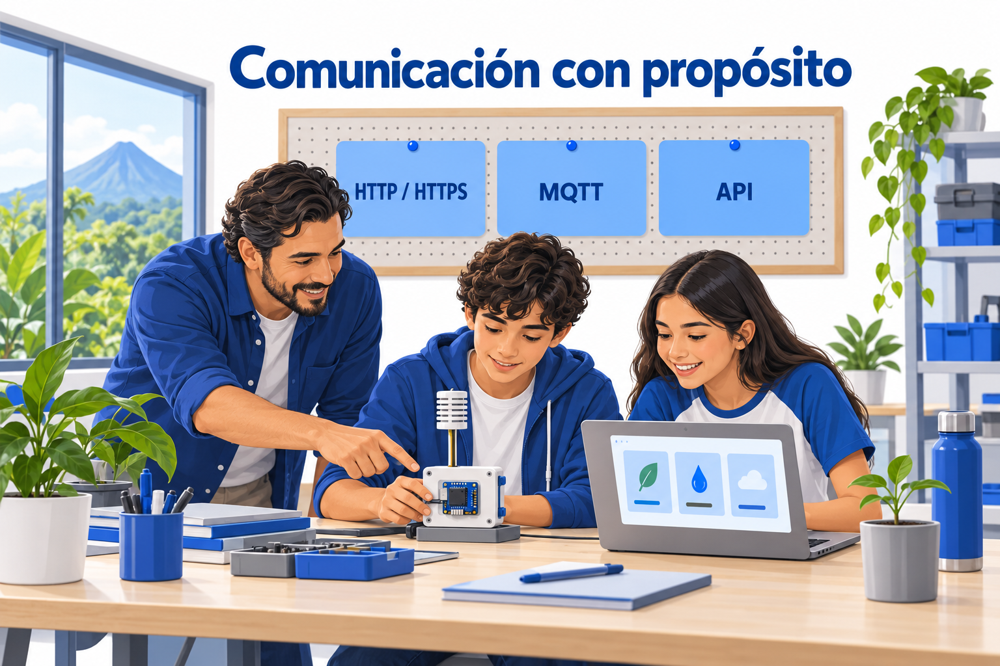

# Protocolos de Comunicación: orientación docente

> Este archivo pertenece a: **Internet de las Cosas y Conectividad**  
> Ruta: `01. Bloques Temáticos/06. IoT y Conectividad/04. Protocolos de Comunicación/README.md`

---

## Estado

**Estado:** En revisión  
**Versión:** v1.0  
**Bloque:** 06_iot-conectividad  
**Última actualización:** 2026-10-04

---

## Descripción

Esta carpeta reúne los fundamentos de HTTP/HTTPS, MQTT y API previstos en la estructura del bloque. Continúa el trabajo de fundamentos, plataformas y ESP32 mediante una pregunta común: ¿qué necesita acordar el sistema para comunicar información útil y reconocer cuando algo falla?

Los documentos son recursos conceptuales de consulta docente. Incluyen ejemplos y criterios de mediación; el diseño completo de sesiones y los montajes se desarrollan en los recursos de prácticas correspondientes.

---

## Propósito

Ayudar a seleccionar una forma de comunicación con sentido, interpretar mensajes y respuestas, proteger el acceso y reunir Evidencias de comprensión. La conexión se valora por su aporte a la persona usuaria, la calidad del dato y el comportamiento ante interrupciones.

---

## Contenido

### 1. Archivos del capítulo

| Recurso | Pregunta orientadora | Aporte |
| --- | --- | --- |
| [HTTP y HTTPS](http-https.md) | ¿Qué solicita una aplicación y qué confirma la respuesta? | Operaciones, códigos, transporte protegido y recuperación. |
| [Introducción a MQTT](mqtt-introduccion.md) | ¿Cómo reciben novedades los componentes interesados? | Publicación, suscripción, temas y límites de entrega. |
| [API básico](api-basico.md) | ¿Qué acuerdos permiten interpretar el intercambio? | Contrato, formato, validez, vigencia y permisos. |

Los tres documentos utilizan una estación ambiental ficticia del Makerspace. Sus lecturas están etiquetadas como simuladas. No requieren registrar personas ni crear cuentas estudiantiles.

### 2. Ruta de consulta

Se recomienda **HTTP/HTTPS → API → MQTT**. Este orden permite comprender primero un intercambio, después su contrato y finalmente una alternativa de distribución. El nombre de los archivos conserva la estructura prevista del repositorio.

Antes de introducir detalles técnicos, compruebe que el grupo puede explicar entrada, proceso y salida; distinguir red local de Internet y relacionar una lectura con una unidad. Si esas relaciones necesitan apoyo, use tarjetas y mensajes preparados.

### 3. Diferencias que deben quedar claras

| Elemento | Decisión que ayuda a tomar | Límite |
| --- | --- | --- |
| HTTP/HTTPS | Cómo consultar o solicitar una operación web. | Una respuesta no demuestra por sí sola un resultado físico. |
| MQTT | Cómo distribuir mensajes según temas de interés. | La recepción no equivale a ejecución ni a archivo histórico. |
| API | Qué operaciones, datos y respuestas se acuerdan. | Un formato legible puede contener información inválida. |

API no es un protocolo que compita directamente con HTTP o MQTT. Es un nivel distinto de acuerdo. El proyecto puede utilizar una API HTTP y, además, mensajes MQTT con un contrato de aplicación.

### 4. Criterios de selección

Parta de la necesidad. Para una consulta puntual a un servicio documentado, una API HTTP puede facilitar la integración. Si varios componentes necesitan novedades, analice MQTT y la disponibilidad de un broker. En ambos casos defina permisos, vigencia del dato, respuesta ante fallos y capacidad de mantenimiento.

No se incorpora una tecnología solo para aumentar la dificultad. Una representación con tarjetas puede expresar el mismo aprendizaje central que una implementación: quién envía, quién recibe, qué contenido circula y qué permite afirmar su llegada.

### 5. Progresión y alcance

El [Mapa de Progresión del bloque](../01.%20Mapa%20de%20Progresi%C3%B3n.md) concentra los ajustes por ciclo: Preescolar; I Ciclo, 1.º–3.º; II Ciclo, 4.º–6.º; III Ciclo, 7.º–9.º; y Educación Diversificada, 10.º–11.º. Esta carpeta remite a ese recurso y no introduce otra tabla curricular.

IoT se profundiza principalmente en Innovation Lab. En aproximaciones previas, preserve el propósito y ajuste vocabulario, cantidad de componentes, autonomía y Evidencias. No exija que todos los ciclos configuren servidores, brokers o credenciales.

La conexión con el PNFT se trabaja mediante resolución de problemas, interpretación de información, programación cuando corresponda y uso responsable de tecnología. Esta orientación no asigna códigos curriculares ni sustituye la alineación institucional del bloque.

### 6. Preparación docente

1. Definir la persona usuaria, el dato y la decisión que apoyará.
2. Seleccionar el alcance con el mapa de progresión.
3. Preparar mensajes simulados o una red de demostración autorizada.
4. Comprobar el contrato y los resultados normales y fallidos.
5. Separar datos públicos de credenciales privadas.
6. Definir cómo se comunica dato ausente, antiguo o inválido.
7. Seleccionar Evidencias y una pregunta para orientar la mejora.

Los ejemplos HTTP son mensajes; el JSON es contenido; la secuencia de API es pseudocódigo. No se presentan como firmware listo para cargar. Una demostración física requiere verificar placa, bibliotecas, red y condiciones del centro.

---

## Aplicación en Maker Academy

### Inspiración

Presente el problema ambiental y solicite identificar quién necesita la información. Invite a comparar una consulta a demanda con la recepción de novedades. La Pasión se activa mediante una pregunta cercana y el Proyecto conserva una utilidad concreta.

### Experimentación

Trabaje con los documentos según el alcance elegido. Los Pares pueden asumir roles de dispositivo, servicio y panel, y después intercambiarlos. El Juego consiste en explorar cambios controlados: ruta distinta, mensaje antiguo, campo faltante o servicio detenido. Solicite una predicción antes de observar cada resultado.

### Reflexión y evaluación formativa

| Criterio | Evidencia observable |
| --- | --- |
| Propósito | Explica quién utiliza el resultado y para qué. |
| Comunicación | Identifica emisor, receptor, operación y contenido. |
| Interpretación | Distingue recibido, válido, vigente y ejecutado. |
| Responsabilidad | Justifica permisos y protege credenciales. |
| Iteración | Compara predicción y resultado; propone una mejora. |

Use dibujos, explicación oral, tablas o documentación técnica según el mapa. Una pantalla con datos no es suficiente: el equipo debe explicar qué observó y qué permanece incierto.

---

## Recursos relacionados

- [HTTP y HTTPS](http-https.md).
- [MQTT](mqtt-introduccion.md).
- [API](api-basico.md).
- [ESP32: orientación de la carpeta](../03.%20ESP32/README.md).
- [Plataformas y herramientas](../02.%20Plataformas%20y%20Herramientas/README.md).
- [Mapa de Progresión del bloque](../01.%20Mapa%20de%20Progresi%C3%B3n.md).
- [Seguridad del bloque](../03.Seguridad.md).
- [Alineación con el PNFT](../04.%20Alineaci%C3%B3n%20con%20el%20PNFT.md).

---

## Nota docente

Los cuatro documentos quedan **En revisión** para la revisión pedagógica, editorial y técnica del equipo. La carpeta incluye sus imágenes y navegación interna. Los vínculos al mapa y a carpetas vecinas se comprobaron contra el árbol del repositorio al preparar esta actualización.

El README del bloque enlaza esta carpeta. Al revisar el capítulo, compruebe la lectura de los ejemplos y la visualización de las imágenes desde GitHub. Este recurso conserva el alcance conceptual y no sustituye las prácticas guiadas.
