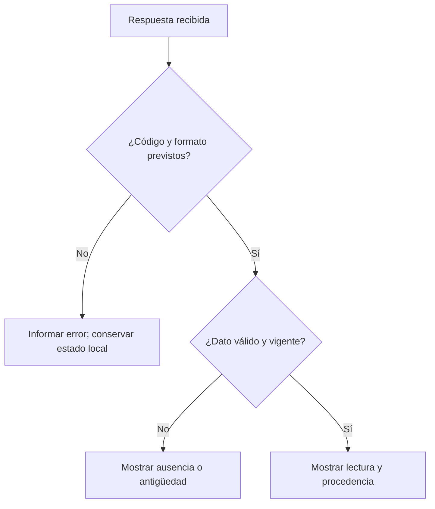
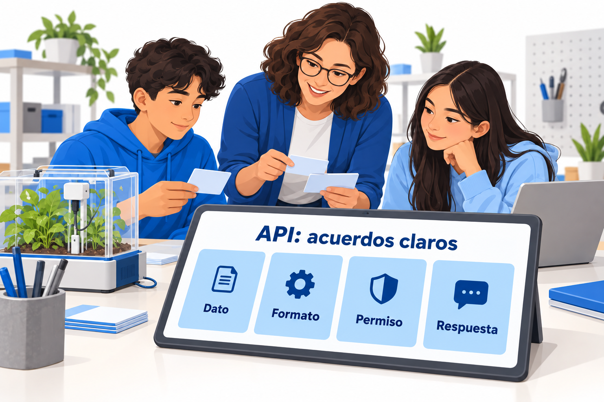

# API: acuerdos para intercambiar e interpretar datos

> Este archivo pertenece a: **Internet de las Cosas y Conectividad**  
> Ruta: `01. Bloques Temáticos/06. IoT y Conectividad/04. Protocolos de Comunicación/api-basico.md`

---

## Estado

**Estado:** En revisión  
**Versión:** v1.0  
**Bloque:** 06_iot-conectividad  
**Última actualización:** 2026-10-04

---

## Descripción

Una API es una interfaz que define cómo un programa utiliza capacidades de otro. En IoT permite acordar operaciones, formatos y respuestas entre dispositivos, servicios y aplicaciones. Este recurso orienta al personal docente para analizar ese contrato y validar datos antes de incorporarlos a una decisión.

---

## Propósito

Ayudar a explicar qué puede solicitar una aplicación, qué debe enviar y cómo interpreta el resultado. Se utiliza una API HTTP ficticia de estación ambiental para trabajar acuerdos explícitos, calidad de datos, permisos y Documentación maker.

---

## Contenido

### 1. Distinguir interfaz, protocolo y formato

| Concepto | Qué define | Ejemplo |
| --- | --- | --- |
| API | Operaciones y reglas de uso. | Consultar el estado de una estación. |
| HTTP | Semántica de solicitudes y respuestas. | Una consulta GET y su resultado. |
| JSON | Forma de representar datos. | Objeto con valor, unidad y validez. |
| Plataforma | Servicio que puede ofrecer una API. | Sistema de monitoreo del proyecto. |

Una API no equivale a una página web ni es necesariamente REST. REST es un estilo arquitectónico; usar HTTP y JSON no demuestra por sí solo que una API lo siga. También existen interfaces de bibliotecas y acuerdos de aplicación sobre MQTT. Aquí se trabaja con una API HTTP para mantener un caso concreto.

**Necesidad de referencia:** el panel del Makerspace debe consultar una temperatura comprensible y reconocer cuándo falta una lectura válida. El acuerdo se define antes de programar el panel.

### 2. Escribir un contrato mínimo

Este contrato es una **propuesta didáctica**, no una API desplegada. El equipo puede revisarlo sin conectarse a ningún servicio.

| Campo del contrato | Decisión de referencia |
| --- | --- |
| Recurso | Estación ficticia `aula-01`. |
| Ruta | `/api/v1/estaciones/aula-01`. |
| Método | GET. |
| Acceso | Cuenta o token de solo lectura en el entorno preparado. |
| Solicitud | Sin cuerpo; acepta `application/json`. |
| Respuesta normal | 200 y objeto JSON definido abajo. |
| Estación inexistente | 404. |
| Credencial inválida | 401. |
| Acceso denegado | 403. |
| Servicio no disponible | 503. |
| Frecuencia del panel | Una consulta cada 20 segundos, decisión del ejemplo. |
| Tiempo de espera | Máximo 5 segundos por intento, decisión del ejemplo. |
| Vigencia de referencia | Lectura de hasta 60 segundos, decisión del ejemplo. |

Los tiempos son elecciones pedagógicas del caso. Una plataforma real puede imponer otros límites. Antes de adoptarlos, revise su documentación y la necesidad de la persona usuaria.

No sustituya una ruta existente por otra sin actualizar consumidores y documentación. Una especificación OpenAPI puede formalizar rutas, parámetros, esquemas y respuestas, pero una tabla clara basta para esta introducción.

### 3. Dar significado al JSON

Respuesta simulada preparada por la persona docente:

```json
{
  "estacion": "aula-01",
  "temperatura_c": 24.6,
  "dato_valido": true,
  "simulado": true,
  "edad_dato_ms": 1200
}
```

| Campo | Tipo acordado | Significado y comprobación |
| --- | --- | --- |
| `estacion` | Cadena | Coincide con la estación solicitada. |
| `temperatura_c` | Número o `null` | Temperatura en °C; `null` si falta una lectura. |
| `dato_valido` | Booleano | Señal de validez definida por la aplicación. |
| `simulado` | Booleano | Identifica explícitamente un dato de demostración. |
| `edad_dato_ms` | Entero no negativo o `null` | Edad al construir la respuesta; `null` si se desconoce. |

JSON utiliza punto decimal, comillas dobles en las cadenas y valores `true`, `false` y `null` en minúscula. No admite comentarios, `NaN` ni `Infinity`. La cadena `"24.6"` no tiene el mismo tipo que el número `24.6`.

La sintaxis correcta no demuestra validez del dato. Para el caso se acuerda un intervalo de demostración de 0 a 50 °C, elegido para el entorno de aula; no se afirma que sea el rango de cualquier sensor. La persona docente debe ajustar límites según el modelo y el contexto.

La edad se calcula en la estación de origen al preparar la respuesta. Al mostrar el dato se considera además el tiempo transcurrido desde su recepción y el posible retraso de transporte. Si ese retraso importa para la decisión, se necesita una política temporal más precisa. `millis()` es tiempo desde arranque, no una fecha UTC.

### 4. Validar antes de mostrar

Secuencia conceptual para la aplicación del caso, independiente del lenguaje:

```text
Solicitar la estación con tiempo de espera limitado.
Si no hay respuesta, indicar “sin actualización”.
Si el código no es 200, interpretar el error según el contrato.
Comprobar tipo de contenido, tamaño permitido y JSON legible.
Verificar campos requeridos y sus tipos.
Confirmar estación, unidad acordada, intervalo y validez.
Comprobar vigencia; si se desconoce, informarlo.
Mostrar la lectura aceptada y distinguir si es simulada.
```

Una respuesta con `temperatura_c: null` y `dato_valido: false` informa ausencia. No debe convertirse en 0 °C. Un campo faltante, una cadena donde se esperaba un número o un JSON incompleto requieren un resultado comprensible para la persona usuaria.



**Descripción alternativa:** la aplicación comprueba primero la respuesta y después la validez y vigencia del dato. Solo muestra como actual una lectura que supera ambos controles.

### 5. Permisos y manejo del acceso

Autenticación identifica al cliente; autorización limita lo que puede hacer. El panel del caso solo consulta. Registrar lecturas o solicitar acciones debe tener permisos separados.

Si la API utiliza tokens, conserve el secreto en una configuración privada. No lo incluya en el repositorio, en capturas ni en un ZIP compartido. Una clave incrustada en JavaScript que se entrega al navegador puede ser vista por quien recibe la página: un archivo de configuración no la vuelve secreta allí.

Las credenciales que se comuniquen requieren un transporte protegido y verificación del servidor. Su ubicación y nombre de cabecera dependen del contrato; no se supone que todas las plataformas acepten `Authorization` o el mismo formato de token.

Si un cliente web hace solicitudes a otro origen, puede necesitar una política CORS del servidor. CORS regula acceso desde navegadores; no sustituye autenticación ni autorización. Una solicitud bloqueada por el navegador puede requerir diagnóstico diferente de la realizada por un ESP32.

### 6. Comprobar el contrato con ejemplos

La persona docente prepara respuestas ficticias y solicita comparar lo esperado con lo recibido. La meta es justificar la aceptación o el rechazo, no memorizar códigos.

| Respuesta preparada | Resultado esperado del panel | Evidencia |
| --- | --- | --- |
| Número válido y reciente | Lectura con unidad y etiqueta de simulación. | Explica los controles superados. |
| `null` y validez falsa | “Sin lectura válida”. | No inventa un cero. |
| `"24.6"` como cadena | Rechazo según el contrato. | Identifica tipo incorrecto. |
| Edad superior a 60 segundos | Aviso de dato antiguo. | Explica el límite del ejemplo. |
| 401 | Solicitar revisión del acceso sin mostrar el secreto. | Diferencia credencial y red. |
| 503 o tiempo de espera | “Sin actualización”. | Conserva y etiqueta el último valor. |

Documente ruta, versión del contrato, ejemplo recibido, interpretación y mejora propuesta. Cuando cambie un campo obligatorio, revise todos los consumidores afectados.

---

## Aplicación en Maker Academy

### Inspiración

Presente dos tarjetas con el mismo número: una tiene unidad y procedencia, la otra no. Pregunte cuál permite tomar una decisión y qué información falta. La pregunta conecta el contrato con una necesidad real de comprensión.

### Experimentación

Consulte el [Mapa de Progresión del bloque](../01.%20Mapa%20de%20Progresi%C3%B3n.md). Ajuste el apoyo sin duplicar las tablas por ciclo. Con mayor mediación, use tarjetas de campos y ejemplos válidos o incompletos. Con autonomía técnica, el equipo diseña el contrato, interpreta respuestas preparadas y explica sus rechazos.

Las 4P se concretan en un Proyecto útil, una pregunta que activa la Pasión, revisión entre Pares y Juego como exploración de variaciones controladas. No hace falta una cuenta externa para experimentar con estos acuerdos.

### Reflexión y evaluación formativa

Pregunte qué decisión tomó el panel, cuál campo la justifica y qué ocurriría si ese campo faltara. Observe si el equipo distingue sintaxis, significado y permiso. Retroalimente una mejora observable, como indicar la antigüedad o separar acceso de lectura y escritura.

---

## Recursos relacionados

- [Orientación del capítulo](README.md).
- [HTTP y HTTPS](http-https.md).
- [MQTT y payloads](mqtt-introduccion.md).
- [Servidor web embebido](../03.%20ESP32/servidor-web-embebido.md).
- [Plataformas y herramientas](../02.%20Plataformas%20y%20Herramientas/README.md).
- [OpenAPI 3.1.1: operaciones, esquemas y respuestas](https://spec.openapis.org/oas/v3.1.1.html).
- [RFC 8259: formato JSON](https://www.rfc-editor.org/rfc/rfc8259.html).
- [MDN: visión general de HTTP](https://developer.mozilla.org/en-US/docs/Web/HTTP/Guides/Overview).
- [MDN: CORS](https://developer.mozilla.org/en-US/docs/Web/HTTP/Guides/CORS).

Fuentes consultadas el 2026-10-04. El contrato y los umbrales son ejemplos didácticos diseñados para este recurso.

---




## Nota docente

Introduzca una variación por vez para que el grupo pueda explicar su efecto. Trabajar con respuestas simuladas permite observar la interpretación sin confundir un fallo de red con uno de datos. El contrato debe ser comprensible para quien construye el dispositivo y para quien diseña la interfaz.
